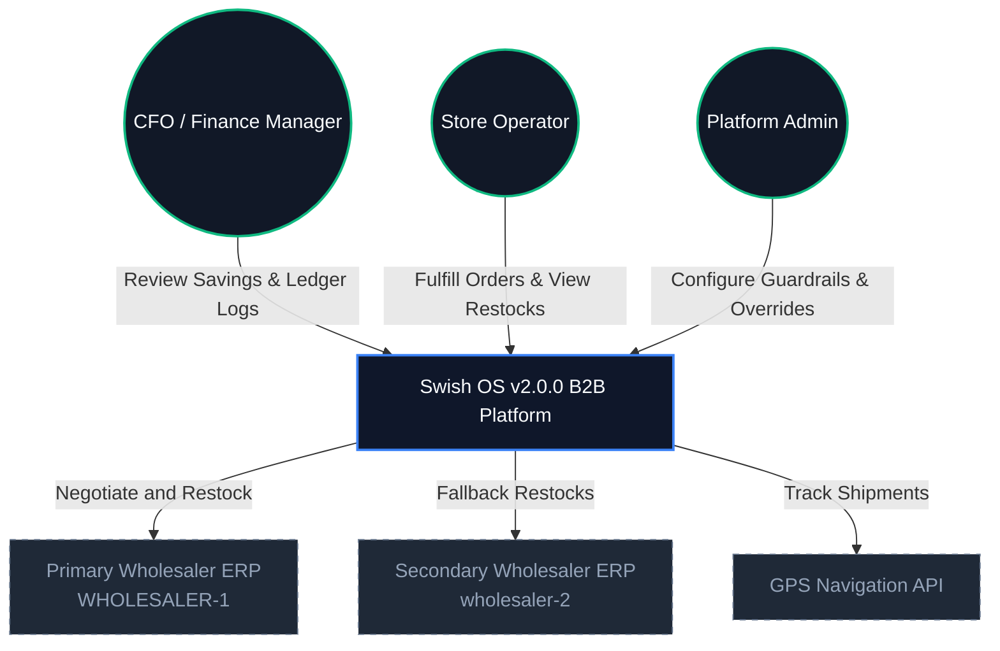

# Swish OS v2.0.0 🚀

[](https://github.com/Muneeb7860/Swish_App/actions)
[](https://opensource.org/licenses/MIT)
[](https://img.shields.io/badge/Java-17-orange)
[](https://spring.io/projects/spring-boot)
[](https://react.dev/)

Welcome to **Swish OS v2.0.0**, an enterprise-grade, multi-tenant B2B SaaS platform engineered to transform legacy convenience stores and micro-fulfillment centers (MFCs) into autonomous, high-velocity distribution hubs. Designed to guarantee hyper-local grocery delivery within a strict 15-minute window, Swish OS represents a low-CapEx, software-first solution that retrofits existing retail networks with decentralized micro-frontends and agentic workflows.

---

## 🏗️ Architectural Vision & Design Frameworks

Swish OS is designed around rigorous architectural standards, combining business agility with system resilience:

> [!NOTE]
> **As-built vs. roadmap.** The **current** deployment path is **Google Cloud Run** (`.github/workflows/deploy-cloudrun.yml`); demo/closed-beta runs via `docker-compose.demo.yml`. Items marked **🛣️ Roadmap** below — the Kubernetes service mesh, Envoy mTLS sidecars, SPIFFE/SPIRE identity, NGINX Ingress — are **planned feature improvements, not yet implemented** (Kubernetes is currently deprecated; see [`infrastructure/k8s/DEPRECATED.md`](infrastructure/k8s/DEPRECATED.md)).

*   **TOGAF ADM Alignment:** Guided by the Open Group Architecture Framework, with traceability from Phase A (Business Stakeholder ROI) to Phase D (technology/deployment on Cloud Run; Kafka KRaft event pipelines).
*   **🛣️ Roadmap — Zero-Trust Networking:** *Planned:* mutual TLS (mTLS) with SPIFFE/SPIRE identity across a service mesh behind a rate-limited ingress. *Today:* TLS terminates at Cloud Run / the gateway with JWT auth + edge rate limiting.
*   **Hexagonal Architecture (Ports & Adapters):** Isolates pure domain rules and state-machine logic in backend microservices from database adapters, web endpoints, and external API connectors.
*   **COBIT 2019 & ITIL v4 Resilience:** Standardized circuit breakers, dead-letter fallback recovery queues, and pessimistic database locking to mitigate dual-write failures and transaction anomalies.

---

## 🌐 System Context (C4 Model)

### System Context Level (L1)


### Container Level (L2) — 🛣️ Target Architecture (roadmap)

> The diagram below depicts the **target** topology (Kubernetes mesh + Envoy mTLS sidecars). The **current** runtime is Cloud Run services (prod) / docker-compose (demo) — same containers, no mesh yet.

```mermaid
graph TB
  classDef edge fill:#0f172a,stroke:#10b981,stroke-width:2px,color:#f8fafc;
  classDef gateway fill:#0f172a,stroke:#8b5cf6,stroke-width:2px,color:#f8fafc;
  classDef container fill:#0f172a,stroke:#3b82f6,stroke-width:2px,color:#f8fafc;
  classDef store fill:#0f172a,stroke:#06b6d4,stroke-width:2px,color:#f8fafc;
  classDef queue fill:#0f172a,stroke:#f59e0b,stroke-width:2px,color:#f8fafc;

  Ingress[NGINX Ingress Controller<br>DMZ / TLS Termination]:::edge
  
  subgraph k8s-service-mesh [Kubernetes Pod Mesh]
    GW[platform-gateway<br>Spring Cloud Gateway Port 8080]:::gateway
    
    subgraph core-services [Core Services (Envoy mTLS Sidecars)]
      Backend[backend Service<br>Hexagonal Core Port 8080]:::container
      BusinessEngine[core-business-engine<br>Checkout/Inv/B2B Port 8081]:::container
      NotifEngine[notification-engine<br>Kafka Consumer/WS Port 8082]:::container
      SharedAsync[shared-async-services<br>AI & Ledger]:::container
      SecurityEngine[Security Engine<br>Guardrails / mTLS]:::container
      RewardsEngine[Rewards Engine<br>Gamification / Loyalty]:::container
      EventsEngine[Events Engine<br>Outbox Relay]:::container
      GovernanceEngine[Governance Engine<br>Compliance / Onboarding]:::container
    end
    
    subgraph databases [Data & Storage Tier]
      Redis[(Redis Cache & Rate Limiting)]:::store
      Postgres[(PostgreSQL OLTP Database)]:::store
      MongoDB[(MongoDB Analytical Archive)]:::store
    end

    Kafka[Kafka Event Broker]:::queue
  end

  Ingress -->|mTLS Traffic Route| GW
  
  GW -->|Route| Backend
  GW -->|Route| BusinessEngine
  GW -->|Route| NotifEngine
  GW -->|Route| SharedAsync

  Backend --> Postgres
  BusinessEngine --> Postgres
  NotifEngine --> Postgres
  SharedAsync --> Postgres

  Backend --> SecurityEngine
  Backend --> EventsEngine
  SharedAsync --> RewardsEngine
  BusinessEngine --> GovernanceEngine

  SecurityEngine -.-> Redis
  SecurityEngine -.->|"publish"| Kafka
  RewardsEngine --> Postgres
  RewardsEngine -.-> Redis
  EventsEngine --> Postgres
  EventsEngine -.->|"publish"| Kafka
  GovernanceEngine --> Postgres

  Backend -.-> Redis
  BusinessEngine -.-> Redis
  NotifEngine -.-> Redis
  GW -.-> Redis

  BusinessEngine -.->|"publish"| Kafka
  Kafka -.->|"consume"| NotifEngine
  Kafka -.->|"consume"| SharedAsync
  Postgres -.->|"Outbox publish"| Kafka
  Kafka -.->|OlapEventSinkListener| MongoDB
```

---

## 🗄️ Core Architecture & Data Strategy

### 1. Traffic Flow
1.  **🛣️ Roadmap — NGINX Ingress / Envoy mTLS mesh:** *Planned:* DMZ TLS termination + SPIFFE-verified, sidecar-encrypted pod-to-pod traffic. *Today:* TLS terminates at Cloud Run (prod) / the gateway, no mesh.
2.  **platform-gateway:** Unified routing gateway with custom filter chains for JWT verification, idempotency checking, circuit-breaker fallbacks, and edge rate limiting. *(As-built.)*

### 2. Segmented Dual-Database Model
To prevent write locks and reconcile database performance with cost controls:
*   **Relational Tier (PostgreSQL):** Single source of truth for OLTP transactions, inventory tracking, and double-entry general ledgers. Uses Flyway database migrations and is configured for `READ_COMMITTED` isolation combined with explicit pessimistic locking (`SELECT ... FOR UPDATE`) to eliminate concurrent transaction rollback anomalies.
*   **Analytical Archive (MongoDB):** Low-cost, tiered document database acting as a cold-archive for high-throughput, non-critical telemetry logs (e.g. GPS coordinates, local weather, and historical bidding traces). Sharded to prevent dual-write performance bottlenecks.
*   **Distributed Session State (Redis):** Cluster cache capturing autocomplete inventory structures, courier presence markers, and token buckets. Bypasses relational disk writes for 70% of read requests.

#### 🗃️ Data Schema Map
| Data Type | Primary DB | Archive | TTL / Expiry | Example Fields |
| :--- | :--- | :--- | :--- | :--- |
| **Orders & Checkout** | PostgreSQL | MongoDB | ∞ | `order_id`, `status`, `total_amount` |
| **Ledger Auditing** | PostgreSQL | WORM (S3/GCS) | ∞ | `transaction_id`, `hash_chain`, `signature` |
| **Inventory & Products**| PostgreSQL | Redis | 1 hour cache | `product_id`, `stock_count`, `price` |
| **GPS Telemetry** | Redis (Buffer) | MongoDB | 24 hours | `rider_id`, `latitude`, `longitude` |
| **Bidding Logs** | MongoDB | — | 30 days | `bid_id`, `wholesaler_name`, `proposed_price` |


### 3. Asynchronous Event Pipeline (Transactional Outbox)
To avoid dual-write inconsistencies (where a database update succeeds but a corresponding message broker write fails):
1.  Both the primary transaction and the pending event metadata are committed to a database-backed `outbox` table within the same ACID unit of work.
2.  An asynchronous outbox relay polls this table and publishes the events sequentially to **Apache Kafka**.
3.  Kafka pipelines process messages using a Kafka broker running in KRaft mode, backed by a `DeadLetterPublishingRecoverer` strategy to isolate malformed payloads.

---

## 🤖 B2B Agentic OS, LLM Strategy & Safety Guardrails

Swish OS features a multi-domain agentic pipeline that manages stock replenishment and operational exceptions:

```
[Stock < 3 Alarm] 
        │
        ▼
[B2BProcurementAgent] ──► [Query Wholesaler Pricing] ──► [Evaluate Contract Cost]
                                                                   │
       ┌───────────────────────────────────────────────────────────┘
       ▼
[ProcurementGuardrailsEngine]
       │
       ├─► (Passes bounds: Cost < $5000 & Variance < 10%) ──► [REST API RESTOCK] ──► [Update PostgreSQL]
       │                                                                                  │
       └─► (Violates bounds) ──► [Write to HitlQueue] ──► [L1/L2 Operator Release] ───────┘
```

### 🧠 AI & LLM Execution Strategy

To ensure zero external cloud dependencies, offline functionality, and predictable token costs, the platform implements a tiered hybrid execution model:

#### 1. Local Inference (Primary)
*   **Execution Engine:** Self-hosted **Ollama** serving containerized models.
*   **Default Model:** `qwen:14b` or `llama2:13b` serving B2B negotiations and agent mesh calls locally.
*   **Memory Preserving layer:** Uses **Letta (formerly MemGPT)** to manage stateful memory contexts (Core Memory + Archival Database Vector search using pgvector) for long-running multi-turn Wholesaler RFQ negotiations.

#### 2. Cloud Fallback (Secondary)
*   **Execution Engine:** **Spring AI** (`spring-ai-openai-spring-boot-starter`).
*   **Trigger Condition:** Automatically trips via the `ResilientLlmGateway` circuit breaker if the local Ollama instance timeouts or crashes.
*   **Cost Management:** PII is redacted at the gateway before sending requests to public cloud endpoints; a strict `$5/day` token budget counter checks usage dynamically.

---

### 🛡️ Safety Guardrails & Payload Verification

Before query routing and model output deliveries, the governance layer executes two safety guardrail systems:

#### 1. NVIDIA NeMo Guardrails (Colang Dialog Safety)
*   **Safety Scripting:** Active rails defined in [config.yml](./homelab-ai-governance/config/nemo_guardrails/config.yml) and [flows.co](./homelab-ai-governance/config/nemo_guardrails/flows.co) enforce conversation flow boundaries.
*   **Input Blocking:** Matches prompts against safety intents (e.g., system configuration overrides, malicious bypasses, or requests for competitor pricing). If violated, the flow triggers a direct bot safety response, short-circuiting downstream LLM costs.

#### 2. Guardrails AI (Structured Output Validation)
*   **Schema Enforcement:** Model outputs are parsed and validated against strict Pydantic schemas (e.g. `CustomerSupportSchema`, `DynamicPricingSchema`).
*   **Recursive Self-Correction:** If the model outputs malformed JSON or invalid values (e.g., negative prices, invalid barcodes), the enforcer extracts field-level error messages and re-submits a structured correction request to the model (up to 3 retries) before escalating to local fallback.

---

### 🧑‍💻 Core Platform Agents
*   **B2BProcurementAgent:** Autonomous AI agent that queries pricing structures from primary and secondary wholesalers and conducts restock negotiations.
*   **ProcurementGuardrailsEngine:** Evaluates contract proposals against strict financial bounds (e.g., maximum cost thresholds and wholesale price variance ceilings).
*   **Human-in-the-Loop (HITL) Queue:** If guardrail thresholds are violated, the proposed transaction is locked in `hitl_queue` and requires manual release by an authorized operator.

*   **Additional Domain Agents:**
    *   *FraudAgent:* Checks order frequencies, trust scores, and transactions to detect identity/payment fraud.
    *   *PricingAgent:* Adapts delivery pricing dynamically based on local congestion, weather, and inventory counts.
    *   *RoutingAgent:* Directs split-shipment logistics, calculating carrier rates and courier capacity constraints.

---

## 📜 Compliance, Governance, & Safety

*   **GDP Temperature Compliance:** Satisfies Good Distribution Practice guidelines (EU 2013/C 343/01) for cold chain integrity. Sensor records are cryptographically signed at the IoT boundary.
*   **Write-Once, Read-Many (WORM) Auditing:** Core logs (sensor diagnostics, ledger transactions, and HITL approvals) are archived in WORM storage to provide audit trails for regulatory compliance.
*   **GDPR Article 17 Purge:** Out-of-the-box support for the "Right to be Forgotten." Customer records can be fully anonymized without breaking relational foreign keys or double-entry financial ledger integrity.

---

## 📁 Repository Blueprint

```text
├── backend/                   # Spring Boot Hexagonal core microservice & domain logic
│   └── src/main/java/ch/swissqcommerce/backend/domain/
│       ├── transaction/       # Order lifecycle & state machines
│       ├── payment/           # Payment processing & webhook endpoints
│       ├── inventory/         # Product structures & dark store operations
│       ├── event/             # Transactional Outbox relay scheduler
│       ├── auth/              # JWT-based authorization & security contexts
│       └── agent/             # Gemini AI adapter for procurement
├── platform-gateway/          # Custom Spring Cloud Gateway, rate limiter & security proxy
├── core-business-engine/      # Standalone service executing B2B orders & timeout sweepers
├── notification-engine/       # Kafka listener broadcasting updates via Websockets
├── shared-async-services/     # Universal schemas, AI routingports & accounting ledger
├── frontend-host/             # Micro-frontend shell hosting decoupled client modules
├── frontend-customer/         # Customer ordering storefront module (Port 5173)
├── frontend-rider/            # Courier navigation and routing UI (Port 5174)
├── frontend-admin/            # Console managing chaos desks & HITL ticket resolution (Port 5175)
├── frontend-b2b/              # Supplier inventory dashboard and negotiation portal
├── mobile/                    # React Native codebase for mobile deployments
├── infrastructure/            # Centralized Docker Compose layers & Kubernetes manifests
├── docs/                      # Architectural Decision Records (ADRs) & HLD/LLD assets
├── scripts/                   # System synchronization, chaos scripts, and build suites
└── tests/                     # Cypress end-to-end scripts and unified regression suites
```

---

## ⚙️ Service Inventory

The platform is transitioning from a monolithic core to a microservices architecture. The current deployment state of each service is as follows:

| Service / Component | Purpose | Local Port | Status / Deployment |
| :--- | :--- | :--- | :--- |
| **`backend/`** | Hexagonal Core Engine. Manages order lifecycles, payments, sensor calibration, and agent mesh execution. | `8083` | **Active** (Java Spring Boot) |
| **`platform-gateway/`** | API Ingress gateway. Executes JWT checks, routing, and token bucket rate-limiting. | `8080` | **Active** (Spring Cloud Gateway) |
| **`core-business-engine/`** | Standalone B2B checkout & catalog management engine. | `8081` | *Under Extraction / Development* |
| **`notification-engine/`** | Kafka listener broadcasting real-time updates over WebSockets. | `8082` | *Under Extraction / Development* |
| **`shared-async-services/`** | Universal domain entities & accounting schemas. | — | *Under Extraction / Development* |

---

## 🎨 Module Federation & Micro-Frontends

Micro-Frontends (MFEs) are decoupled client apps federated at runtime using `@originjs/vite-plugin-federation` (v1.4.1). Mismatches are avoided by pinning shared library versions in `vite.config.ts` across all MFEs:

*   **`react` / `react-dom`:** Pinned to `^18.2.0`
*   **`zustand`:** Pinned to `^4.5.2` for shared client store state
*   **`@swish/design-system`:** Local UI component library ensuring style uniformity across Customer, Rider, and Admin screens.

---


## 🚀 Quick Start Guide (5 Minutes)

Spin up the entire local infrastructure footprint—including frontends, microservices, databases, event brokers, and complete telemetry pipelines—using a single command.

### 1. Initialize Configuration
Clone the repository and pull the active development tree:
```bash
git clone https://github.com/Muneeb7860/Swish_App.git
cd Swish_App
git checkout macbook_machine
```

### 2. Boot the Ecosystem
**Closed-beta / UAT / Local Demo (One-Click Launch):**
```bash
# Checks ports, starts docker stack, runs flyway migrations, builds/packages jar files,
# and boots backend gateway and all 5 MFEs on pinned ports (3000-3003, 5002)
./run_demo.sh
```

**Local dev infra only (Postgres/Kafka/Redis/Mongo):**
```bash
docker compose -f docker-compose-local.yml up -d
```
> The legacy `infrastructure/docker-compose.yml` is **not** a supported boot path (drifted; references the retired `bff`).

### 3. Mission Control Port Mappings
Once healthy, access these local addresses:
*   🛒 **Customer Storefront MFE:** `http://localhost:5173`
*   🏍️ **Rider Logistics MFE:** `http://localhost:5174`
*   🛠️ **Admin Management MFE:** `http://localhost:5175`
*   📊 **Grafana Core Metrics Control:** `http://localhost:3000`
*   🔌 **Platform API Gateway:** `http://localhost:8080`

---

## 🧪 Testing & Chaos Engineering

### Automated Regression Testing
Verify backend compiler compliance, ArchUnit architecture rules, and unit expectations:
```bash
# Execute Spring Boot JUnit & ArchUnit guards
mvn test

# Run Cypress End-to-End browser workflows
npm run test:e2e
```

### Chaos Engineering Execution
Swish OS enforces high-availability limits. Trigger the chaos engine script to randomly inject network partition drops, Kafka broker failures, database connectivity timeouts, and API latency surges to evaluate Resilience4j circuit breakers:
```bash
bash scripts/chaos.sh
```

---

## 🏛️ Program Governance

*   **Scaled Agile Framework (SAFe):** Managed on a 2-week Program Increment (PI) planning cycle with feature toggles dynamically controling the chaos engines and procurement guardrail limits.
*   **ITIL v4 Service Value Chain:** Structures the flow of restocking requests to business margin optimization.
*   **veriSM Management Mesh Weights:**
    *   *Agile Development (SAFe):* **Weight 5** (Weekly deployment matrix checks).
    *   *DevOps (CI/CD):* **Weight 5** (Automated matrix testing of backend containers).
    *   *Service Management (ITIL v4):* **Weight 4** (SLA monitoring, cold chain telemetry tracking).
    *   *Governance (COBIT 2019):* **Weight 5** (Tamper-evident ledger, secrets rotation).

---

## 🔗 Related Documentation Index
*   📐 **[System Architecture](./docs/ARCHITECTURE.md)**: Architectural patterns, structural layout, and C4 context levels.
*   💼 **[Business Requirements Document (BRD)](./docs/BRD.md)**: Enterprise scope, customer segments, subscription tiers, andpicking/delivery SLAs.
*   📈 **[High Level Design (HLD)](./docs/HLD.md)**: Network topology, distributed database layouts, and outbox schema structures.
*   🔍 **[Low Level Design (LLD)](./docs/LLD.md)**: Interface bindings, class/object relations, and micro-frontend federation configs.
*   🔒 **[Security Architecture Audit](./docs/SECURITY.md)**: Cryptographic signature chains, TLS termination details, and GDPR purge rules.
*   🧪 **[User Acceptance Testing (UAT)](./docs/UAT_TEST_CASES.md)**: Detailed test scripts, validations, and administrative scenario flows.

