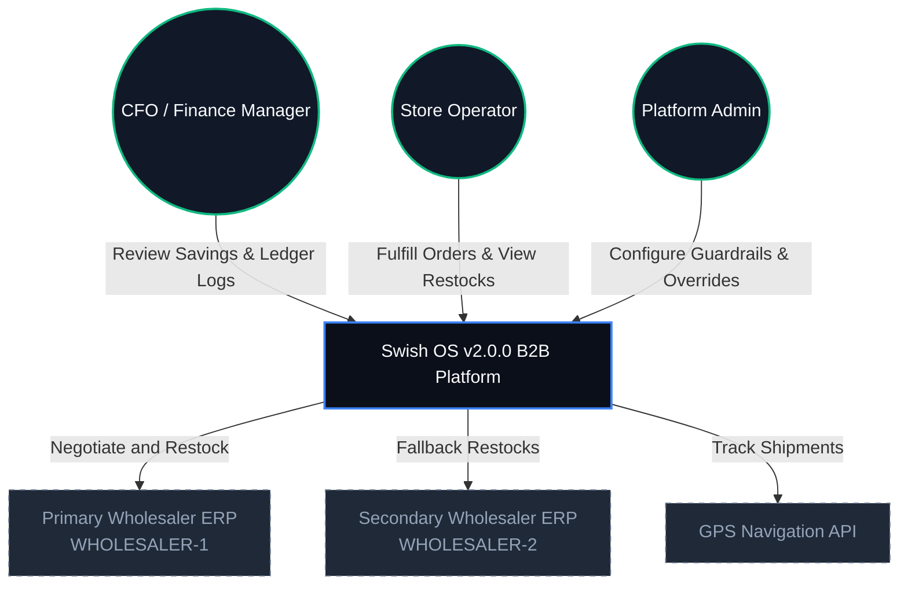

<p align="center">
  <svg width="800" height="240" viewBox="0 0 800 240" fill="none" xmlns="http://www.w3.org/2000/svg">
    <defs>
      <linearGradient id="bgGrad" x1="0%" y1="0%" x2="100%" y2="100%">
        <stop offset="0%" stop-color="#0b0f19" />
        <stop offset="100%" stop-color="#111827" />
      </linearGradient>
      <linearGradient id="accentGrad" x1="0%" y1="0%" x2="100%" y2="0%">
        <stop offset="0%" stop-color="#3b82f6" />
        <stop offset="50%" stop-color="#8b5cf6" />
        <stop offset="100%" stop-color="#ec4899" />
      </linearGradient>
      <filter id="glow" x="-20%" y="-20%" width="140%" height="140%">
        <feGaussianBlur stdDeviation="6" result="blur" />
        <feComposite in="SourceGraphic" in2="blur" operator="over" />
      </filter>
    </defs>
    
    <!-- Background Card -->
    <rect width="800" height="240" rx="16" fill="url(#bgGrad)" stroke="#1f2937" stroke-width="2" />
    
    <!-- Decorative Ambient Glows -->
    <circle cx="720" cy="60" r="140" fill="#8b5cf6" opacity="0.12" filter="url(#glow)" />
    <circle cx="80" cy="180" r="100" fill="#3b82f6" opacity="0.08" filter="url(#glow)" />
    
    <!-- Hexagonal Logo Symbol -->
    <g transform="translate(60, 60)" filter="url(#glow)">
      <polygon points="60,10 110,38.8 110,96.2 60,125 10,96.2 10,38.8" fill="none" stroke="url(#accentGrad)" stroke-width="6" stroke-linejoin="round" />
      <!-- Inner Lightning Bolt / Dynamic Flow -->
      <path d="M60,35 L40,75 L65,75 L55,105 L80,65 L55,65 Z" fill="url(#accentGrad)" />
    </g>
    
    <!-- Text Elements -->
    <text x="210" y="110" fill="#ffffff" font-family="-apple-system, BlinkMacSystemFont, 'Segoe UI', Roboto, 'Helvetica Neue', Arial, sans-serif" font-size="44" font-weight="900" letter-spacing="1">SWISH OS</text>
    <text x="210" y="145" fill="#94a3b8" font-family="-apple-system, BlinkMacSystemFont, 'Segoe UI', Roboto, 'Helvetica Neue', Arial, sans-serif" font-size="16" font-weight="500">Autonomous B2B Quick-Commerce Operating System</text>
    <text x="210" y="175" fill="url(#accentGrad)" font-family="-apple-system, BlinkMacSystemFont, 'Segoe UI', Roboto, 'Helvetica Neue', Arial, sans-serif" font-size="12" font-weight="700" letter-spacing="2">v2.0.0 • MULTI-TENANT SaaS • HEXAGONAL ARCHITECTURE</text>
  </svg>
</p>

<p align="center">
  <a href="https://github.com/Muneeb7860/Swish_App/actions"></a>
  <a href="https://opensource.org/licenses/MIT"></a>
  <a href="https://www.oracle.com/java/technologies/javase/jdk17-archive.html"></a>
  <a href="https://spring.io/projects/spring-boot"></a>
  <a href="https://react.dev/"></a>
</p>

---

## 🗺️ Navigation Dashboard

*   🎯 **[Platform Overview & Vision](#-platform-overview--vision)**
*   🏗️ **[System Architecture & Container Topology](#-system-architecture--container-topology)**
*   📂 **[Repository Directory Blueprint](#-repository-directory-blueprint)**
*   🤖 **[B2B Agentic OS & LLM Strategy](#-b2b-agentic-os--llm-strategy)**
*   📜 **[Compliance, Governance & Security](#-compliance-governance--security)**
*   📐 **[Architecture Decision Records (ADR) Registry](#-architecture-decision-records-adr-registry)**
*   🚀 **[Homelab Dev Setup & Troubleshooting](#-homelab-dev-setup--troubleshooting)**
*   🧪 **[Testing, Quality Gates & Chaos Engineering](#-testing-quality-gates--chaos-engineering)**

---

## 🎯 Platform Overview & Vision

**Swish OS v2.0.0** is an enterprise-grade, multi-tenant B2B SaaS operating system engineered to transform legacy convenience stores and micro-fulfillment centers (MFCs) into autonomous, high-velocity distribution hubs. Designed to satisfy a strict **15-minute hyper-local grocery delivery SLA**, Swish OS retrofits existing retail networks with decentralized micro-frontends and robust agentic workflows.

### Architectural Pillars & Design Frameworks
*   **TOGAF ADM Lifecycle Traceability**: Integrates business stakeholders' requirements directly with technical deployments on Google Cloud Run and Apache Kafka event streams.
*   **Hexagonal Isolation (Ports & Adapters)**: Separates pure domain rules, workflows, and state-machine components from database engines, communication adapters, and frontend client views.
*   **COBIT 2019 & ITIL v4 Service Value Chains**: Builds high availability and resilience directly into the ecosystem with circuit breakers, dead-letter fallbacks, and pessimistic resource locking.
*   **Zero-Trust Networking Roadmap**: *Planned improvements include* mutual TLS (mTLS) with SPIFFE/SPIRE identity propagation inside a Kubernetes service mesh. *As-built:* TLS termination at Cloud Run / API Gateway with JSON Web Token (JWT) auth.

---

## 🏗️ System Architecture & Container Topology

### L1: System Context Diagram
The following diagram maps how customers, platform administrators, and CFOs interface with Swish OS, which coordinates negotiations with wholesalers and updates external mapping APIs.



### L2: Container Target Topology (🛣️ Roadmap)
> [!NOTE]
> **Kubernetes Ingress Deployment**: The target environment includes NGINX Ingress and Envoy mTLS sidecars. The current production deployment uses Google Cloud Run (individual container microservices) and Docker Compose for local environments.

```mermaid
graph TB
  classDef edge fill:#0b0f19,stroke:#10b981,stroke-width:2px,color:#f8fafc;
  classDef gateway fill:#0b0f19,stroke:#8b5cf6,stroke-width:2px,color:#f8fafc;
  classDef container fill:#0b0f19,stroke:#3b82f6,stroke-width:2px,color:#f8fafc;
  classDef store fill:#0b0f19,stroke:#06b6d4,stroke-width:2px,color:#f8fafc;
  classDef queue fill:#0b0f19,stroke:#f97316,stroke-width:2px,color:#f8fafc;

  Ingress[NGINX Ingress Controller<br>DMZ / TLS Termination]:::edge
  
  subgraph k8s-service-mesh [Kubernetes Pod Mesh]
    GW[platform-gateway<br>Spring Cloud Gateway Port 8080]:::gateway
    
    subgraph core-services [Core Services (Envoy mTLS Sidecars)]
      Backend[backend Service<br>Hexagonal Core Port 8083]:::container
      BusinessEngine[core-business-engine<br>Checkout & Inventory Port 8081]:::container
      NotifEngine[notification-engine<br>Kafka WebSockets Port 8082]:::container
      SharedAsync[shared-async-services<br>AI & Ledger Port 8084]:::container
      SecurityEngine[Security Engine<br>Guardrails / mTLS]:::container
      RewardsEngine[Rewards Engine<br>Gamification]:::container
      EventsEngine[Events Engine<br>Outbox Relay]:::container
      GovernanceEngine[Governance Engine<br>Compliance]:::container
    end
    
    subgraph databases [Data & Storage Tier]
      Redis[(Redis Cache & Rate Limiter)]:::store
      Postgres[(PostgreSQL OLTP Database)]:::store
      MongoDB[(MongoDB Analytical Archive)]:::store
    end

    Kafka[Kafka Event Broker]:::queue
  end

  Ingress -->|mTLS Route| GW
  
  GW -->|Route| Backend
  GW -->|Route| BusinessEngine
  GW -->|Route| NotifEngine
  GW -->|Route| SharedAsync

  Backend --> Postgres
  BusinessEngine --> Postgres
  NotifEngine --> Postgres
  SharedAsync --> Postgres

  Backend --> SecurityEngine
  Backend --> EventsEngine
  SharedAsync --> RewardsEngine
  BusinessEngine --> GovernanceEngine

  SecurityEngine -.-> Redis
  SecurityEngine -.->|"publish"| Kafka
  RewardsEngine --> Postgres
  RewardsEngine -.-> Redis
  EventsEngine --> Postgres
  EventsEngine -.->|"publish"| Kafka
  GovernanceEngine --> Postgres

  Backend -.-> Redis
  BusinessEngine -.-> Redis
  NotifEngine -.-> Redis
  GW -.-> Redis

  BusinessEngine -.->|"publish"| Kafka
  Kafka -.->|"consume"| NotifEngine
  Kafka -.->|"consume"| SharedAsync
  Postgres -.->|"Outbox publish"| Kafka
  Kafka -.->|OlapEventSinkListener| MongoDB
```

---

## 📂 Repository Directory Blueprint

The workspace is organized into discrete service folders separating backend APIs, frontend micro-frontends, telemetry setups, and configuration:

| Submodule / Folder | Technology Stack | Purpose | Local Dev Port |
| :--- | :--- | :--- | :--- |
| 🔌 **[platform-gateway](./platform-gateway)** | Java Spring Cloud Gateway | Ingress routing, JWT checks, rate-limiting | `8080` |
| ☕ **[backend](./backend)** | Java 17, Spring Boot, Lombok | Hexagonal Core (order states, auth, DB) | `8083` |
| 🤖 **[homelab-ai-governance](./homelab-ai-governance)** | Python 3.14, FastAPI, NeMo | AI Guardrails, Pydantic RAIL enforcers | `5002` |
| 🏷️ **[competitor-pricing-server](./competitor-pricing-server)** | Node.js, Express, Axios | External mockup mock pricing server | `8085` |
| 📦 **[core-business-engine](./core-business-engine)** | Java Spring Boot | Standalone B2B procurement & checkout | `8081` |
| 🔔 **[notification-engine](./notification-engine)** | Java Spring Boot, Kafka | Kafka consumer & WebSocket event server | `8082` |
| 📊 **[shared-async-services](./shared-async-services)** | Java Spring Boot | AI routing ports & double-entry ledger | — |
| 🎨 **[design-system](./design-system)** | React, Vanilla CSS, Vite | Unified UI component library (`@swish/ds`) | — |
| 🛒 **[frontend-customer](./frontend-customer)** | React, TypeScript, Zustand | Customer shopping storefront MFE | `3001` |
| 🏍️ **[frontend-rider](./frontend-rider)** | React, TypeScript, Leaflet | Courier tracking & route navigation MFE | `3002` |
| 🛠️ **[frontend-admin](./frontend-admin)** | React, TypeScript, Recharts | Ops panel (chaos toggles, HITL, compliance) | `3003` |
| 💼 **[frontend-b2b](./frontend-b2b)** | React, TypeScript | Wholesaler bid negotiation & invoice MFE | `3004` |
| 📱 **[mobile](./mobile)** | React Native, Expo | Courier/Operator companion native app | — |
| 🛡️ **[infrastructure](./infrastructure)** | Docker Compose, Postgres GIS | Local infrastructure setups (Postgres, Mongo, Kafka) | — |

---

## 🤖 B2B Agentic OS & LLM Strategy

Swish OS features an agentic pipeline executing B2B restocks and protecting operations against out-of-bounds contract terms:

```
[Stock < 3 Alarm]
        │
        ▼
[B2BProcurementAgent] ──► [Query Wholesaler Pricing] ──► [Evaluate Contract Cost]
                                                                    │
       ┌────────────────────────────────────────────────────────────┘
       ▼
[ProcurementGuardrailsEngine]
       │
       ├─► (Passes: Cost < $5000 & Variance < 10%) ──► [REST API RESTOCK] ──► [Update PostgreSQL]
       │                                                                            │
       └─► (Violates bounds) ──► [Write to HitlQueue] ──► [L1/L2 Operator Release] ──┘
```

### 🧠 Core Platform Agents
*   **B2BProcurementAgent**: Queries wholesaler catalog prices, runs multi-turn RFQ negotiations, and selects contract proposals.
*   **ProcurementGuardrailsEngine**: Verifies transaction bounds (e.g., maximum order size, price deviation ceilings).
*   **Human-in-the-Loop (HITL) Queue**: Intercepts transactions violating guardrails, locking them in `hitl_queue` for operator resolution.
*   **Domain Agents**:
    *   *FraudAgent*: Evaluates customer purchase velocities, trust levels, and geolocation telemetry.
    *   *PricingAgent*: Adapts quick-commerce checkout pricing dynamically using congestion, logistics, and store stock.
    *   *RoutingAgent*: Manages delivery dispatch sequences, carrier assignments, and shipping split logic.

### 🧠 LLM Execution & Hybrid Fallback Strategy
To guarantee offline reliability and contain token budgets, Swish OS runs a local-first inference pipeline:
1.  **Local Inference (Primary)**: Uses local **Ollama** serving `qwen:14b` or `llama2:13b` to process B2B bids. Stateful conversation logs are managed using **Letta (formerly MemGPT)** to maintain long-term memory.
2.  **Cloud Fallback (Secondary)**: Trips to **Spring AI** using OpenAI/Gemini endpoints if local latency breaches SLAs. Sensitive identifiers are anonymized at the gateway before routing to the cloud.

### 🛡️ Safety Guardrails
1.  **NVIDIA NeMo Guardrails**: Standardizes safety intents via Colang scripts (`config.yml` / `flows.co`). Restricts injection attempts or requests for competitor pricing before routing to models.
2.  **Guardrails AI Enforcer**: Validates model output JSON against Pydantic RAIL schemas. If a field fails validation (e.g., negative prices), the enforcer automatically runs up to 3 self-correction loops.

---

## 📜 Compliance, Governance & Security

The platform aligns operational auditing with strict enterprise standards:

### Compliance Matrix
| Feature | Compliance Standard | Regulatory Mechanism | Evidence Location |
| :--- | :--- | :--- | :--- |
| **Tamper-Evident Ledger** | SOC 2 Type II / COBIT 2019 | Cryptographic double-entry hash-chaining of journal logs | [`LedgerServiceImpl.java`](./backend/src/main/java/ch/swissqcommerce/backend/domain/transaction/core/service/LedgerServiceImpl.java) |
| **Right to be Forgotten** | GDPR Article 17 | Customer data purge & anonymization without breaking double-entry ledger | [`LedgerUseCase.java`](./backend/src/main/java/ch/swissqcommerce/backend/domain/transaction/port/in/LedgerUseCase.java) |
| **Cold Chain Tracking** | GDP (EU 2013/C 343/01) | IoT sensor temperature signatures verified at network boundary | [`RiderTrackingPanel.tsx`](./frontend-host/src/components/RiderTrackingPanel.tsx) |
| **Write-Once-Read-Many** | SEC Rule 17a-4 | Read-only analytical archive logs stored on immutable file storage | [`MongoDB OLAP Sink`](./docs/adr/adr_009_telemetry_consolidation_and_compliance.md) |
| **Program Governance** | SAFe & ITIL v4 | 2-week agile program increments, incident management workflows, and ITIL mesh | [`docs/board_resolution.md`](./docs/board_resolution.md) |

---

## 📐 Architecture Decision Records (ADR) Registry

We document all system constraints and architectural pivot histories in `docs/adr/`:

| ID | Title | Status | Abstract |
|---|---|---|---|
| 001 | [Hexagonal Architecture](./docs/adr/adr_001_hexagonal_architecture.md) | **Accepted** | Isolates core business domain logic from databases, UI, and external REST APIs. |
| 002 | [Module Federation](./docs/adr/adr_002_module_federation_zustand.md) | **Accepted** | Dynamically integrates micro-frontends at runtime using Vite federation and Zustand. |
| 003 | [Kafka DLQ Resilience](./docs/adr/adr_003_kafka_resilience_dlq.md) | **Accepted** | Implements the transactional outbox pattern to guarantee event deliveries. |
| 004 | [WebSocket Notifications](./docs/adr/adr_004_robust_notification_engine.md) | **Accepted** | Deploys WebSocket event streams to notify operators and couriers in real-time. |
| 005 | [Strangler Fig Extraction](./docs/adr/adr_005_service_extraction_strangler_fig.md) | **Accepted** | Details extraction roadmap of monolithic domains into standalone microservices. |
| 006 | [Secrets Vault & mTLS](./docs/adr/adr_006_secrets_vault_and_mtls.md) | **Accepted** | Guides secrets storage in HashiCorp Vault / Cloud Secret Manager. |
| 007 | [Agentic Governance Layer](./docs/adr/adr_007_agentic_governance_layering.md) | **Accepted** | Employs NeMo and Guardrails AI to sanitize input prompts and output JSON payloads. |
| 007b | [Handoff Runbooks](./docs/adr/adr_007_implementation_and_handover.md) | **Accepted** | Detailed phase-by-phase implementation verification and handoff runbooks. |
| 008 | [Multi-Agent Collaboration](./docs/adr/adr_008_multi_agent_operating_model.md) | **Accepted** | Models collaborative workflows between B2B procurement, fraud, and pricing agents. |
| 009 | [Telemetry Compliance](./docs/adr/adr_009_telemetry_consolidation_and_compliance.md) | **Accepted** | Consolidates IoT sensor logs, WORM database logs, and GDPR consent states. |

---

## 🚀 Homelab Dev Setup & Troubleshooting

### Prerequisites
*   **Java Development Kit (JDK) 17**: Ensure your `JAVA_HOME` points strictly to JDK 17 (Lombok fails processing under JDK 26+).
*   **Node.js**: v18.0.0+ (required for Micro-Frontend bundling).
*   **Docker & Compose**: For running Kafka, PostgreSQL, MongoDB, and Redis.

### Dev Environment Ingress Boot
Set up the entire local infrastructure and verify compilation inside the directories:

```bash
# 1. Boot local infrastructure services
docker compose -f docker-compose-local.yml up -d

# 2. Compile Java Backend with Java 17
export JAVA_HOME="/Library/Java/JavaVirtualMachines/microsoft-17.jdk/Contents/Home"
export PATH="$JAVA_HOME/bin:$PATH"
cd backend && mvn clean compile -DskipTests
```

### Port Map Reference
Access the developer dashboards at these local addresses:
*   🛒 **Host Front-End / Customer MFE**: `http://localhost:5173`
*   🏍️ **Rider Delivery Dashboard**: `http://localhost:3002`
*   🛠️ **Platform Ingress Gateway**: `http://localhost:8080`
*   📊 **Grafana Monitor Console**: `http://localhost:3000`

---

## 🧪 Testing, Quality Gates & Chaos Engineering

### Standards Checks
All commits run through strict Biome linting, Spotless formatting, and backend tests:
```bash
# Run Biome code quality checks
npx biome check --write ./

# Format Java code style
mvn spotless:apply -f backend/pom.xml

# Run Java Backend Tests
mvn test -f backend/pom.xml
```

### Chaos Engineering Tests
Trigger random container network drops, database latencies, and message queue faults to evaluate circuit-breaker resilience:
```bash
bash scripts/chaos.sh
```

---

**Made with ❤️ by Muneeb7860**  
*Swish OS — Fast, autonomous, resilient quick-commerce operations.*
