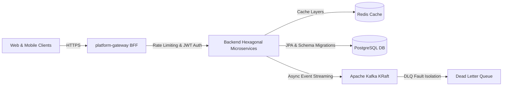

[](https://github.com/Muneeb7860/Swish_App/actions)
[](https://opensource.org/licenses/MIT)
[](https://img.shields.io/badge/Java-17-orange)
[](https://spring.io/projects/spring-boot)
[](https://react.dev/)Here is a comprehensive, world-class `README.md` for your **Swish App** repository. This version provides full structural clarity, fixes the Mermaid rendering issues that often break on GitHub, and highlights the technical depth of your 3-sided enterprise marketplace.

---

# Swish App 🚀

Welcome to **Swish**, an ultra-low latency, event-driven Quick Commerce (Q-Commerce) ecosystem engineered to guarantee hyper-local grocery delivery within a strict 15-minute window.

Swish is a **true 3-sided enterprise marketplace** designed around rigorous architectural standards (TOGAF alignment and COBIT 2019 resilience patterns). The platform utilizes a cutting-edge **Module Federation (Micro-Frontend)** presentation tier, an intelligent **Edge Routing Layer**, and a distributed, message-driven **Spring Boot Hexagonal Architecture** backend.

---

## 🏗️ 30-Second Architecture

Swish handles massive transactional throughput by isolating mutations through an optimized API Gateway, caching read-heavy hotspots at the edge, and decoupling state boundaries using an asynchronous message broker running in KRaft mode.



### Advanced System Engineering

* **Presentation Tier:** Sliced Micro-Frontends (`frontend-host`, `frontend-customer`, `frontend-rider`, `frontend-b2b`, `frontend-admin`) optimized via the Zustand `StateCreator` pattern, compiled with Vite, and styled natively with TailwindCSS v4.
* **Intelligent Automation:** Integrates advanced workflow engines (`docker-compose-n8n.yml`) to orchestrate asynchronous background tasks and external event hooks.
* **Resilience Framework:** Zero-dependency Apache Kafka running in KRaft mode combined with strict Redis Token Bucket edge rate-limiting to gracefully mitigate unexpected traffic surges.

---

## 📁 Repository Blueprint

The ecosystem is cleanly partitioned into domain-specific modules to maximize discoverability and unblock independent team delivery velocity:

```text
├── backend/                   # Principal Hexagonal Spring Boot core microservices
├── platform-gateway/          # Edge proxy, routing configurations, and cross-origin handling
├── core-business-engine/      # Domain rules, telemetry layers, and AI guardrail systems
├── notification-engine/       # Multi-channel notification routing, testing suites, and mocks
├── shared-async-services/     # Universal event schemas and asynchronous event utilities
├── frontend-*/                # Decoupled React + Vite Micro-Frontends (MFE) via Module Federation
├── infrastructure/            # Distributed Docker Compose environments and Kubernetes manifests
├── k8s/                       # Remediated infrastructure deployment definitions and security controls
├── docs/                      # Architectural Decision Records (ADRs), HLD, and LLD artifacts
├── scripts/                   # Automation matrices, cross-platform sync tools, and chaos suites
└── tests/                     # Centralized orchestration runners and validation targets

```

---

## 🚀 Quick Start Guide (5 Minutes to Prod)

Spin up the entire local infrastructure footprint—including frontends, microservices, databases, event brokers, and complete telemetry pipelines—using a single configuration:

### 1. Clone & Initialize

```bash
git clone https://github.com/Muneeb7860/Swish_App.git
cd Swish_App

```

### 2. Boot the Ecosystem Infrastructure

```bash
docker-compose -f infrastructure/docker-compose.yml up -d --build

```

### 3. Mission Control Port Mappings

Once your container instances report healthy, access the target entry points:

* 🛒 **Customer Storefront MFE:** `http://localhost:5173`
* 🏍️ **Rider Logistics MFE:** `http://localhost:5174`
* 🛠️ **Admin Management MFE:** `http://localhost:5175`
* 📊 **Grafana Core Metrics Control:** `http://localhost:3000`

---

## 🏆 Epic Deliverables & Proof of Concept

The platform is fortified across continuous optimization cycles to guarantee **Tier-1 Operational Readiness**.

### 🔄 CI/CD & Schema Evolution (Epic 1)

* **Hardened Delivery Gates:** Automated GitHub Actions run deep compilation checks, validation hooks, and quality checks on every inbound Pull Request targeting `develop` or `master`. (Verify via `.github/workflows/ci.yml`).
* **Deterministic Migrations:** Database state evolutions are tracked linearly and run natively using Flyway migration logic. (Verify via `backend/src/main/resources/db/migration/V1__init_schema.sql`).

### 📊 Observability & Distributed Telemetry (Epic 2)

* **Unified Metrics Logging:** Every microservice reports system telemetry metrics utilizing Micrometer and OpenTelemetry components.
* **Distributed Tracing:** Spans are passed across network boundaries and collected transparently into Zipkin infrastructure for structural latency deep-dives. (Verify via `platform-gateway` and service configurations).

### 🏎️ Scale, Reliability & Quality Assurance (Epic 3)

* **Asynchronous Fault Isolation:** Kafka streams implement a robust `DeadLetterPublishingRecoverer` strategy to prevent malformed poison-pill payloads from degrading line performance. (Verify via `KafkaConfig.java`).
* **Micro-Frontend Architecture:** Frontends use decoupled state management strategies, utilizing TypeScript types and Biome validation checks to block regression issues. (Verify via individual `frontend-*/` directories).
* **Comprehensive Testing:** End-to-end multi-step checkout and onboarding journeys are validated using high-fidelity Cypress UI automated tracks. (Verify via `frontend-host/cypress/e2e/journey.cy.ts`).

---

## 🧪 Structural Testing & Chaos Verification

We don't simply assume our services scale under pressure—we continuously break them to prove they can recover.

> ### 💥 Chaos Engineering Execution
> 
> 
> Trigger our custom automated runtime chaos suite to randomly drop target database dependencies and gateway layers to evaluate real-time Resilience4j fallback behavior:
> ```bash
> bash scripts/chaos.sh
> 
> ```
> 
> 

To run localized domain assertions, architectural layer validation rules, and isolated unit tests:

```bash
# Execute Backend JUnit & ArchUnit Architecture Guards
mvn test

# Run End-to-End Application Testing
npm run test:e2e

```

---

## 📜 Governance, Contribution & Security

* **Licensing:** Distributed under the open-source [MIT License](https://www.google.com/search?q=LICENSE).
* **Branch Strategy:** We follow a mandatory per-machine branching structure. Ensure your work complies with the standards detailed in `BRANCH_STRATEGY.md` and `CONTRIBUTING.md`.
* **Security & Vulnerabilities:** For responsible vulnerability disclosure pipelines, cryptographic signing definitions, and isolation configurations, review `SECURITY.md`.
