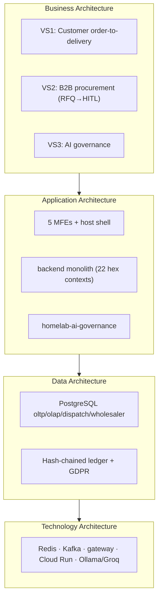

# Architecture & Delivery Framework Evaluation

Evaluation of Swish against four enterprise frameworks — **TOGAF** (enterprise
architecture), **SAFe** (scaled agile), **Disciplined Agile / DA** (right-sized
WoW), and **LeSS** (large-scale Scrum) — to harden the product design.

**Honest framing first.** These frameworks were built for different scales. SAFe
and LeSS assume *many teams* (50–125+ people / multiple Scrum teams on one
product); Swish today is a **single-developer, modular-monolith codebase**.
Applying their full ceremony now would be cargo-cult overhead. So this is a
*right-sizing* evaluation: **adopt the parts that genuinely make the design
robust now (TOGAF artefacts + DA way-of-working), and define the scale triggers
at which SAFe/LeSS become worth it.** Verdict per framework is in §5.

---

## 1. TOGAF — Enterprise Architecture (high applicability ✅)

TOGAF's **ADM** (gap analysis between a Baseline and a Target architecture, with
Transition Architectures between) maps almost perfectly onto work already done.

| ADM phase | Swish artefact (already exists) |
| :--- | :--- |
| A. Vision | BRD (North-Star B2B-SaaS vision) |
| B. Business Architecture | BRD §5 FRs, value streams (below), actors/use cases (`lld-complete.md`) |
| C. Data Architecture | Validated ERD (`data-model-erd-asbuilt.md`) + GDPR/ledger governance |
| C. Application Architecture | 22 hexagonal contexts + MFEs + AI lib (`architecture-c4-components.md`) |
| D. Technology Architecture | Spring Boot · PostgreSQL · Redis · Kafka · gateway/services · GCP Cloud Run · Ollama/Groq |
| E. Opportunities & Solutions | `AS_BUILT_VS_TARGET.md` §A gap analysis |
| F. Migration Planning | R1–R5 convergence roadmap = **Transition Architectures** |
| G. Implementation Governance | ADRs (`adr_001–004`), CI quality gates as fitness functions |
| H. Change Management | per-context re-evaluation at each phase boundary |

**The four architecture domains, as-built:**

**TOGAF robustness actions (adopt now):**
1. Treat `docs/diagrams/` as the **Architecture Repository** (it already is one).
2. Run R1–R5 as governed **Transition Architectures** — each phase has a defined baseline→target delta and exit criteria.
3. Keep **ADRs** as the architecture-governance log; require an ADR for any context extraction (R4).
4. Promote the CI gates (coverage 75%, security review, Cypress E2E, schema validate) to explicit **architecture fitness functions** — automated conformance to the target.

---

## 2. SAFe — Scaled Agile (low applicability now ⚠️, useful lenses)

Full SAFe needs an **Agile Release Train** (5–12 teams). Swish has one developer
— so portfolio/ART/PI ceremony is overkill. But three SAFe constructs add value
immediately:

- **Value Streams** — Swish has three (VS1 customer delivery, VS2 B2B
  procurement, VS3 AI governance). Naming them clarifies team-of-the-future
  boundaries and which contexts move together.
- **Portfolio epics** — R2–R5 are exactly portfolio epics; bill them as a Lean
  Portfolio backlog.
- **WSJF prioritisation** — applied to R2 below; this is the single most useful
  SAFe import for a small team.

**WSJF for R2** (Cost of Delay ÷ Job Size; higher = do first):

| Candidate | User/Biz value | Time criticality | Risk reduction | CoD | Job size | **WSJF** |
| :--- | :-: | :-: | :-: | :-: | :-: | :-: |
| **FR-06 Billing engine** | 8 | 8 | 5 | 21 | 5 | **4.2** |
| FR-01 Retailer portal | 7 | 5 | 4 | 16 | 8 | 2.0 |

→ **Billing engine first** (it monetises the SaaS and is the only *hard*
functional gap; smaller job, higher time-criticality). Retailer portal second.

**Scale trigger:** adopt **Essential SAFe (one ART)** only past ~4–5 teams /
~25 people.

---

## 3. Disciplined Agile (DA) — right-sized WoW (best fit now ✅)

DA's core tenet "**context counts — choose your WoW**" is the correct posture for
Swish's scale. Mapping:

- **Lifecycle:** *Continuous Delivery: Agile* — frequent small commits, trunkish
  `Mac_Machine→develop` flow, automated CI gates. Keep it.
- **Process goals that are already satisfied:** "Accelerate Value Delivery"
  (CI/CD), "Move Closer to Deployable" (Cypress E2E on real Postgres),
  "Govern" (ADRs + reconciliation doc).
- **Process goal to strengthen:** *"Explore Scope"* — the BRD↔as-built drift
  (now reconciled) was a scope-clarity gap; keep `AS_BUILT_VS_TARGET.md` live.
- **Right-sizing rule:** don't add roles/ceremonies until a real constraint
  appears. Solo → lean ADR + WSJF backlog is sufficient.

DA is the framework Swish should *consciously* run under today.

---

## 4. LeSS — Large-Scale Scrum (not applicable now ⚠️, architecture is ready)

LeSS = multiple **feature teams** on one product, owning vertical slices end-to-
end (over component teams/silos). Not applicable to a solo dev. But the key LeSS
*architecture* enabler is already in place:

- The **hexagonal bounded contexts** are feature-team-friendly: each owns its
  adapter→port→core→persistence vertical, so future teams can own *features*
  across the stack without stepping on a shared "DB team" or "UI team."
- The modular monolith is the ideal LeSS substrate — extract to services (R4)
  only when a team boundary genuinely needs fault/scale isolation.

**Scale trigger:** consider LeSS (2–8 feature teams, one Product Owner) when the
team reaches ~3+ teams and Conway's-law pressure appears. Until then, the design
just needs to *stay* feature-team-friendly (keep contexts vertically sliced).

---

## 5. Verdict & robustness recommendations

| Framework | Fit now | Adopt | Trigger to escalate |
| :--- | :-- | :--- | :--- |
| **TOGAF** | ✅ high | ADM gap-analysis + Architecture Repository + ADR governance + fitness functions | always-on, lightweight |
| **DA** | ✅ high | "Continuous Delivery: Agile" WoW, context-driven right-sizing | always-on |
| **SAFe** | ⚠️ partial | Value streams + portfolio epics + **WSJF** | Essential SAFe at ~4–5 teams |
| **LeSS** | ⚠️ later | keep architecture feature-team-friendly | 3+ feature teams |

**Net recommendation:** run Swish **as a TOGAF-governed, DA-delivered product**
now; borrow SAFe's **WSJF** for backlog ordering; keep the architecture
LeSS-ready (vertical contexts) for later team growth. Do **not** import SAFe/LeSS
ceremony until the scale triggers fire — premature scaling frameworks are a
common failure mode and would slow a small team.

**Top 5 robustness moves (concrete):**
1. Make CI gates **explicit fitness functions** with documented thresholds (conformance-as-code).
2. Run R1–R5 as **governed Transition Architectures**, each with exit criteria.
3. **ADR-gate** every service extraction (R4) and every cross-context dependency.
4. Keep `AS_BUILT_VS_TARGET.md` a **living** baseline↔target ledger (update each phase).
5. Order the backlog by **WSJF** → **R2 starts with the Billing engine**, then the Retailer portal.

---

> This evaluation makes the next step concrete: **R2 begins with FR-06 Billing
> engine** (WSJF 4.2), then FR-01 Retailer self-service portal (WSJF 2.0).
