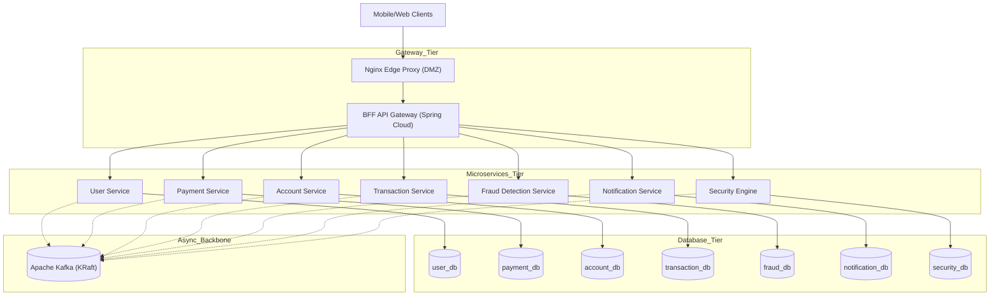

# High-Level Design (HLD): Swish Quick Commerce
**Version**: 3.0.0 (Microservices Edition)

---

## 1. System Context & Network Topology

---

## 2. Component Design & Patterns

### A. Database-per-Service (Sharding)
The legacy monolith has been decomposed. Each microservice owns its PostgreSQL database exclusively to prevent cross-service lock contention. Data consistency across boundaries is maintained via Kafka-driven Eventual Consistency.

### B. Strangler Fig Migration
The transition from monolith to microservices employs the Strangler Fig pattern with **Blue/Green deployments**. Clients use `Accept-Version: v1` or `Accept-Version: v2` headers. v2 requests are routed to the new extracted microservices, while v1 remains tied to the legacy monolith until cutover is complete.

### C. Kafka Topic Topology
We operate 9 core transactional topics, each with a `.dlq` companion topic:
1. `payment.initiated`
2. `payment.balance-check`
3. `payment.fraud-screen`
4. `payment.authorized`
5. `payment.captured`
6. `payment.failed`
7. `payment.refunded`
8. `payment.notification`
9. `payment.compensation`

### D. Security Architecture
*   **HashiCorp Vault**: Manages DB credentials, JWT secrets, and issues mTLS certificates.
*   **Audit Logging**: The `Security Engine` asynchronously consumes all domain events via the `security.audit` topic and writes immutable records to a dedicated MongoDB cluster.

### E. Redis Logical Isolation
A shared Redis 7 cluster provides fast data structures, logically isolated via DB indexes:
*   `DB0`: User Sessions
*   `DB1`: Account Balance Cache-Aside
*   `DB2`: Fraud Velocity Counters
*   `DB3`: Gamification Leaderboards

## 3. Observability
*   **Correlation ID**: `X-Correlation-ID` injected at the BFF, passed via HTTP headers and Kafka headers, and bound to `MDC` logs.
*   **Zipkin / Jaeger**: End-to-end distributed tracing.
*   **Prometheus**: Metrics scraping across all 7 services.

## 4. Formal Architecture Artifacts
For C4 diagrams, ERDs, and API contracts, see `docs/diagrams/`.
