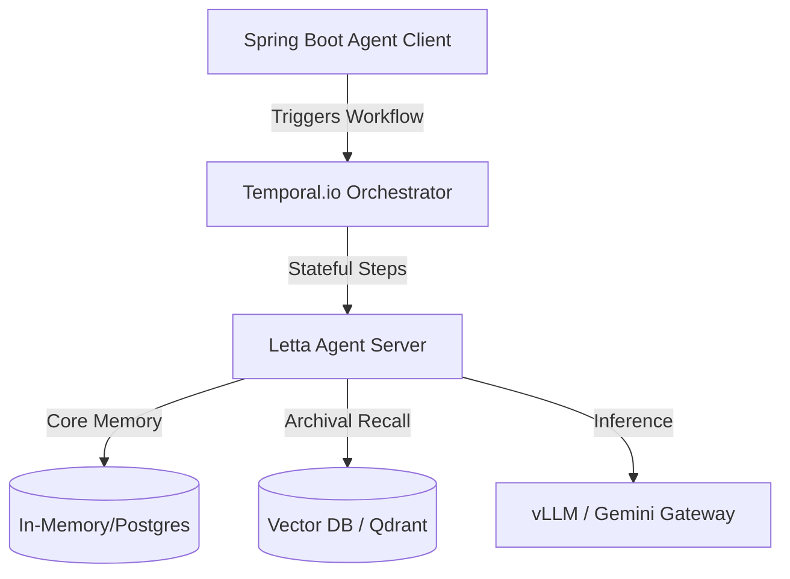

# Swish App: Agentic OS Architectural Blueprint

As an Agentic OS Architect, I have evaluated the current hybrid architecture (Spring Boot backend + Python Governance + local/cloud LLMs). Below is a curated selection of advanced, industry-standard tools and frameworks designed to maximize performance, resilience, and versatility while strictly respecting the **on-premise, PII-sensitive, and offline-first constraints** of the project.

---

## 1. High-Performance Local Inference Layer
To scale the dynamic pricing and customer support agents on bare-metal or on-premise VMs, raw Ollama needs to be upgraded to a production-grade inference server.

| Tool | Focus | Role in Swish App | Rationale |
|---|---|---|---|
| **vLLM** | High-Throughput Serving | Local LLM engine for Qwen/Llama | Implements **PagedAttention** which increases LLM serving throughput by 10x–20x compared to Ollama/HuggingFace under concurrent user requests. Exposes a standard OpenAI-compatible API out of the box. |
| **Llama.cpp / llama-cpp-python** | CPU-only Optimization | Light guardrail model executor | Perfect for running small classification models (e.g., a 1B model for semantic routing or PII categorization) directly on CPU-only edge VMs with minimal memory footprint. |

---

## 2. Stateful Agent Memory & Lifecycle Management
Currently, agents rely on simple REST request-response cycles. To support long-running procurement negotiations and multi-step customer support tickets, agents need structural memory and state management.

### Letta (formerly MemGPT)
* **What it does**: Implements virtual context management for LLM agents.
* **Application**: Allows the **Customer Support** and **B2B Procurement** agents to maintain infinite memory.
* **Why it's robust**: It divides memory into **Core Memory** (edited/updated dynamically by the agent itself) and **Archival Memory** (queried via semantic search from a local vector DB). This prevents the agent from forgetting context during a long negotiation or when the context window fills up.

### Temporal.io
* **What it does**: A distributed, durable execution engine.
* **Application**: Wrap the B2B wholesaler negotiation loops inside a Temporal Workflow.
* **Why it's robust**: Agent negotiations are non-deterministic, long-running, and prone to failures (e.g., wholesaler API timeouts, model hallucination). Temporal guarantees that if a server restarts mid-negotiation, the workflow resumes exactly where it left off, maintaining full state consistency.

---

## 3. Production-Grade Guardrails & Structured I/O
Instead of maintaining hand-coded regex and string matchers, standardizing the validation input/output schemas improves robustness.

> [!NOTE]
> Integrating structured validation frameworks guarantees that JSON payloads sent to Spring Boot always conform to the required DTO structures.

* **Guardrails AI**: Allows you to define `RAIL` schemas (Pydantic-like structures with validation logic) that run locally inside the Python governance service. It automatically intercepts, validates, and runs self-healing loops (asking the LLM to correct itself) before returning the final response to the backend.
* **NeMo Guardrails (NVIDIA)**: A powerful engine for defining conversational guardrails using Colang. It ensures that the support agent stays on-topic, respects safety guidelines, and does not engage in off-topic discussions (e.g. answering general knowledge questions unrelated to Swish App).

---

## 4. PII-Safe LLM Observability & Tracing
While LangSmith is a great cloud SaaS, it violates the homelab requirement where raw prompt content containing PII must not be sent to external networks.

> [!IMPORTANT]
> Keep 100% of LLM trace logs within the homelab boundaries.

* **Arize Phoenix / OpenLLMetry**:
  * **Self-Hosted Observability**: An open-source, fully dockerizable observability platform.
  * **Traces and Spans**: Integrates seamlessly with Spring AI and FastAPI using OpenTelemetry. It traces the exact execution graph of your agents, including intermediate steps like guardrail checks, database queries, and raw prompt/response content.
  * **Local Evaluation**: Allows you to run offline eval loops to track hallucinations, response latency, and token costs locally.

---

## 5. Automated Agent Testing & Red-Teaming
To ensure that prompt injections or edge-case payloads cannot bypass the Python governance layer, you need security scanner utilities.

* **Promptfoo**:
  * **Continuous Integration Test Suite**: A CLI tool that runs automated evaluations on LLM prompts.
  * **Red-Teaming**: You can define 100+ adversarial prompts (prompt injections, PII leakage attempts, jailbreaks) and run them against the governance pipeline in parallel.
  * **Assertive Checks**: Validates that the response contains `GOVERNANCE_DEGRADED` or is blocked, providing a pass/fail report before merges.

---

## 6. Evaluation of User-Suggested Tooling Options

Based on your requested tools, here is an architectural assessment of how they fit (or mismatch) with the **Swish App Hybrid Agentic Governance** stack:

### 🟢 Adopt (Highly Recommended / In Use)

| Tool | Status / Role in Stack | Architectural Fit |
|---|---|---|
| **FastAPI** | **Active** | Exposes the Python governance engine as a ultra-low-latency REST service to Spring Boot. |
| **Pydantic** | **Active** | Core validation library for inputs/outputs in the FastAPI layer, ensuring strict payload structures. |
| **Gemini** | **Active** | Used as the primary cloud LLM fallback gateway for non-sensitive/PII-free queries. |
| **Docker** | **Active** | Core packaging mechanism for containerizing on-premises servers and the future GKE path. |
| **NVIDIA NeMo Guardrails** | **Adopt** | Ideal for enforcing conversation flow and topical alignment inside the Python governance microservice. |
| **Hugging Face** | **Adopt** | Used to pull local sentence transformers (for PII detection) and local LLMs (for offline classification). |

### 🟡 Evaluate (Use Sparingly or conditionally)

| Tool | Focus | Evaluation / Trade-off |
|---|---|---|
| **Chroma** | Local Vector DB | Excellent if we need local, offline semantic memory. Prefer it over cloud DBs to keep all embeddings within the homelab. |
| **Streamlit** | Internal UI | Perfect for creating lightweight internal admin screens (e.g., to review human-in-the-loop tickets). |
| **Claude / OpenAI** | Cloud LLMs | Can be integrated as secondary fallback models for PII-free data, but Gemini remains primary. |
| **LlamaIndex / LangChain** | RAG / Frameworks | Useful if we build complex document retrieval later. Keep it restricted to the Python service; do not pollute the core Spring Boot architecture. |

### 🔴 Avoid (Violates Constraints or Adds Redundant Complexity)

| Tool | Constraint Violated | Rationale for Swish App |
|---|---|---|
| **LangSmith** | ❌ **PII Privacy** | Sends raw prompt/response traces containing customer PII to cloud SaaS. Use self-hosted **Arize Phoenix** instead. |
| **Pinecone** | ❌ **Offline-First** | Cloud-only vector database. Violates the requirement that data must stay within the homelab boundaries. |
| **crewAI / AutoGen** | ❌ **Simplification** | Multi-agent frameworks that run autonomous loops. Swish App delegates orchestration directly to Spring Boot and Temporal, making these redundant and non-deterministic. |
| **DSPy** | ❌ **Complexity** | Prompts are currently simple and deterministic. Programmatic prompt compilation is overkill for this phase. |
| **Langflow** | ❌ **Maintainability** | Visual drag-and-drop workflow tool. Not suitable for production-grade microservice code. |
