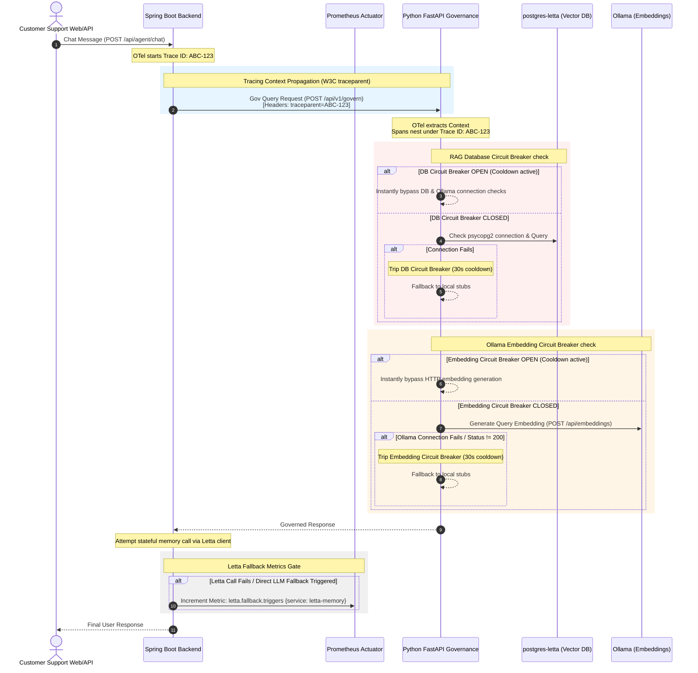

# Swish App: Agentic OS Hardening & Distributed Observability Report

This report summarizes the architectural changes, integration patterns, and verification results for the **AI Hardening & Observability Epic** implemented across the Spring Boot backend and the Python Governance microservice.

---

## 1. Executive Summary

To achieve **Tier-1 Enterprise** stability, resilience, and visibility, we have hardened the AI architecture under three core pillars:
1. **Low-Latency Fault Tolerance (RAG Circuit Breakers)**: Injected connection-level circuit breakers into the Python `MemoryMesh` retriever to prevent PostgreSQL or local Ollama timeouts from breaching the agent's 1-second SLA window.
2. **Day-2 Ops Telemetry (Prometheus Fallback Metrics)**: Exposed stateful Letta memory client fallback hits and connection exceptions as Spring Boot Actuator Prometheus metrics.
3. **Distributed Observability (Arize Phoenix Tracing Polish)**: Refactored Java HTTP client adapters to utilize auto-instrumented `RestTemplateBuilder` instances. This unifies independent Spring Boot and FastAPI traces into a single distributed context path visible in Arize Phoenix (`http://localhost:6006`).

---

## 2. Architectural Design & Trace Flow

The sequence diagram below illustrates the end-to-end request flow, emphasizing trace context propagation and the dual circuit breaker fail-safe paths in the Python RAG component.



---

## 3. Technical Implementation Details

### 3.1 Python RAG Circuit Breakers (`MemoryMesh`)
- **Location**: [memory_mesh.py](file:///Users/muneeb/Documents/GitHub/Swish_App-1/homelab-ai-governance/src/governance/stubs/memory_mesh.py)
- **Design Pattern**: Introduced class-level variables to preserve circuit breaker states across transient function invocation instances.
- **Cooldown Window**: Configured a `_cooldown_duration = 30.0` seconds interval.
- **Fail-safe Logic**:
  - Checks if `(time.time() - _db_failed_time) < 30` or `(time.time() - _embedding_failed_time) < 30` before attempting expensive connection handshakes or HTTP embedding posts.
  - If a breaker is tripped, the resolver immediately logs a warning and routes the execution path directly to local stubs (`DEFAULT_DOCUMENTS`), avoiding connection timeout delays.

### 3.2 Spring Boot Actuator Prometheus Metrics (`LettaMemoryService`)
- **Location**: [LettaMemoryService.java](file:///Users/muneeb/Documents/GitHub/Swish_App-1/backend/src/main/java/ch/swissqcommerce/backend/domain/agent/core/service/LettaMemoryService.java)
- **Dependency**: Uses Micrometer Core (`MeterRegistry` / `Counter`).
- **Metric Specifications**:
  - **Counter Name**: `letta.fallback.triggers`
  - **Tags**: `{"service": "letta-memory"}`
- **Activation Paths**: Increments the Prometheus counter whenever:
  1. Letta REST client encounters connection exceptions (e.g. `RestClientException`).
  2. The service receives an empty response body or lacks assistant role payload content.
  3. The local memory builder fails to retrieve or auto-create stateful agents.

### 3.3 OpenTelemetry Distributed Tracing Polish
- **Locations**:
  - [PythonGovernanceAdapter.java](file:///Users/muneeb/Documents/GitHub/Swish_App-1/backend/src/main/java/ch/swissqcommerce/backend/domain/agent/adapter/out/governance/PythonGovernanceAdapter.java)
  - [LettaConfig.java](file:///Users/muneeb/Documents/GitHub/Swish_App-1/backend/src/main/java/ch/swissqcommerce/backend/config/LettaConfig.java)
  - [GeminiFreeAdapter.java](file:///Users/muneeb/Documents/GitHub/Swish_App-1/backend/src/main/java/ch/swissqcommerce/backend/domain/agent/adapter/out/gemini/GeminiFreeAdapter.java)
- **Mechanism**: Removed manual `new RestTemplate()` instantiations. Injected `RestTemplateBuilder` into REST client constructors. 
- **Rationale**: Standard `new RestTemplate()` instances bypass Spring Boot's OpenTelemetry tracer interceptors. By utilizing `RestTemplateBuilder` configured beans, OpenTelemetry automatically injects W3C `traceparent` headers into outgoing requests, enabling downstream services to associate child spans to the parent trace context.

---

## 4. Integration Mapping

The table below lists the scraping endpoints and metrics configurations added to unify the observability stack.

| Service / Port | Path | Exposed Metrics / Scopes | Description |
| :--- | :--- | :--- | :--- |
| **Java Backend**<br/>Port `8080` | `/actuator/prometheus` | `letta_fallback_triggers_total` | Scraped by Prometheus to monitor Letta server fallback incidents. |
| **Python Governance**<br/>Port `8000` | `/api/v1/govern` | FastAPI trace spans | Integrates child spans under Spring Boot parent traces. |
| **Arize Phoenix UI**<br/>Port `6006` | `/` | Distributed Tracing Dashboard | Visually debugs request latency, trace graphs, and prompt payload structures. |

---

## 5. Verification & Test Results

The changes have been validated against a comprehensive test suite covering failure path resilience, Prometheus counters, and circuit breaker bypass validations.

### 5.1 Java Backend Test Report (`mvn clean test`)
All **292** unit and integration tests passed successfully. The test suite runs in absolute isolation and does not require external live Letta or Temporal servers.

```
[INFO] ------------------------------------------------------------------------
[INFO] Results:
[INFO] 
[INFO] Tests run: 292, Failures: 0, Errors: 0, Skipped: 0
[INFO] ------------------------------------------------------------------------
[INFO] BUILD SUCCESS
[INFO] ------------------------------------------------------------------------
```

Key verified test cases include:
- `testSendMessageIncrementsPrometheusCounterOnFailure`: Asserts that `letta.fallback.triggers` correctly increments by `1.0` when RestTemplate exchanges encounter `RestClientException`.
- `testSendMessageUsesConfiguredTokenAndModel`: Verifies Bearer authentication headers and model configurations.

### 5.2 Python Governance Test Report (`pytest`)
All **55** tests passed successfully.

```
collected 55 items

tests/test_config.py ........                                            [ 14%]
tests/test_evaluator/test_metrics.py .......                             [ 27%]
tests/test_guardrails/test_detectors.py ..........                       [ 45%]
tests/test_guardrails/test_enforcer.py .......                           [ 58%]
tests/test_guardrails/test_loader.py .....                               [ 67%]
tests/test_pipeline.py ......                                            [ 78%]
tests/test_router/test_decision_table.py ....                            [ 85%]
tests/test_router/test_memory_mesh.py ....                               [ 92%]
tests/test_router/test_pii_scan.py ....                                  [100%]

============================= 55 passed in 30.37s ==============================
```

Key verified test cases include:
- `test_memory_mesh_circuit_breaker`: Mocks DB and embedding service offline exceptions. Asserts that subsequent calls instantly bypass external checks during the 30-second cooldown period, returning stubs immediately.
- `reset_circuit_breakers` (Autouse Fixture): Guarantees test suite isolation by resetting static breaker fields between execution cycles.
