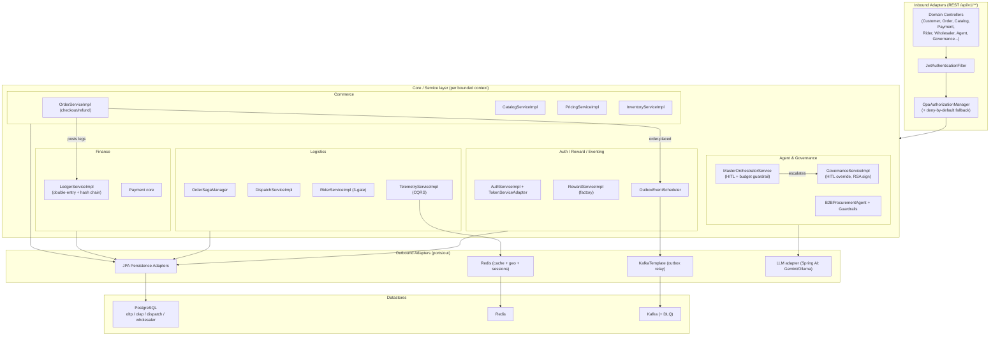
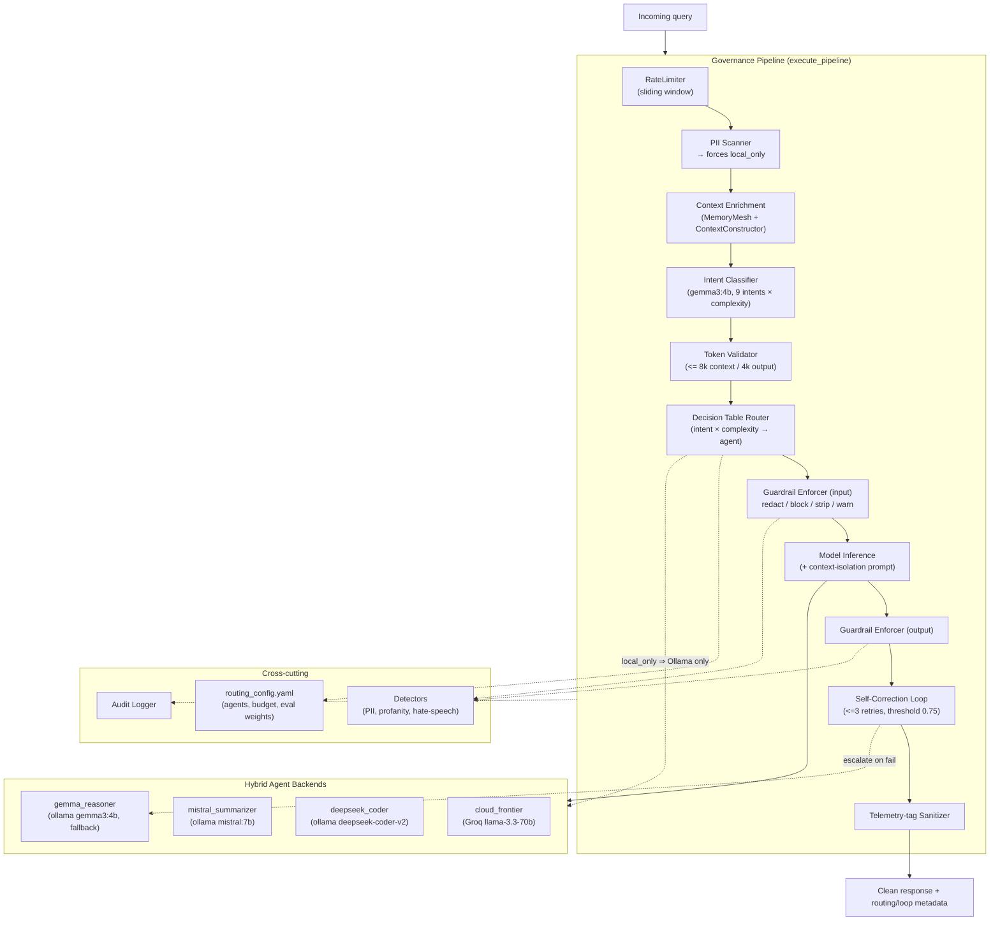

# C4 Component Diagrams — Whole Project (completion)

Completes the C4 **Level 3 (Component)** coverage. The existing
[`architecture-diagrams.md`](./architecture-diagrams.md) carries L1 (Context),
L2 (Container), and one L3 diagram (Payment Service Internals). This document
adds the missing L3 views for the two containers that actually run the bulk of
the system:

1. the **backend modular monolith** (the 22 hexagonal bounded contexts), and
2. the **AI Governance Platform** (`homelab-ai-governance`) — the distributed
   hybrid-agentic layer, previously absent from every diagram.

> Reality note: L1/L2 in `architecture-diagrams.md` describe a *target*
> database-per-service microservices topology. As-built, the 22 contexts run in
> a **single `backend` deployable** (modular monolith, schemas `oltp/olap/
> dispatch/wholesaler`) alongside a few thin services and the new Python
> governance library. These component diagrams reflect the as-built code.

---

## L3 — Backend Modular Monolith (`backend`, port 8083)

Every context follows the same hexagonal shape: an inbound web adapter → a
use-case **port (in)** → a `core/service` → outbound **ports (out)** →
persistence/event adapters. Contexts are grouped by cluster; cross-context calls
go through ports, never directly into another context's core.

Key cross-context invariants visible above: checkout posts to the ledger
(balance + hash-chain triggers in the DB), writes to the outbox (relayed to
Kafka by the scheduler), and the agent escalates low-confidence/over-budget work
to governance HITL. Authorization is layered: filter → OPA → method-level
`@PreAuthorize`/`assertOwnership`.

---

## L3 — AI Governance Platform (`homelab-ai-governance`)

A standalone Python service (not yet wired into the Java backend) implementing
**distributed hybrid-agentic governance**: a semantic router fans queries across
local **Ollama** models and a **cloud frontier** model, wrapped in guardrails,
PII-gated local routing, a recursive self-correction loop, and audit. Mirrors
the Java agent's budget guardrail ($5/day, 100 req/hr).

Source: `homelab-ai-governance/src/governance/pipeline.py` (`execute_pipeline`).

**Hardening controls (Phase 9):** rate limiting, PII-driven local-only routing,
input+output guardrails, prompt-injection-resistant context isolation, recursive
self-correction with a local Gemma fallback, and full audit logging.

---

## As-Built Container Addendum

The L2 container diagram in `architecture-diagrams.md` predates the AI governance
layer. As-built, add:

| Container | Tech | Role |
| :--- | :--- | :--- |
| `homelab-ai-governance` | Python (pytest) | Hybrid-agentic router + guardrails + eval |
| Ollama runtime | local LLMs | gemma3:4b · mistral:7b · deepseek-coder-v2 |
| Groq API | cloud LLM | `cloud_frontier` frontier model |
| `backend` | Spring Boot (8083) | The 22 hexagonal contexts (monolith) |

**Integration gap (open):** `homelab-ai-governance` is standalone — no call path
from the Java `backend` (`MasterOrchestratorService`) into the Python governance
pipeline yet. Wiring those two agentic layers together is the natural next step
of the distributed hybrid-agentic build.

---

## C4 coverage status

| Level | Coverage |
| :--- | :--- |
| L1 Context | ✅ `architecture-diagrams.md` |
| L2 Container | ✅ `architecture-diagrams.md` + addendum above (AI governance) |
| L3 Component — Payment | ✅ `architecture-diagrams.md` |
| L3 Component — Backend monolith | ✅ this doc |
| L3 Component — AI Governance Platform | ✅ this doc |
| L4 Code | ▫ intentionally omitted (covered by the sequence diagrams) |
