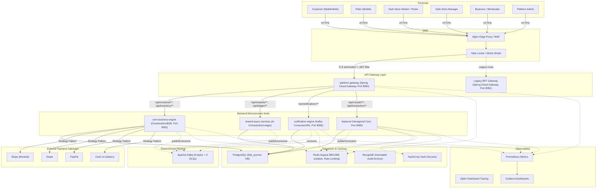
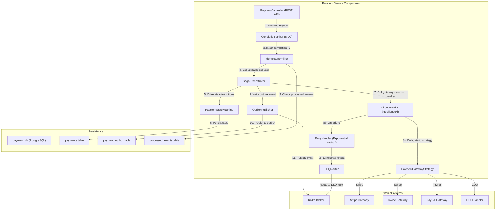
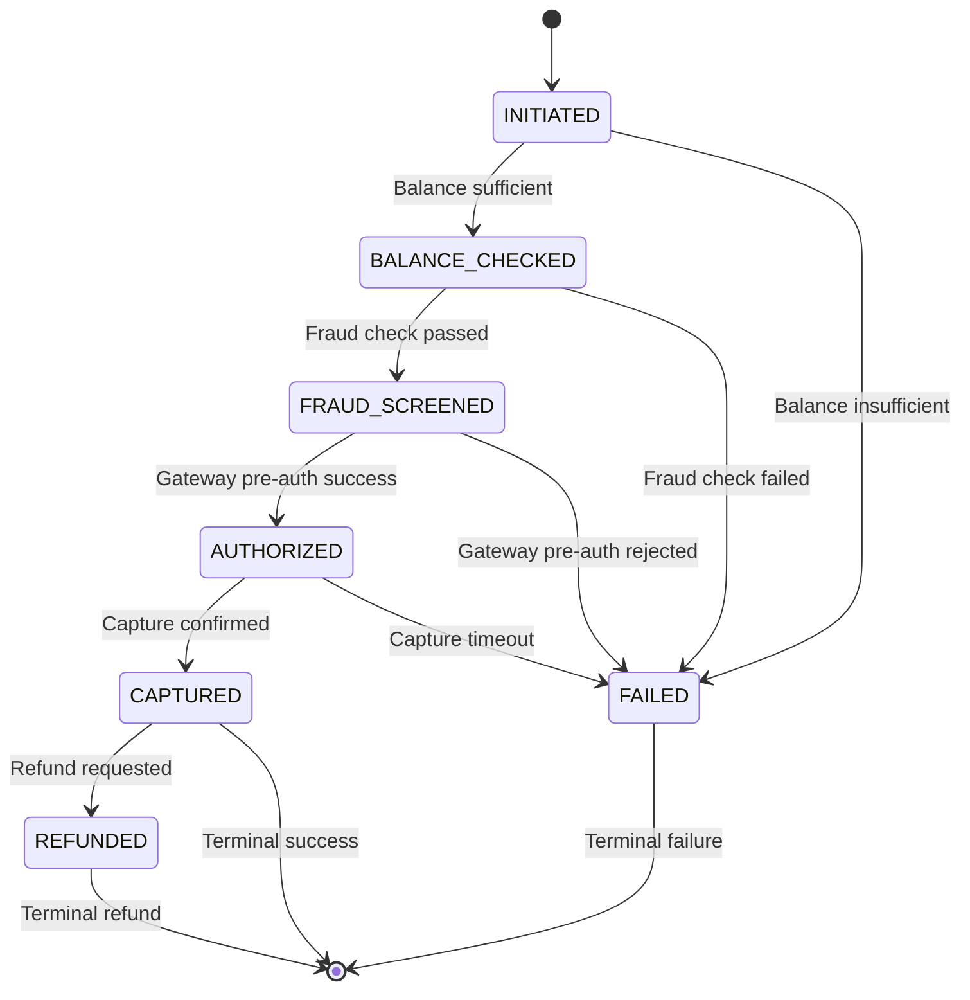

# Architecture Diagrams — Swish Payment Ecosystem (Microservices)

This document contains the formal C4 architecture artifacts for the Swish Quick Commerce platform, reflecting the updated **database-per-service microservices architecture** and newer services (`platform-gateway`, `core-business-engine`, `notification-engine`, `shared-async-services`) added in recent sprints.

> **Migration Strategy**: Strangler Fig pattern with blue/green deployment and API versioning (`Accept-Version: v1, v2`).

---

## C4 Context Diagram

Shows all external personas, the DMZ boundary, API Gateways, new and legacy microservices, and shared infrastructure components.

---

## C4 Container Diagram

Database-per-service layout mapping the container boundaries, ports, and databases (PostgreSQL databases, Redis logical caching, Kafka topics) for the updated service suite.

```mermaid
flowchart TB
  subgraph Clients
    WebApp["Web Application (frontend-host Shell)"]
    CustomerApp["Customer App (frontend-customer)"]
    RiderApp["Rider App (frontend-rider)"]
    B2bDashboard["B2B Wholesale Dashboard (frontend-b2b)"]
    AdminPortal["Admin Portal (frontend-admin)"]
  end

  subgraph Gateway["Gateway Tier"]
    PlatformGW["platform-gateway (Spring Cloud Gateway, Port 8080)"]
    IdempFilter["IdempotencyFilterFactory"]
    RateLimiterFilter["Redis Rate Limiter"]
    SecurityConf["SecurityConfig"]
  end

  subgraph CoreServices["Core Service Tier"]
    subgraph BackendModule["backend Service (Hexagonal Core, Port 8080)"]
      HexCore["Hexagonal Domains (Transaction, Payment, Inventory)"]
    end
    
    subgraph CoreBusiness["core-business-engine (Port 8081)"]
      CheckoutSvc["Checkout & Stripe-Mock"]
      B2bOrderSvc["B2bOrderService"]
      AiSweeper["AI Evaluation Timeout Sweeper"]
    end

    subgraph NotificationSvc["notification-engine (Port 8082)"]
      KafkaCons["NotificationKafkaConsumer"]
      RedisPubSub["Redis Pub/Sub & WebSockets"]
      Channels["Dispatcher & Channels (Email/Push/WS)"]
    end

    subgraph SharedAsync["shared-async-services"]
      AiOrch["AI Model Orchestration Port"]
      FinLedger["Financial Ledger Entry"]
    end
  end

  subgraph Storage["Datastore Backplane"]
    Postgres["PostgreSQL (b2b_qcomm DB)"]
    Redis["Redis (DB0: Sessions, DB1: Rate Limits, DB2: Pub/Sub)"]
    MongoDB["MongoDB (Audit Logs Archive)"]
    Vault["HashiCorp Vault"]
  end

  subgraph MessageBroker["Message Broker"]
    direction LR
    T1["b2b.checkout.events"]
    T2["b2b.wholesale.order.placed"]
    T3["b2b.wholesale.order.evaluated"]
    T4["security.audit"]
    DLQ["DLQ Companion Topics"]
  end

  WebApp --> PlatformGW
  CustomerApp --> PlatformGW
  RiderApp --> PlatformGW
  B2bDashboard --> PlatformGW
  AdminPortal --> PlatformGW

  PlatformGW --> IdempFilter
  PlatformGW --> RateLimiterFilter
  PlatformGW --> SecurityConf

  PlatformGW -->|"/api/checkout/**"| CoreBusiness
  PlatformGW -->|"/ws/notifications/**"| NotificationSvc
  PlatformGW -->|"/api/ledger/**"| SharedAsync
  PlatformGW -->|"/api/transaction/**"| BackendModule

  BackendModule --> Postgres
  CoreBusiness --> Postgres
  NotificationSvc --> Postgres

  BackendModule -.-> Redis
  CoreBusiness -.-> Redis
  NotificationSvc -.-> Redis
  PlatformGW -.-> Redis

  CoreBusiness -.->|"publish"| T1
  CoreBusiness -.->|"publish"| T2
  NotificationSvc -.->|"consume"| T3
  BackendModule -.->|"publish"| T4

  BackendModule -.-> MongoDB
  BackendModule -.-> Vault
```

---

## C4 Component Diagram — Payment Service Internals

Deep dive into the Payment Service showing the Saga Orchestrator, State Machine, Circuit Breaker, Outbox Publisher, Idempotency Filter, and Gateway Strategy.

---

## Payment State Machine

---

## Kafka Topic Topology

| # | Topic Name                       | Publisher            | Consumer(s)                      | DLQ Companion                           |
|---|----------------------------------|----------------------|----------------------------------|-----------------------------------------|
| 1 | `b2b.checkout.events`            | Core Business Engine | Platform Gateway                 | `b2b.checkout.events.dlq`               |
| 2 | `b2b.wholesale.order.placed`     | Core Business Engine | B2B Procurement Agent            | `b2b.wholesale.order.placed.dlq`        |
| 3 | `b2b.wholesale.order.evaluated`  | Core Business Engine | Notification Engine              | `b2b.wholesale.order.evaluated.DLQ`     |
| 4 | `payment.initiated`              | Backend Core         | Account Service                  | `payment.initiated.dlq`                 |
| 5 | `payment.authorized`             | Backend Core         | Transaction Service              | `payment.authorized.dlq`                |
| 6 | `payment.captured`               | Backend Core         | Transaction, Notification        | `payment.captured.dlq`                  |
| 7 | `payment.failed`                 | Backend Core         | Notification Service             | `payment.failed.dlq`                    |
| 8 | `payment.refunded`               | Backend Core         | Account, Transaction, Notif.     | `payment.refunded.dlq`                  |
| 9 | `security.audit`                 | All Services         | Security Engine                  | `security.audit.dlq`                    |

## Redis Logical Database Allocation

| DB  | Purpose              | Service(s)                | Data Pattern             |
|-----|----------------------|---------------------------|--------------------------|
| DB0 | Session Store        | User Service / Backend    | JWT session tokens       |
| DB1 | Rate Limiting Cache  | Platform Gateway          | Sliding window counters  |
| DB2 | WebSocket Pub/Sub    | Notification Engine       | Redis Channels           |
| DB3 | Product Catalog Cache| Catalog Service / Engine  | Cache-aside products    |

---

## Design Patterns Applied

| Pattern                        | Implementation                                      |
|--------------------------------|-----------------------------------------------------|
| Outbox Pattern                 | `payment_outbox` table + `OutboxPublisher` CDC       |
| Idempotency                    | Redis-based `IdempotencyFilter` in gateway          |
| Circuit Breaker                | Resilience4j wrapping client gateway calls          |
| Retry with Exponential Backoff | `RetryHandler` with jitter on transient failures     |
| Dead Letter Queue              | DLQ companion topics for poison pill isolation      |
| Choreography Saga              | Kafka-driven event chain across services             |
| Correlation ID                 | MDC filter + Kafka header propagation                |
| Strategy Pattern               | `PaymentGatewayStrategy` for Stripe/Swipe/PayPal/COD |
| Strangler Fig                  | Gateway-driven routing to new vs legacy backend     |

> **Notes:**
> - Each microservice owns its PostgreSQL database schema exclusively — no cross-service joins.
> - Async communication uses Kafka; synchronous fallback is only for health checks.
> - The Security Engine consumes audit events from all services and archives to MongoDB.
> - HashiCorp Vault manages all secrets; services fetch credentials at startup via Vault Agent sidecar.
