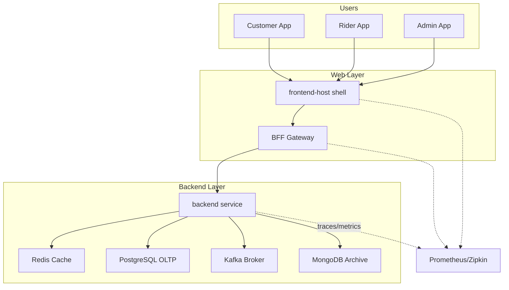
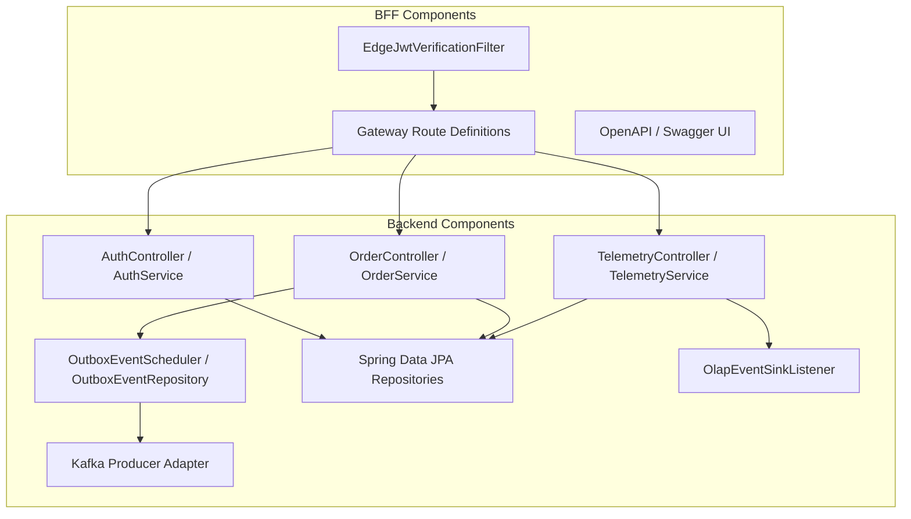

# Architecture Diagrams

This document contains the formal architecture artifacts for the Swish App platform.

## C4 Context Diagram

```mermaid
flowchart TB
  subgraph External Users
    Customer[Customer User]
    Rider[Rider User]
    Admin[Admin User]
  end

  subgraph DMZ
    Edge[Nginx Edge Proxy / JWT Filter]
  end

  subgraph Application
    BFF[Gateway BFF (Spring Cloud Gateway)]
    FrontendHost[Frontend Host Shell]
    Backend[Backend Core (Spring Boot)]
  end

  subgraph DataServices
    Postgres[PostgreSQL OLTP]
    Mongo[MongoDB Analytics Archive]
    Kafka[Apache Kafka Event Bus]
    Redis[Redis Cache / Geo Store]
  end

  subgraph Observability
    Zipkin[Zipkin Tracing]
    Prometheus[Prometheus Metrics]
    Grafana[Grafana Dashboards]
  end

  Customer -->|browser/API| FrontendHost
  Rider -->|browser/API| FrontendHost
  Admin -->|browser/API| FrontendHost
  FrontendHost -->|HTTP| BFF
  BFF -->|authenticated proxy| Backend
  BFF -->|OpenAPI docs| FrontendHost

  Backend --> Postgres
  Backend --> Mongo
  Backend --> Kafka
  Backend --> Redis

  Backend --> Zipkin
  Backend --> Prometheus
  BFF --> Prometheus
  FrontendHost --> Prometheus

  Kafka -->|stream| Backend
  Kafka -->|telemetry events| Mongo

  Edge -->|JWT verification / header rewrite| BFF
  Edge -->|TLS termination| FrontendHost
```
```

## C4 Container Diagram



## C4 Component Diagram


```

> Notes:
> - The BFF handles authentication boundary logic and routes traffic to backend services.
> - The backend implements hexagonal architecture via controllers, service ports, and adapters.
> - The backend persists transactional outbox records in `oltp.outbox_events` and uses `OutboxEventScheduler` to emulate Kafka/CDC dispatch.
> - Telemetry is decoupled from transactional write paths using Kafka and MongoDB.
