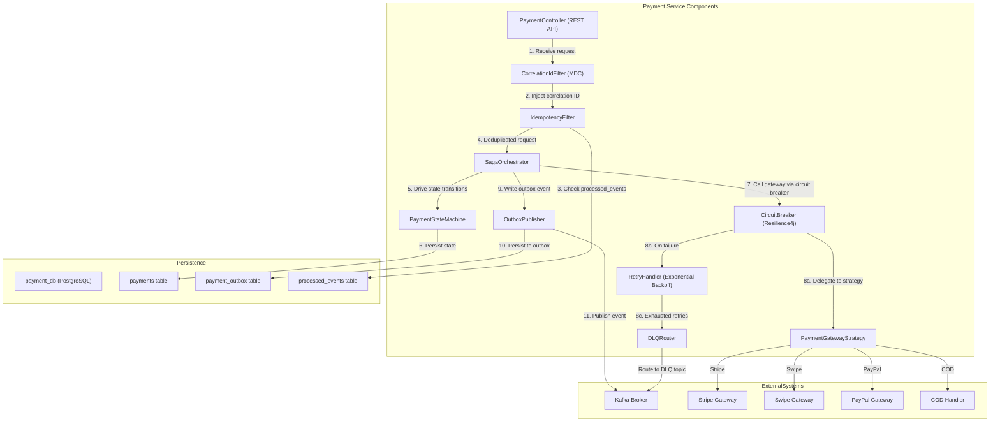
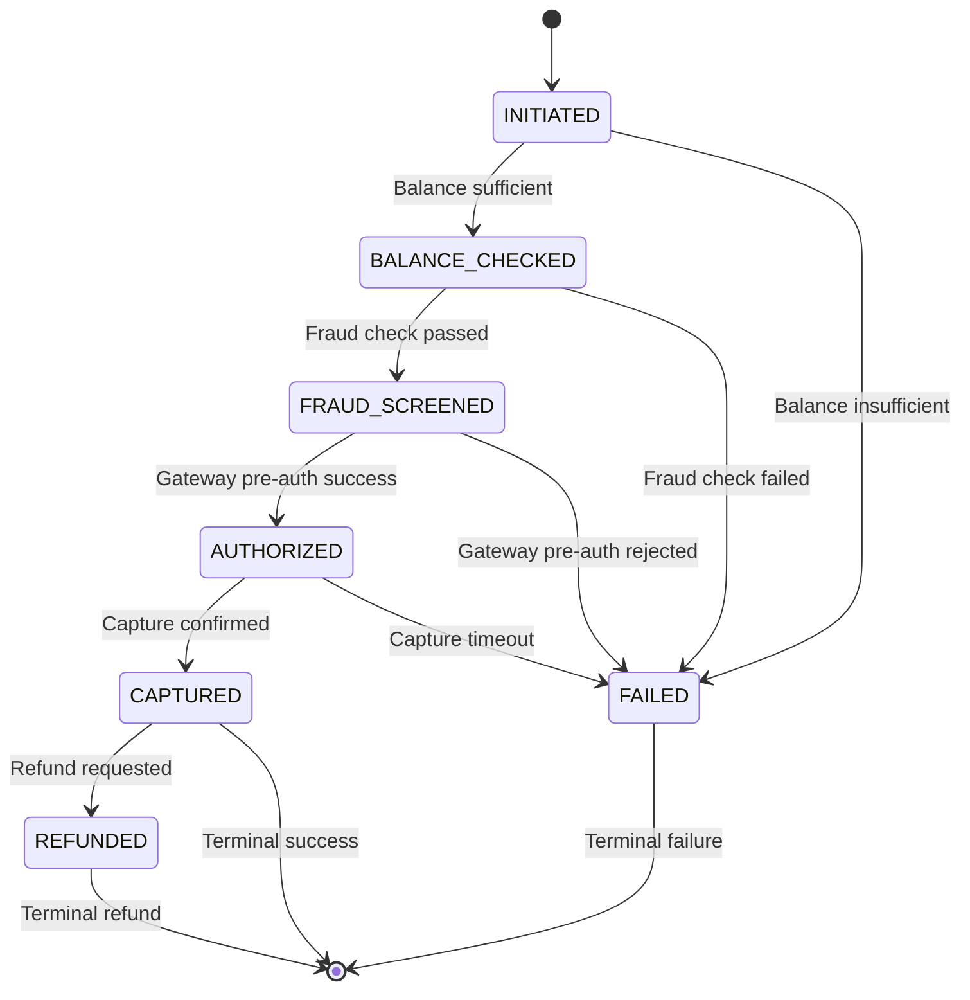

# Architecture Diagrams — Swish Payment Ecosystem (Microservices)

This document contains the formal C4 architecture artifacts for the Swish Quick Commerce platform,
reflecting the **database-per-service microservices architecture** that replaces the previous monolithic deployment.

> **Migration Strategy**: Strangler Fig pattern with blue/green deployment and API versioning (`Accept-Version: v1, v2`).

---

## C4 Context Diagram

Shows all external personas, the DMZ boundary, API Gateway, 7 backend microservices,
and shared infrastructure components.

```mermaid
flowchart TB
  subgraph Personas
    Customer["Customer (Mobile/Web)"]
    Rider["Rider (Mobile)"]
    DSWorker["Dark Store Worker"]
    DSManager["Dark Store Manager"]
    Business["Business / Wholesaler"]
    Admin["Platform Admin"]
  end

  subgraph DMZ
    Edge["Nginx Edge Proxy / WAF"]
    RateLimiter["Rate Limiter / DDoS Shield"]
  end

  subgraph API_Gateway["API Gateway Layer"]
    BFF["BFF Gateway (Spring Cloud Gateway)"]
  end

  subgraph Microservices["Backend Microservices"]
    UserSvc["User Service"]
    PaymentSvc["Payment Service"]
    AccountSvc["Account Service"]
    TransactionSvc["Transaction Service"]
    FraudSvc["Fraud Detection Service"]
    NotifSvc["Notification Service"]
    SecuritySvc["Security Engine"]
  end

  subgraph ShardedDatabases["Sharded Databases (PostgreSQL)"]
    UserDB["user_db"]
    PaymentDB["payment_db"]
    AccountDB["account_db"]
    TransactionDB["transaction_db"]
    FraudDB["fraud_db"]
    NotifDB["notification_db"]
    SecurityDB["security_db"]
  end

  subgraph SharedInfra["Shared Infrastructure"]
    Kafka["Apache Kafka (9 topics + 9 DLQs)"]
    Redis["Redis (DB0-DB3 logical isolation)"]
    Mongo["MongoDB (Immutable Audit Archive)"]
    Vault["HashiCorp Vault (Secrets)"]
  end

  subgraph Observability
    Zipkin["Zipkin Distributed Tracing"]
    Prometheus["Prometheus Metrics"]
    Grafana["Grafana Dashboards"]
  end

  subgraph ExternalGateways["External Payment Gateways"]
    Stripe["Stripe"]
    Swipe["Swipe"]
    PayPal["PayPal"]
    COD["Cash on Delivery"]
  end

  Customer -->|"HTTPS"| Edge
  Rider -->|"HTTPS"| Edge
  DSWorker -->|"HTTPS"| Edge
  DSManager -->|"HTTPS"| Edge
  Business -->|"HTTPS"| Edge
  Admin -->|"HTTPS"| Edge

  Edge --> RateLimiter
  RateLimiter -->|"TLS termination + JWT filter"| BFF

  BFF -->|"route"| UserSvc
  BFF -->|"route"| PaymentSvc
  BFF -->|"route"| AccountSvc
  BFF -->|"route"| TransactionSvc
  BFF -->|"route"| FraudSvc
  BFF -->|"route"| NotifSvc
  BFF -->|"route"| SecuritySvc

  UserSvc --> UserDB
  PaymentSvc --> PaymentDB
  AccountSvc --> AccountDB
  TransactionSvc --> TransactionDB
  FraudSvc --> FraudDB
  NotifSvc --> NotifDB
  SecuritySvc --> SecurityDB

  PaymentSvc -->|"Strategy Pattern"| Stripe
  PaymentSvc -->|"Strategy Pattern"| Swipe
  PaymentSvc -->|"Strategy Pattern"| PayPal
  PaymentSvc -->|"Strategy Pattern"| COD

  UserSvc -.->|"publish/consume"| Kafka
  PaymentSvc -.->|"publish/consume"| Kafka
  AccountSvc -.->|"publish/consume"| Kafka
  TransactionSvc -.->|"consume"| Kafka
  FraudSvc -.->|"publish/consume"| Kafka
  NotifSvc -.->|"consume"| Kafka
  SecuritySvc -.->|"consume"| Kafka

  UserSvc -.-> Redis
  PaymentSvc -.-> Redis
  AccountSvc -.-> Redis
  FraudSvc -.-> Redis

  SecuritySvc -.-> Mongo
  SecuritySvc -.-> Vault

  UserSvc -.-> Prometheus
  PaymentSvc -.-> Prometheus
  AccountSvc -.-> Prometheus
  TransactionSvc -.-> Prometheus
  FraudSvc -.-> Prometheus
  NotifSvc -.-> Prometheus
  SecuritySvc -.-> Prometheus
  BFF -.-> Prometheus
  Prometheus --> Grafana
```

---

## C4 Container Diagram

Database-per-service layout with all 7 PostgreSQL instances, Kafka topic topology,
shared Redis with logical DB isolation, MongoDB audit archive, and HashiCorp Vault.

```mermaid
flowchart TB
  subgraph Clients
    WebApp["Web Application"]
    MobileApp["Mobile Application"]
    AdminPortal["Admin Portal"]
  end

  subgraph Gateway
    BFF["BFF Gateway (Spring Cloud Gateway)"]
  end

  subgraph UserServiceContainer["User Service"]
    UserApp["user-service (Spring Boot)"]
    UserPG["user_db (PostgreSQL)"]
  end

  subgraph PaymentServiceContainer["Payment Service"]
    PayApp["payment-service (Spring Boot)"]
    PayPG["payment_db (PostgreSQL)"]
  end

  subgraph AccountServiceContainer["Account Service"]
    AccApp["account-service (Spring Boot)"]
    AccPG["account_db (PostgreSQL)"]
  end

  subgraph TransactionServiceContainer["Transaction Service"]
    TxApp["transaction-service (Spring Boot)"]
    TxPG["transaction_db (PostgreSQL)"]
  end

  subgraph FraudServiceContainer["Fraud Detection Service"]
    FraudApp["fraud-service (Spring Boot)"]
    FraudPG["fraud_db (PostgreSQL)"]
  end

  subgraph NotificationServiceContainer["Notification Service"]
    NotifApp["notification-service (Spring Boot)"]
    NotifPG["notification_db (PostgreSQL)"]
  end

  subgraph SecurityServiceContainer["Security Engine"]
    SecApp["security-engine (Spring Boot)"]
    SecPG["security_db (PostgreSQL)"]
  end

  subgraph KafkaCluster["Apache Kafka"]
    direction LR
    T1["payment.initiated"]
    T2["payment.balance-check"]
    T3["payment.fraud-screen"]
    T4["payment.authorized"]
    T5["payment.captured"]
    T6["payment.failed"]
    T7["payment.refunded"]
    T8["payment.notification"]
    T9["security.audit"]
    DLQ["9 DLQ companion topics"]
  end

  subgraph RedisCluster["Redis (Logical DB Isolation)"]
    RDB0["DB0: Sessions"]
    RDB1["DB1: Balance Cache"]
    RDB2["DB2: Velocity / Fraud Counters"]
    RDB3["DB3: Leaderboards"]
  end

  subgraph AuditStore["Audit Infrastructure"]
    MongoDB["MongoDB (Immutable Archive)"]
    HCVault["HashiCorp Vault (Secrets)"]
  end

  WebApp --> BFF
  MobileApp --> BFF
  AdminPortal --> BFF

  BFF --> UserApp
  BFF --> PayApp
  BFF --> AccApp
  BFF --> TxApp
  BFF --> FraudApp
  BFF --> NotifApp
  BFF --> SecApp

  UserApp --> UserPG
  PayApp --> PayPG
  AccApp --> AccPG
  TxApp --> TxPG
  FraudApp --> FraudPG
  NotifApp --> NotifPG
  SecApp --> SecPG

  UserApp -.-> RDB0
  AccApp -.-> RDB1
  FraudApp -.-> RDB2
  PayApp -.-> RDB3

  PayApp -.->|"outbox publish"| T1
  AccApp -.->|"consume"| T2
  FraudApp -.->|"consume"| T3
  PayApp -.->|"consume"| T4
  TxApp -.->|"consume"| T5
  PayApp -.->|"publish"| T6
  PayApp -.->|"publish"| T7
  NotifApp -.->|"consume"| T8
  SecApp -.->|"consume"| T9

  SecApp -.-> MongoDB
  SecApp -.-> HCVault
```

---

## C4 Component Diagram — Payment Service Internals

Deep dive into the Payment Service showing the Saga Orchestrator, State Machine,
Circuit Breaker, Outbox Publisher, Idempotency Filter, and Gateway Strategy.

---

## Payment State Machine

---

## Kafka Topic Topology

| # | Topic Name              | Publisher          | Consumer(s)                   | DLQ Companion                   |
|---|-------------------------|--------------------|-------------------------------|----------------------------------|
| 1 | `payment.initiated`     | Payment Service    | Account Service               | `payment.initiated.dlq`         |
| 2 | `payment.balance-check` | Account Service    | Payment Service               | `payment.balance-check.dlq`     |
| 3 | `payment.fraud-screen`  | Payment Service    | Fraud Detection Service       | `payment.fraud-screen.dlq`      |
| 4 | `payment.authorized`    | Payment Service    | Transaction Service           | `payment.authorized.dlq`        |
| 5 | `payment.captured`      | Payment Service    | Transaction, Notification     | `payment.captured.dlq`          |
| 6 | `payment.failed`        | Payment Service    | Notification Service          | `payment.failed.dlq`            |
| 7 | `payment.refunded`      | Payment Service    | Account, Transaction, Notif.  | `payment.refunded.dlq`          |
| 8 | `payment.notification`  | Payment Service    | Notification Service          | `payment.notification.dlq`      |
| 9 | `security.audit`        | All Services       | Security Engine               | `security.audit.dlq`            |

## Redis Logical Database Allocation

| DB  | Purpose             | Service(s)              | Data Pattern            |
|-----|---------------------|-------------------------|-------------------------|
| DB0 | Session Store       | User Service            | JWT session tokens      |
| DB1 | Balance Cache       | Account Service         | Cache-aside wallet      |
| DB2 | Velocity / Fraud    | Fraud Detection Service | Sliding window counters |
| DB3 | Leaderboards        | Payment / Gamification  | Sorted sets             |

---

## Design Patterns Applied

| Pattern                        | Implementation                                      |
|--------------------------------|-----------------------------------------------------|
| Outbox Pattern                 | `payment_outbox` table + `OutboxPublisher` CDC       |
| Idempotency                    | `processed_events` table + `IdempotencyFilter`       |
| Circuit Breaker                | Resilience4j wrapping gateway calls                  |
| Retry with Exponential Backoff | `RetryHandler` with jitter on transient failures     |
| Dead Letter Queue              | 9 DLQ companion topics for poison pill isolation     |
| Choreography Saga              | Kafka-driven event chain across services             |
| Correlation ID                 | MDC filter + Kafka header propagation                |
| Strategy Pattern               | `PaymentGatewayStrategy` for Stripe/Swipe/PayPal/COD |
| Strangler Fig                  | Blue/green deployment + `Accept-Version` header      |

> **Notes:**
> - Each microservice owns its PostgreSQL database exclusively — no cross-service joins.
> - Async communication uses Kafka; synchronous fallback is only for health checks.
> - The Security Engine consumes audit events from all services and archives to MongoDB.
> - HashiCorp Vault manages all secrets; services fetch credentials at startup via Vault Agent sidecar.
