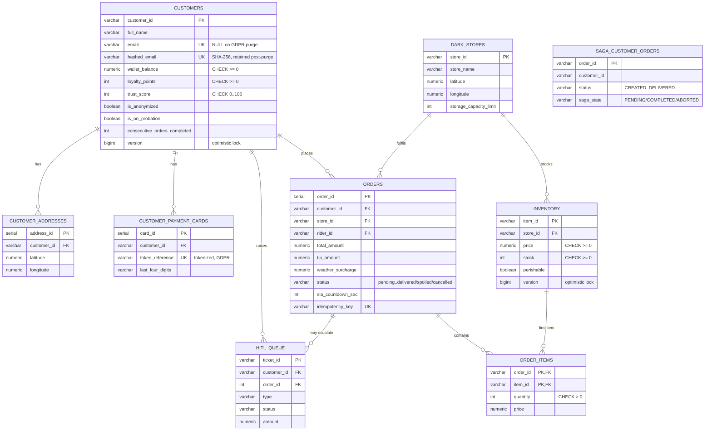
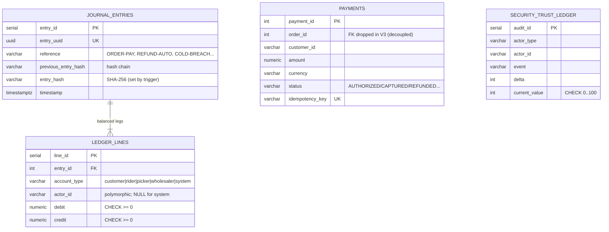
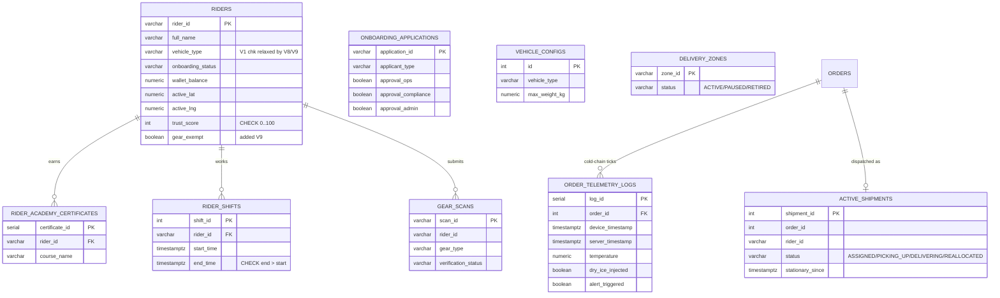
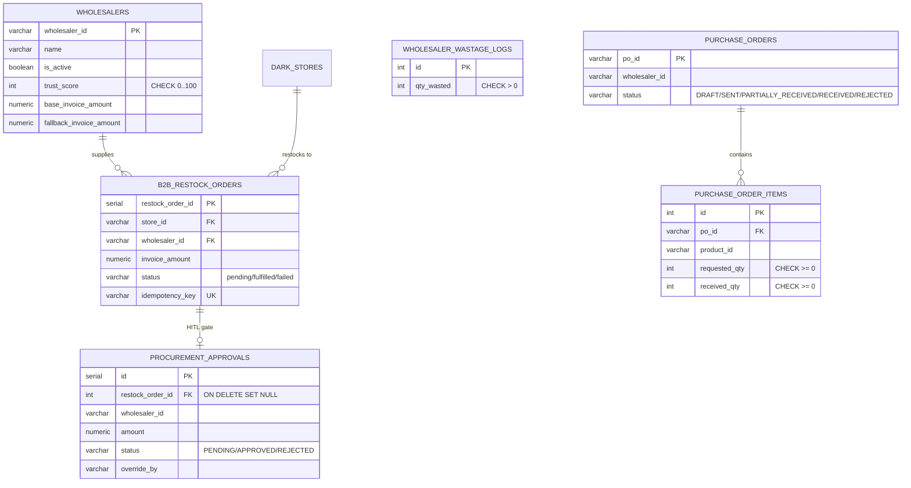
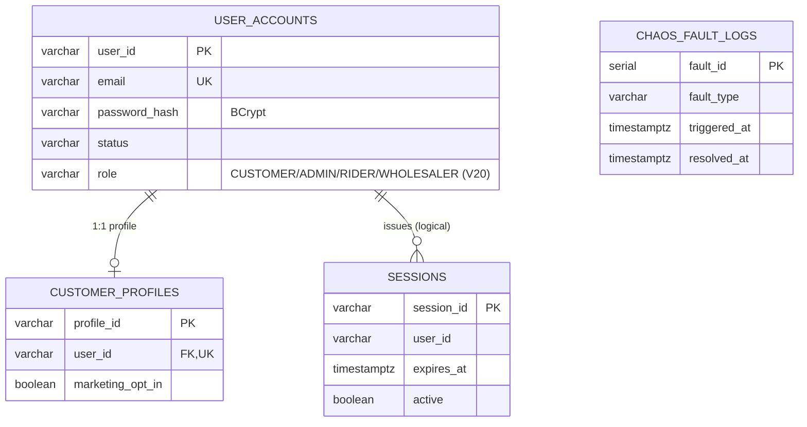
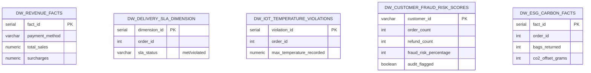

# Data Model ERD — As-Built (validated)

This ERD reflects the **actual implemented schema**: the Flyway migrations
(`V1`–`V20`, authoritative) cross-checked against the JPA `@Entity` mappings.

> ⚠️ It is distinct from [`data-model-erd.md`](./data-model-erd.md), which
> describes an **aspirational target** — a 7-database "sharded microservices"
> model that the code has **not** adopted. The code is a modular DDD monolith
> with four PostgreSQL **schemas**: `oltp` (transactional), `olap` (warehouse),
> `dispatch`, and `wholesaler`. This document is the source of truth for the
> data model as it exists today.

Validation method: `@Table(name, schema)` on every entity was diffed against the
`CREATE TABLE` statements and `REFERENCES`/`CHECK`/`TRIGGER` clauses in the
migrations. Findings are in [§Validation](#validation-findings) at the end.

---

## A. Commerce & Orders (`oltp`)

> Note — **two parallel order models** coexist: the rich legacy `orders`
> (written by `transaction/OrderServiceImpl.checkout`) and the hexagonal
> `saga_customer_orders` (the `ordermanagement` choreography saga). They are not
> FK-linked; see Validation F-5.

---

## B. Finance — Double-Entry Ledger & Payments (`oltp`)

**Integrity (DB-enforced, `V1`):**
- `trg_enforce_ledger_balance` — *deferrable* constraint trigger: at commit,
  `SUM(debit) = SUM(credit)` per `entry_id`, else the whole transaction aborts.
- `trg_hash_journal_entry` — `BEFORE INSERT`: chains
  `entry_hash = sha256(entry_uuid ‖ reference ‖ description ‖ previous_entry_hash)`.
- `ledger_lines` CHECKs: `debit>0 OR credit>0` **and** `NOT(debit>0 AND credit>0)`
  — exactly one side positive per leg.

---

## C. Logistics — Riders, Dispatch & Telemetry (`oltp` + `dispatch`)

---

## D. Wholesaler & B2B Procurement (`oltp` + `wholesaler`)

---

## E. Auth, Identity & Security (`oltp`)

---

## F. Catalog, Rewards, Eventing & Support (`oltp` + default schema)

```mermaid
erDiagram
    PRODUCT_LISTINGS {
        varchar product_id PK
        varchar title
        numeric base_price "CHECK >= 0"
        varchar status "DRAFT/ACTIVE/OUT_OF_STOCK/ARCHIVED"
    }
    PROMOTIONS {
        varchar promo_id PK
        varchar type "PERCENT/FLAT/FREE_SHIPPING"
        numeric value "CHECK >= 0"
    }
    CUSTOMER_LOYALTY {
        varchar id PK
        varchar customer_id
        int points
    }
    OUTBOX_EVENTS {
        serial id PK
        varchar aggregate_type
        varchar aggregate_id
        varchar event_type
        text payload
        varchar status "PENDING/PUBLISHED/FAILED"
        int retry_count
    }
    DOMAIN_EVENTS {
        varchar event_id PK
        varchar event_type
        varchar aggregate_id
        text payload
    }
    NOTIFICATIONS {
        int id PK
        varchar channel "EMAIL/SMS/PUSH/WEBHOOK"
        varchar status "QUEUED/SENT/FAILED/CANCELLED"
    }
    SUPPORT_TICKETS {
        int id PK
        varchar priority "LOW/NORMAL/HIGH/URGENT"
        varchar status "OPEN..RESOLVED/CLOSED"
    }
    FEEDBACKS {
        int id PK
        varchar customer_id
        int rating
    }
```

> `outbox_events` is the transactional-outbox relay table (see sequence §9).
> `domain_events` and `inventory_items` are **entity-only** — no migration
> creates them (Validation F-1).

---

## G. OLAP Analytical Warehouse (`olap`)

Populated from `oltp` by the stored procedure `olap.etl_sync_replication_process()` (`V1`).

ETL derives: revenue facts ← `orders`; SLA dimension ← delivered `orders`;
temperature violations ← `order_telemetry_logs ⋈ order_items ⋈ inventory`
(perishable + alert); fraud scores ← `customers ⋈ orders ⋈ hitl_queue`
(refund ratio ≥ 0.30 ⇒ flagged); ESG carbon ← `orders.bags_returned × 250 g`.

---

## Validation Findings

Severity: 🔴 fix before prod · 🟡 drift / inconsistency · 🟢 verified-correct.

| ID | Sev | Finding | Recommendation |
| :-- | :-: | :--- | :--- |
| F-1 | 🔴 | `DomainEventEntity → domain_events` and `InventoryItemEntity → inventory_items` have **no `CREATE TABLE` in any migration**. They exist only via Hibernate `ddl-auto`. Under prod (`ddl-auto=validate` + Flyway-only), these tables are absent → context fails. | Add a Flyway migration creating both (in `oltp`), or drop the unused entities. |
| F-2 | 🟡 | Schema mismatch: `saga_customer_orders` & `promotions` are created in **`oltp`**, `delivery_zones` & `rider_shifts` in **`dispatch`**, but their entities (`CustomerOrderEntity`, `PromotionEntity`, `DeliveryZoneEntity`, `RiderShiftEntity`) declare **no `schema`**. Resolution depends on the connection `search_path`. | Add the explicit `schema=` to each `@Table` to remove search_path ambiguity. |
| F-3 | 🟡 | `RewardPointsEntity` and `Customer` **both map to `oltp.customers`** (RewardPoints is a read-projection over `loyalty_points`). Two writable entities on one table risks divergent updates. | Make `RewardPointsEntity` `@Immutable`/read-only, or fold into `Customer`. |
| F-4 | 🟡 | Two `wastage_logs` tables: `WastageLog` (`oltp`) and `WastageLogEntity` (`wholesaler`). Same name, different schemas/shapes. | Rename one (e.g. `wholesaler.wholesaler_wastage_logs`) to avoid confusion. |
| F-5 | 🟡 | Two unlinked order models: rich `oltp.orders` (transaction domain) and `oltp.saga_customer_orders` (ordermanagement saga). No FK relates them. | Decide the system of record; bridge by `order_id` or merge the saga state onto `orders`. |
| F-6 | 🟡 | `V1` CHECK constraints encode early enums later outgrown by code — e.g. `riders.vehicle_type IN ('E-Bike','Scooter')` (code uses Van/Bike), `riders.onboarding_status IN ('unapplied','pending','active')` (code uses `pending_review`/`approved`), `hitl_queue.type` lacks `agent_escalation`. Later migrations (`V6`,`V8`,`V9`) realign some. | Audit that every status string written by services satisfies the *current* CHECK set; add a migration for any gap. |
| F-7 | 🟢 | Ledger integrity is **DB-enforced**, not just app-enforced: deferrable balance trigger + hash-chain trigger + debit/credit XOR checks. Strong. | None — keep. |
| F-8 | 🟢 | GDPR model is sound: `customers.email` nullable + `hashed_email` retained for fraud; `is_anonymized` excludes rows from OLAP fraud ETL. | None — keep. |
| F-9 | 🟢 | Optimistic-locking `version` columns on `customers` and `inventory` back the `@TransactionalRetry` checkout path. | None — keep. |

**Verdict:** the as-built data model is coherent and the financial core is
rigorously constrained. Two concrete prod-blocking gaps (F-1) and a set of
low-risk drifts (F-2…F-6) are itemised above. The aspirational sharded ERD in
`data-model-erd.md` should be marked as target-state, not current.
