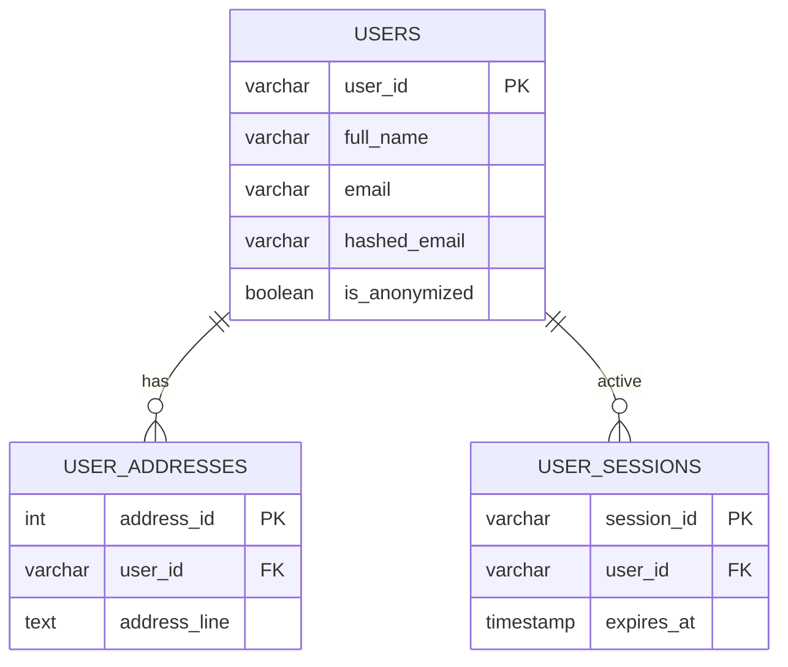
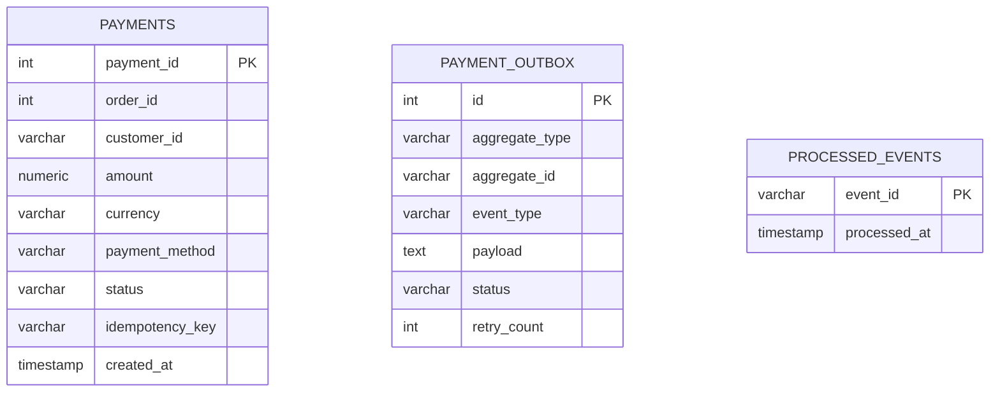
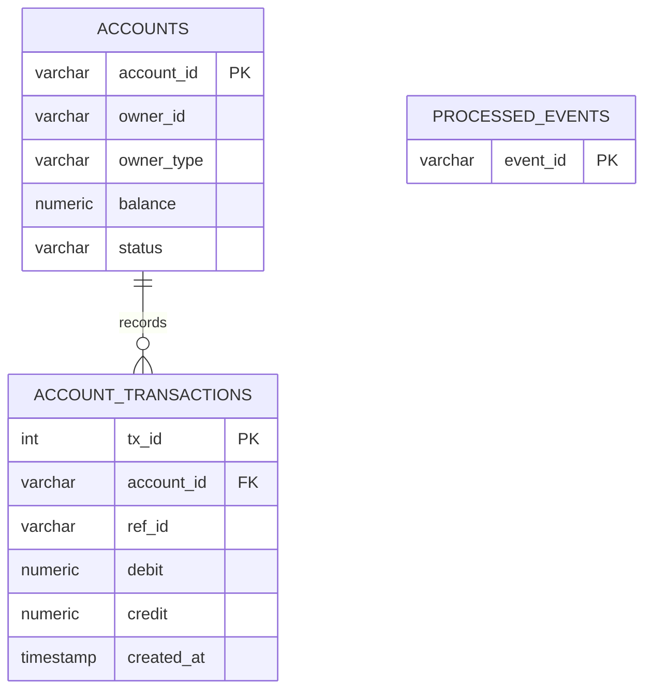
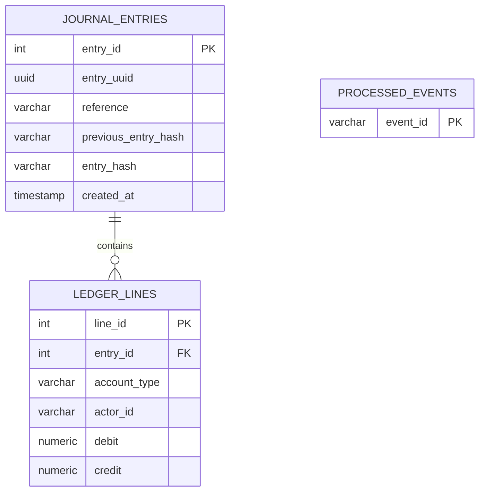
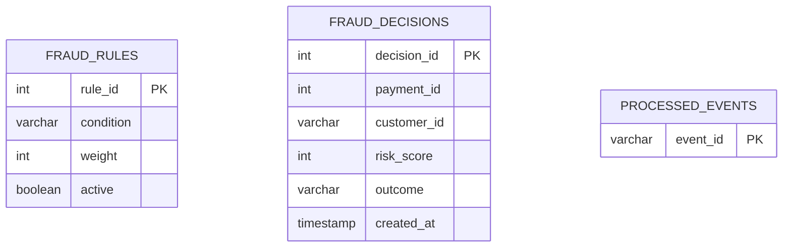
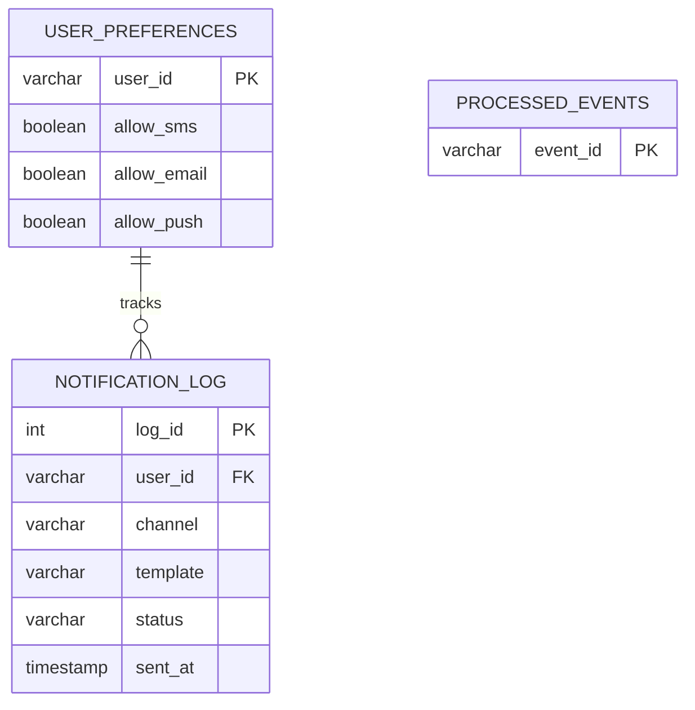
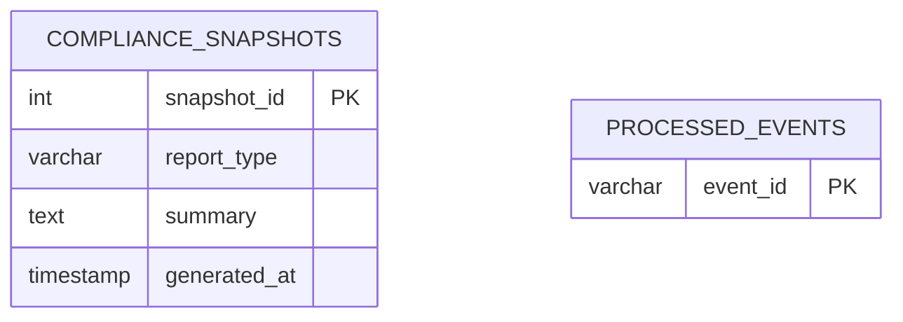

# Data Model ERD (Sharded Architecture)

This ERD represents the target microservices data model. The monolith's `oltp` schema has been sharded across 7 dedicated PostgreSQL databases (one per service).

## 1. User Service Database (`user_db`)

## 2. Payment Service Database (`payment_db`)

## 3. Account Service Database (`account_db`)

## 4. Transaction Service Database (`transaction_db`)

## 5. Fraud Detection Database (`fraud_db`)

## 6. Notification Service Database (`notification_db`)

## 7. Security Engine Database (`security_db`)

> **Note on Auditing**: The Security Engine also writes immutable audit logs to an external `MongoDB` archive collection.

## Notes on Microservices Data Boundaries
- **No Foreign Keys across databases**. A `user_id` in the `PAYMENTS` table is just a `VARCHAR`, not an FK to the `USERS` table.
- **Outbox Pattern**: Each database producing Kafka events needs its own outbox table (e.g., `PAYMENT_OUTBOX`).
- **Idempotency**: Every consuming service implements a `PROCESSED_EVENTS` table to deduplicate consumed Kafka messages.
