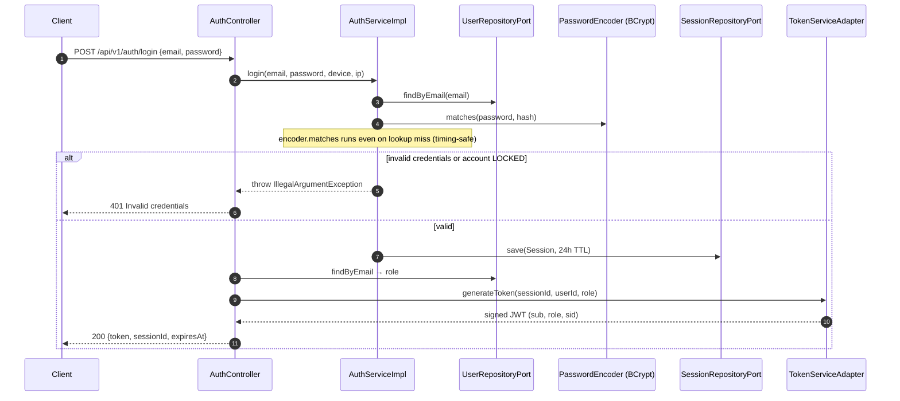
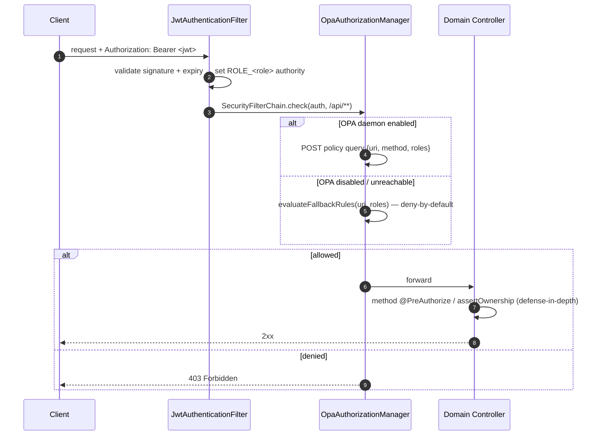
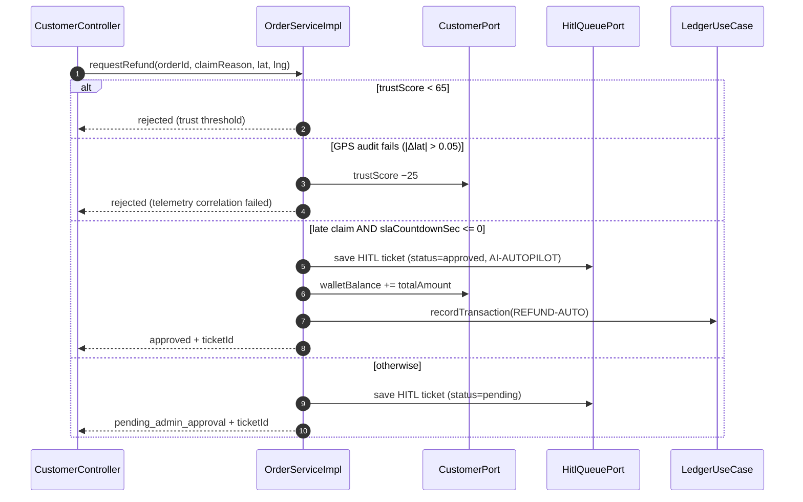
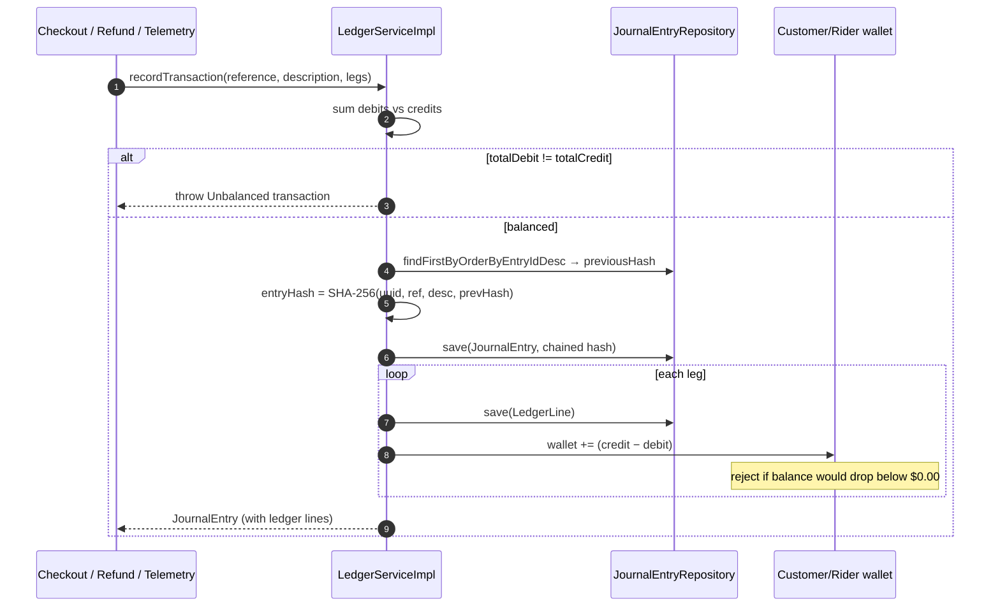
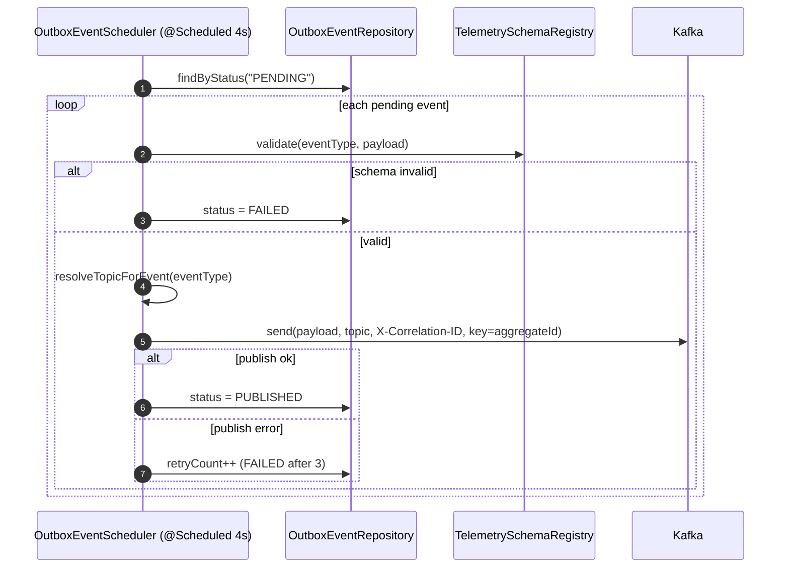
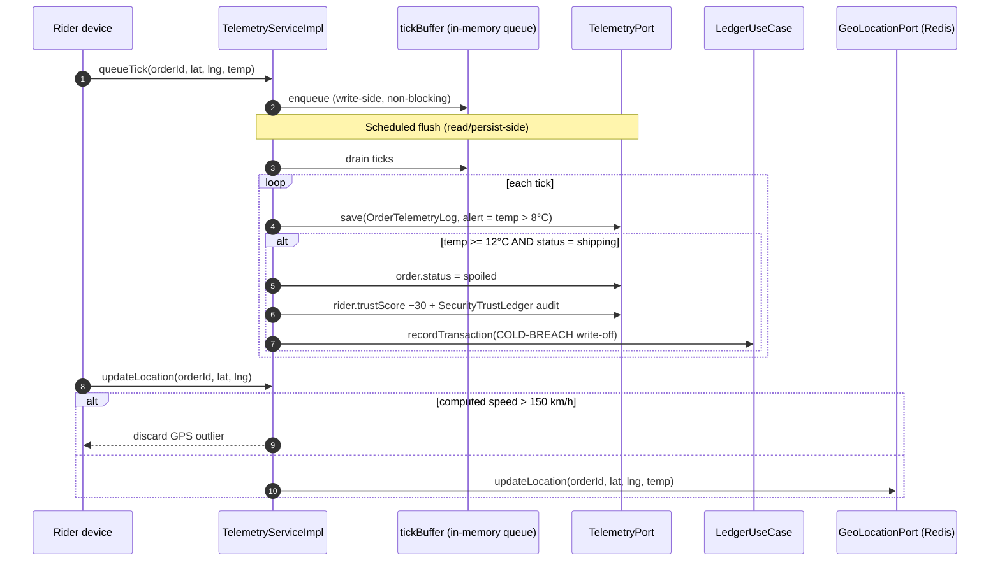
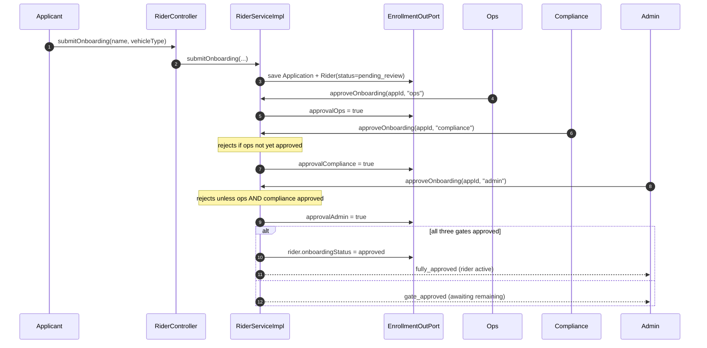
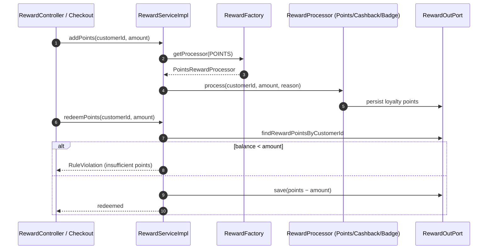

# Domain Sequence & Flow Diagrams — Part 2

Continuation of [`domain-sequence-diagrams.md`](./domain-sequence-diagrams.md).
Part 1 covers the order saga, AI agent orchestration, B2B RFQ + governance, and
dispatch. This part completes the remaining bounded contexts: authentication &
authorization, the customer purchase + refund flow, the double-entry ledger,
the transactional outbox, telemetry CQRS, rider enrollment/delivery, and rewards.

Every diagram cites the `core/service` (or `config`) source it was derived from.

---

## 5. Authentication, JWT Issuance & Per-Request Authorization

Source: `domain/auth/core/service/AuthServiceImpl.java`,
`domain/auth/adapter/out/security/TokenServiceAdapter.java`,
`config/JwtAuthenticationFilter.java`, `config/OpaAuthorizationManager.java`

Login verifies credentials in constant time (no user-enumeration), opens a
24h session, and mints an HS384 JWT carrying `sub` + `role` + `sid`. Every
later request is authenticated by the filter and authorized by the OPA manager
(which falls back to static deny-by-default rules when the OPA daemon is off).





---

## 6. Customer Checkout (Purchase)

Source: `domain/transaction/core/service/OrderServiceImpl.java#checkout`

The central commerce transaction. Idempotent (unique-key + retry), it routes to
a dark store, decrements stock per item, prices in weather surcharge / tip /
ESG rebate, assigns an optimal rider, posts a balanced double-entry ledger
transaction (which fails closed on insufficient funds), accrues loyalty points,
and writes an `order.placed` event to the transactional outbox — all in one
`@Transactional @TransactionalRetry` boundary.

```mermaid
sequenceDiagram
    autonumber
    participant API as CustomerController
    participant OS as OrderServiceImpl
    participant OP as OrderPort
    participant INV as InventoryPort
    participant CFG as SystemConfigPort
    participant RP as RiderPort
    participant LED as LedgerUseCase
    participant OBX as OutboxEventPort

    API->>OS: checkout(customerId, items, paymentMethod, tip, bags, idempotencyKey)
    Note over OS: validate items (qty>0, no dup SKU); assertOwnership upstream
    OS->>OP: findByIdempotencyKey(key)
    alt order already exists
        OS-->>API: existing Order (idempotent replay)
    else new order
        OS->>CFG: evaluateCheckoutRouting → Central / East store
        loop each cart item
            OS->>INV: findInventoryById → check stock
            OS->>INV: save(stock - qty)
        end
        Note over OS: weather surcharge + tip − ESG bag rebate; SLA by vehicle/perishable
        OS->>RP: findOptimalRider(perishable)
        OS->>OP: save(order) + flush (unique-key idempotency)
        OS->>LED: recordTransaction(ORDER-PAY, legs)
        Note over LED: rolls back whole checkout if customer wallet would go < 0
        OS->>OP: customer.loyaltyPoints += items×10
        OS->>OBX: save(OutboxEvent "order.placed", PENDING)
        OS-->>API: 201 Order
    end
```

---

## 7. Refund & SLA Auto-Approval

Source: `domain/transaction/core/service/OrderServiceImpl.java#requestRefund`

Refunds are gated by the customer's trust score and a GPS telemetry-correlation
audit. A verified SLA breach is auto-approved by the AI autopilot (instant
wallet credit + ledger entry); everything else is filed as a pending HITL ticket
for an admin.



---

## 8. Double-Entry Ledger with Hash Chain

Source: `domain/transaction/core/service/LedgerServiceImpl.java#recordTransaction`

Every money movement is a balanced journal entry. Entries are **hash-chained**
(`entryHash = SHA-256(uuid, reference, description, previousHash)`) for
tamper-evidence, and actor wallets are adjusted with a non-negative invariant.



---

## 9. Transactional Outbox → Kafka Relay

Source: `domain/event/core/service/OutboxEventScheduler.java`

Domain writes persist an `OutboxEvent(PENDING)` inside the business transaction.
A scheduler (every 4s) validates each event against the schema registry, routes
it to the correct Kafka topic, stamps an `X-Correlation-ID`, and publishes —
with retry counting and dead-letter (`FAILED` after 3 attempts).



---

## 10. Telemetry CQRS Ingestion + Cold-Chain Spoilage

Source: `domain/telemetry/core/service/TelemetryServiceImpl.java`

High-frequency ticks are buffered in memory (write-side) and flushed in batches
by a scheduler (read/persist-side) to minimise DB write-amplification. Persisting
a tick can trip cold-chain rules: ≥12 °C in transit spoils the cargo, docks the
rider's trust score (audited), and books a write-off ledger entry. GPS outliers
(>150 km/h) are discarded.



---

## 11. Rider Enrollment — 3-Gate Onboarding + Academy

Source: `domain/enrollment/core/service/RiderServiceImpl.java`

Onboarding requires three sequential approval gates (ops → compliance → admin);
each gate enforces that the prior one passed. Only when all three pass does the
rider become `active`. Academy course completion boosts the trust score (audited).



---

## 12. Delivery Confirmation / Rejection

Source: `domain/enrollment/core/service/RiderServiceImpl.java#confirmDelivery / rejectDelivery`

Handover requires a matching delivery PIN **or** a proof-of-delivery photo.
Success raises rider + customer trust (and exits customer probation after 3
consecutive orders); a door rejection requires reason + photo and issues an
instant wallet refund.

```mermaid
sequenceDiagram
    autonumber
    participant Rider as Rider
    participant RS as RiderServiceImpl
    participant EN as EnrollmentOutPort

    Rider->>RS: confirmDelivery(orderId, pin, photoUrl)
    alt order not in "shipping"
        RS-->>Rider: IllegalState
    else PIN matches OR photo provided
        RS->>EN: order.status = delivered + cleanup telemetry
        RS->>EN: rider.trust +5 (audited); customer.trust +3
        Note over RS: consecutiveOrders++ → exit probation at 3
        RS-->>Rider: delivered
    else neither PIN nor photo
        RS-->>Rider: Invalid handover
    end

    Rider->>RS: rejectDelivery(orderId, reason, rejectionPhoto)
    alt reason + photo present
        RS->>EN: order.status = rejected_at_door
        RS->>EN: customer.walletBalance += totalAmount (instant refund)
        RS-->>Rider: rejected_at_door
    else missing reason/photo
        RS-->>Rider: Invalid rejection
    end
```

---

## 13. Rewards — Loyalty Accrual & Redemption

Source: `domain/reward/core/service/RewardServiceImpl.java`, `RewardFactory.java`,
accrual also occurs inline in `OrderServiceImpl.checkout`

Points accrue on checkout (items × 10) and via the reward use-case, which
delegates to a strategy `RewardProcessor` selected by `RewardFactory`
(Points / Cashback / Badge). Redemption enforces a sufficient-balance rule.



---

## Full Domain Coverage Matrix

All 22 bounded contexts, with their flow-documentation status. "Diagram"
domains have a sequence diagram; "CRUD/port" domains are straightforward
read/write adapters whose behaviour is fully captured by their port interface
and need no separate sequence.

| # | Bounded context | Flow documented | Where |
| :-- | :--- | :--- | :--- |
| 1 | payment | ✅ saga + compensation | `lld-diagrams.md` |
| 2 | ordermanagement | ✅ order saga (choreography) | part 1 §1 |
| 3 | agent | ✅ orchestration + HITL + RFQ | part 1 §2–3 |
| 4 | governance | ✅ HITL override (in RFQ) | part 1 §3 |
| 5 | wholesaler | ✅ RFQ auction (in §3) | part 1 §3 |
| 6 | dispatch | ✅ assign / track / reallocate | part 1 §4 |
| 7 | auth | ✅ login + JWT issuance | part 2 §5 |
| 8 | security | ✅ per-request authz (filter+OPA) | part 2 §5 |
| 9 | transaction (order) | ✅ checkout + refund | part 2 §6–7 |
| 10 | transaction (ledger) | ✅ double-entry + hash chain | part 2 §8 |
| 11 | event | ✅ transactional outbox relay | part 2 §9 |
| 12 | telemetry | ✅ CQRS + cold-chain | part 2 §10 |
| 13 | enrollment | ✅ 3-gate onboarding + delivery | part 2 §11–12 |
| 14 | reward | ✅ accrual + redemption | part 2 §13 |
| 15 | catalog | ▫ CRUD (get/create listing) | `CatalogServiceImpl` |
| 16 | pricing | ▫ stateless cart calc + promo code | `PricingServiceImpl` |
| 17 | customer | ▫ profile read + GDPR purge | `CustomerProfileServiceImpl` |
| 18 | inventory | ▫ stock read/decrement (used in §6) | `InventoryServiceImpl` |
| 19 | notification | ▫ multi-channel send adapter | `NotificationServiceImpl` |
| 20 | support | ▫ ticket CRUD + bot escalation | `SupportServiceImpl` |
| 21 | feedback | ▫ feedback submit CRUD | `FeedbackServiceImpl` |
| 22 | fleet / geospatial | ▫ shift CRUD / geo nearest-store | `FleetServiceImpl`, `GeospatialServiceImpl` |

**Verdict:** every multi-step / stateful flow now has a source-verified sequence
diagram; the remaining contexts are thin CRUD/port adapters. The design is solid
and ready for the ERD pass.
