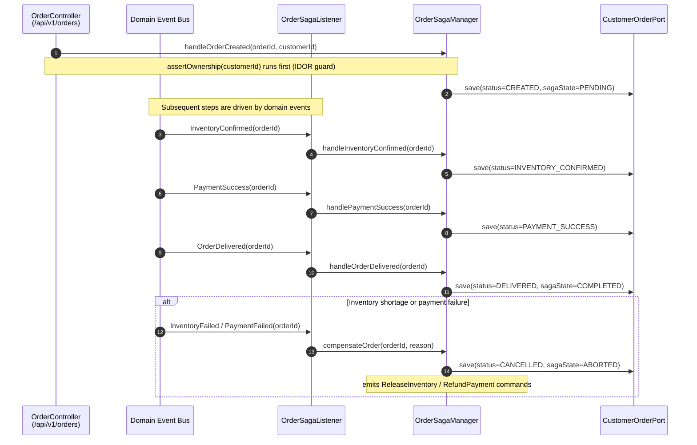
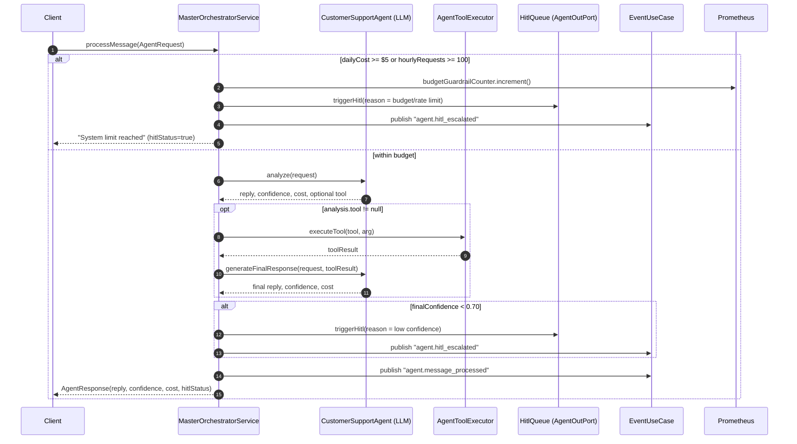
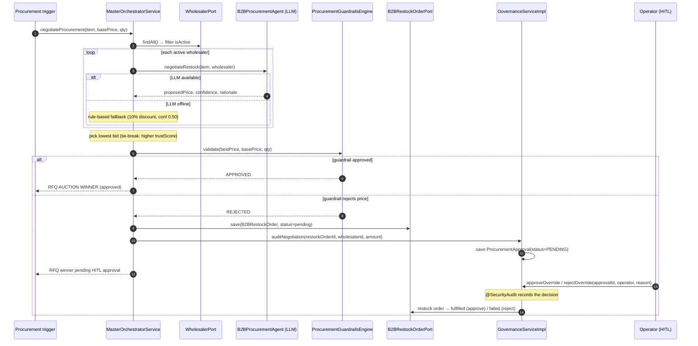

# Domain Sequence & Flow Diagrams

These sequence diagrams document the **core multi-step flows** of the Swish
Q-Commerce platform. Unlike the payment-only diagrams in
[`lld-diagrams.md`](./lld-diagrams.md), these cover the order-fulfilment saga,
the AI-agent orchestration loop, the B2B RFQ auction + governance HITL path, and
rider dispatch.

Each diagram is annotated with the **source file** it was derived from, so the
documentation can be verified against the implementation rather than drifting
from it.

> Status: authored 2026-06 as part of the design-consolidation pass. The
> bounded contexts are hexagonal (see `adr_001_hexagonal_architecture.md`); these
> diagrams describe the `core/service` orchestration inside each context.

---

## 1. Order Fulfilment Saga (event choreography)

Source: `domain/ordermanagement/core/service/OrderSagaManager.java`,
`domain/ordermanagement/adapter/in/event/OrderSagaListener.java`

The order saga is **choreography-based**: a Spring `@EventListener` consumes
`BaseDomainEvent`s and routes them by `eventType` to the saga manager, which
advances the `CustomerOrder.status` / `sagaState` and persists each transition.
Inventory or payment failures drive the compensation path.



---

## 2. AI Agent Orchestration + HITL Escalation

Source: `domain/agent/core/service/MasterOrchestratorService.java`

`processMessage` is the customer-support agent loop. It is gated by a
**budget/rate guardrail** (daily $5 / 100 requests-per-hour) that increments a
Prometheus counter (`agent.budget.guardrail.triggers`) and escalates to a human.
Otherwise it runs LLM analysis, optionally executes a tool, and escalates to a
Human-In-The-Loop ticket when confidence is below 0.70.



---

## 3. B2B RFQ Auction → Procurement Guardrail → HITL Governance

Source: `domain/agent/core/service/MasterOrchestratorService.java#negotiateProcurement`,
`domain/governance/core/service/GovernanceServiceImpl.java`

The procurement agent runs a **reverse auction** across active wholesalers
(lowest bid wins; ties broken by trust score), validates the winning bid against
the guardrail engine, and — when the guardrail rejects the price — persists a
pending `B2BRestockOrder` and routes it to a governance operator for an explicit
approve/reject decision (audited via `@SecurityAudit`).



---

## 4. Rider Dispatch — Assignment, Tracking & Stale-Reallocation

Source: `domain/dispatch/core/service/DispatchServiceImpl.java`

Assignment enforces rider eligibility (gear verification, vehicle weight limits,
and self-matching restrictions). Live GPS updates run **haversine** stationary
detection, and a periodic audit reallocates any shipment that has been stationary
for more than 10 minutes, releasing its order back to the dispatch pool.

```mermaid
sequenceDiagram
    autonumber
    participant API as DispatchController
    participant DS as DispatchServiceImpl
    participant EN as EnrollmentOutPort
    participant OP as OrderPort
    participant DP as DispatchPort

    API->>DS: assignOrder(orderId, riderId, weightKg)
    DS->>EN: findRiderById(riderId)
    DS->>OP: findById(orderId)
    DS->>DP: isRiderEligible(gear, weight, self-match)
    alt eligible
        DS->>OP: order.setRider(rider)
        DS->>DP: saveActiveShipment(status=ASSIGNED)
        DS-->>API: ActiveShipment(ASSIGNED)
    else not eligible
        DS-->>API: IllegalStateException (gear/weight/self-match)
    end

    Note over API,DP: Live tracking
    API->>DS: updateRiderGps(riderId, lat, lng)
    DS->>DP: haversine distance vs lastLat/lng
    Note over DS: < 10 m → set stationarySince; else clear it

    Note over DS,DP: Periodic audit
    API->>DS: runReallocationAudit()
    DS->>DP: find shipments stationary > 10 min
    DS->>DP: status → REALLOCATED
    DS->>OP: order → pending, rider = null (back to pool)
```

---

## Coverage status

| Flow | Diagrammed | Source verified |
| :--- | :--- | :--- |
| Payment saga + compensation | ✅ (`lld-diagrams.md`) | ✅ |
| Order fulfilment saga | ✅ (this doc) | ✅ |
| AI agent orchestration + HITL | ✅ (this doc) | ✅ |
| B2B RFQ auction + governance HITL | ✅ (this doc) | ✅ |
| Rider dispatch + reallocation | ✅ (this doc) | ✅ |

Remaining flows worth diagramming next: customer checkout (pricing + ledger),
3-gate rider enrollment, telemetry CQRS ingestion, and reward/loyalty accrual.
