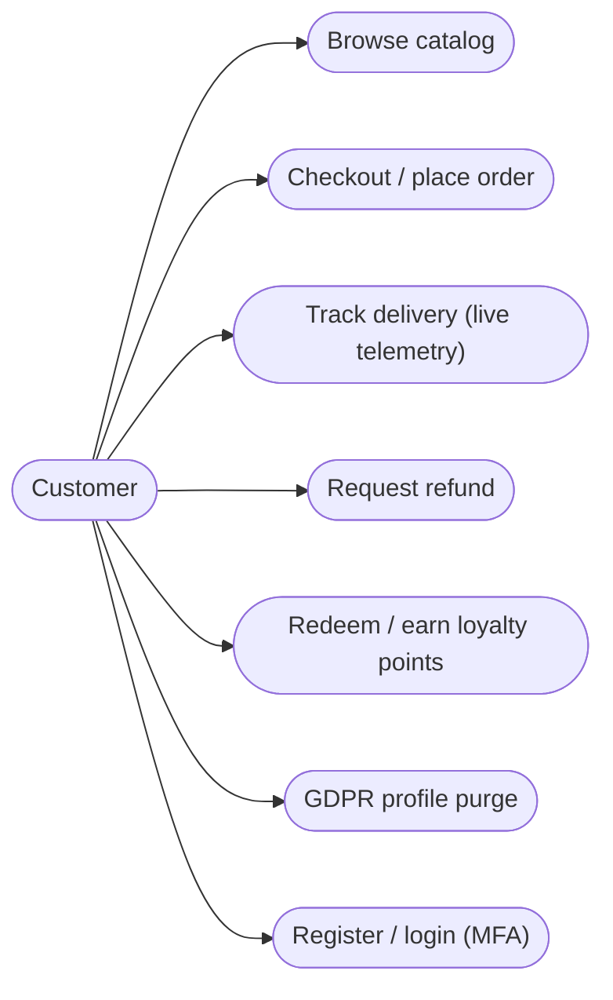
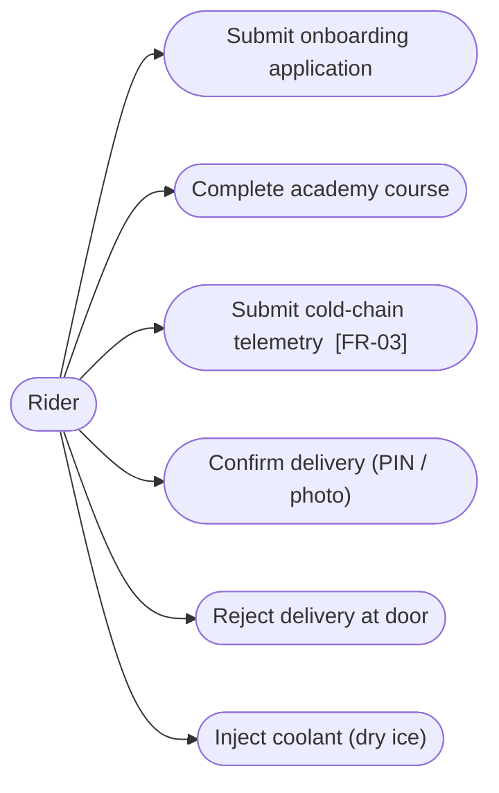
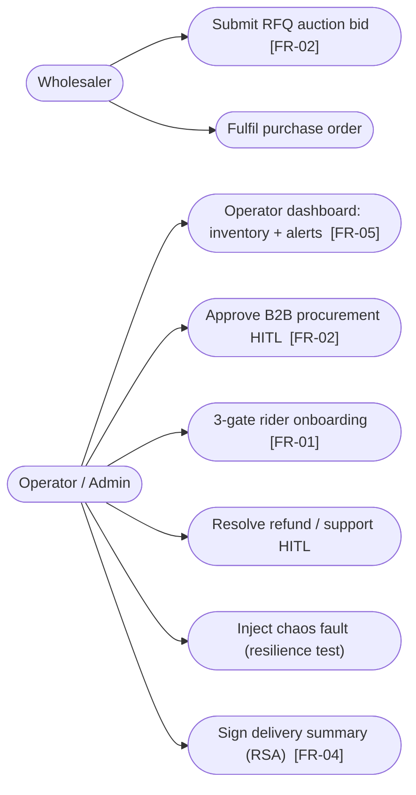
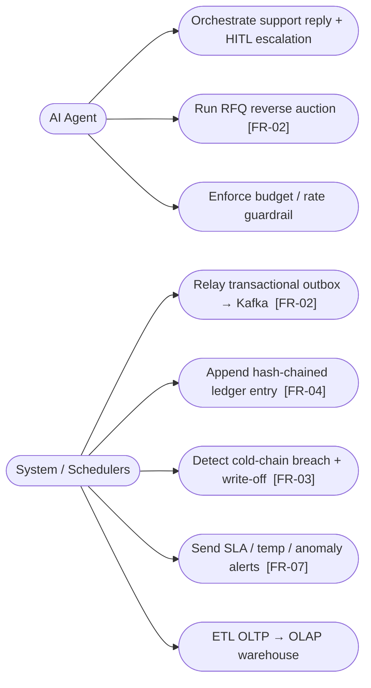
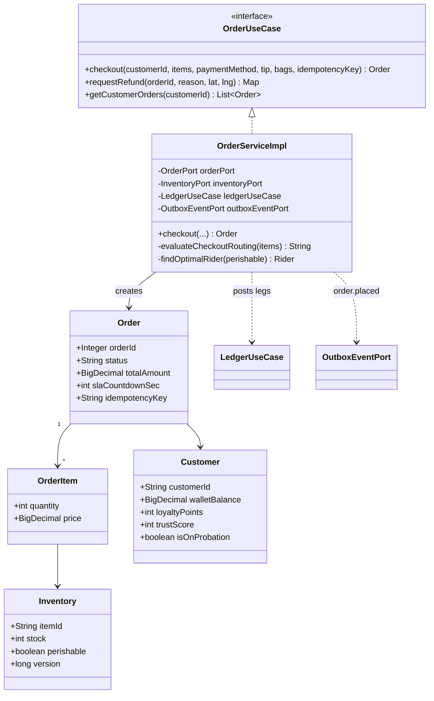
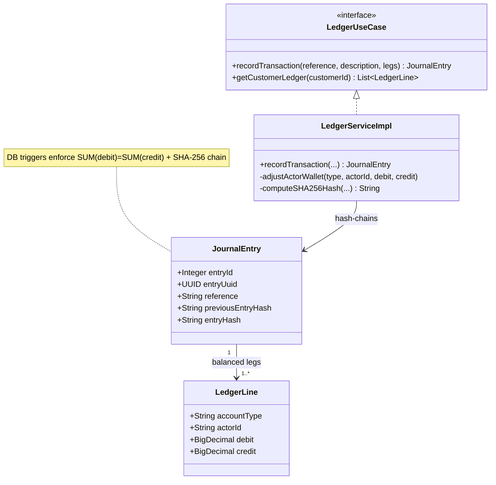
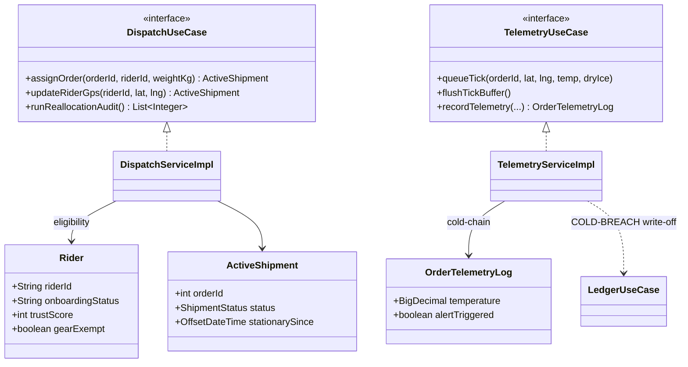
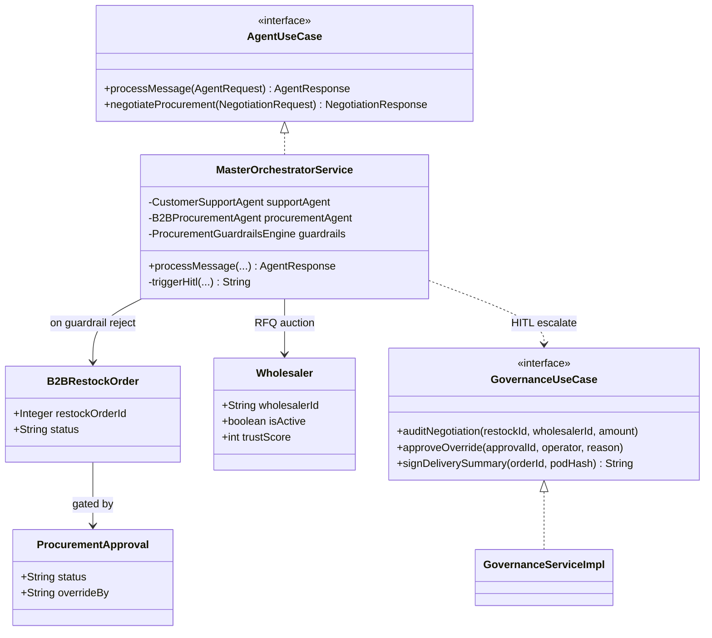
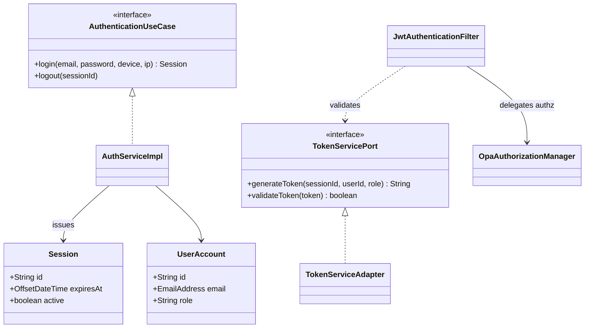

# Low-Level Design — Complete & Validated

The LLD comprises three diagram types. This document completes **use case** and
**class** diagrams for the whole project and validates them against the BRD,
HLD, and ERD. Sequence diagrams are already complete elsewhere.

| LLD artefact | Location | Status |
| :--- | :--- | :--- |
| **Use case** diagrams | this doc §1 | ✅ whole project (was payment-only) |
| **Sequence** diagrams | `domain-sequence-diagrams.md` (+ part 2), `lld-diagrams.md` (payment) | ✅ all stateful flows |
| **Class** diagrams | this doc §2, `lld-diagrams.md` (payment) | ✅ all core contexts |
| **Validation** (BRD / HLD / ERD) | this doc §3 | ✅ traceability + divergences |

---

## 1. Use Case Diagrams (per actor)

> mermaid has no native use-case notation; actors are stadium nodes, use cases
> are rounded nodes (replacing the earlier invalid `actor` keyword inside
> `flowchart`). The BRD FR each use case satisfies is shown in brackets.

### 1.1 Customer

### 1.2 Rider

### 1.3 Wholesaler / B2B & Operator

### 1.4 AI Agent & System (automated actors)

---

## 2. Class Diagrams (per bounded-context cluster)

Attributes mirror the validated as-built ERD
([`data-model-erd-asbuilt.md`](./data-model-erd-asbuilt.md)); methods mirror the
`core/service` implementations. Hexagonal: `*UseCase` = port-in, `*Port` =
port-out, `*ServiceImpl` = core.

### 2.1 Commerce & Order

### 2.2 Finance — Double-Entry Ledger

### 2.3 Logistics — Dispatch & Telemetry

### 2.4 Agent, Wholesaler & Governance

### 2.5 Auth & Security

---

## 3. Validation

### 3.1 LLD ↔ BRD (use cases ⇒ functional requirements)

| BRD FR | Requirement | As-built realization | Status |
| :-- | :--- | :--- | :-: |
| FR-01 | Retailer on-boarding | 3-gate onboarding exists, but for **riders**, not retailers; no sensor provisioning / API-key issuance | 🟡 partial |
| FR-02 | AI negotiation (outbox→Kafka→Mongo) | `MasterOrchestratorService.negotiateProcurement` RFQ auction + outbox→Kafka relay; **Mongo leg not wired** | 🟡 partial |
| FR-03 | Telemetry ingestion | `TelemetryServiceImpl` cold-chain CQRS, but **PostgreSQL not TimescaleDB**, HTTP not MQTT | 🟡 partial |
| FR-04 | Ledger auditing (SHA-256 chain, REST) | `LedgerServiceImpl` + DB hash-chain trigger + `/ledger` REST | ✅ full |
| FR-05 | Operator dashboard + RBAC | `frontend-admin` + JWT/OPA RBAC + HITL queue | ✅ full |
| FR-06 | Billing engine (per-hub flat tier) | **Not implemented** — no billing/invoicing module | 🔴 gap |
| FR-07 | Alert & notification | `notification-engine` (Email/SMS/Push/WS) + cold-chain/SLA alerts | ✅ full |

### 3.2 LLD ↔ ERD (class ⇒ table)

| Class | ERD table | Match |
| :--- | :--- | :-: |
| Customer / Order / OrderItem / Inventory | `oltp.customers/orders/order_items/inventory` | ✅ |
| JournalEntry / LedgerLine | `oltp.journal_entries/ledger_lines` | ✅ |
| Rider / ActiveShipment / OrderTelemetryLog | `oltp.riders` / `dispatch.active_shipments` / `oltp.order_telemetry_logs` | ✅ |
| Wholesaler / B2BRestockOrder / ProcurementApproval | `oltp.wholesalers/b2b_restock_orders/procurement_approvals` | ✅ |
| UserAccount / Session | `oltp.user_accounts/sessions` | ✅ |

All class entities resolve to validated ERD tables; the ERD's own open items
(F-3 `RewardPointsEntity`↔`customers`, F-5 dual order models) are noted there.

### 3.3 LLD ↔ HLD (pattern ⇒ realization)

| HLD pattern | LLD realization | Status |
| :--- | :--- | :-: |
| Transactional Outbox | `OutboxEventScheduler` + `oltp.outbox_events` | ✅ |
| Choreography Saga + compensation | `OrderSagaManager` / `OrderSagaListener` | ✅ |
| Idempotency | unique `idempotency_key` + `@TransactionalRetry` | ✅ |
| Circuit Breaker / Retry / DLQ | Resilience4j + outbox retry→FAILED | ✅ (gateway side) |
| Correlation ID | `X-Correlation-ID` MDC in outbox relay | ✅ |
| Kafka topic topology | `OutboxEventScheduler.TOPIC_ROUTING` | ✅ |
| **Database-per-service (HLD)** | as-built is a **modular monolith** (4 schemas, 1 DB) | 🟡 divergent |
| **MongoDB / TimescaleDB / Vault (HLD)** | not wired (PostgreSQL + H2/Postgres only) | 🟡 divergent |

### 3.4 Architect's divergence summary

The **BRD/HLD describe a B2B-SaaS, database-per-service, MongoDB+TimescaleDB+
Vault microservices platform**; the **as-built is a B2C quick-commerce modular
monolith (PostgreSQL) with B2B procurement** plus a standalone Python
hybrid-agentic governance lib. The two are ~70% aligned at the capability level
(ledger, telemetry, AI negotiation, alerts, RBAC all exist) but diverge on
deployment topology and three concrete items:

1. **FR-06 Billing engine** — not implemented (🔴 the only hard functional gap).
2. **FR-01** — onboarding is rider-centric, not retailer self-service.
3. **Topology** — monolith vs database-per-service; Mongo/Timescale/Vault/MQTT unrealised.

**Recommendation:** either (a) reconcile the BRD/HLD to the as-built reality
(re-baseline as "modular monolith, PostgreSQL, hybrid on-prem AI"), or (b) treat
the gaps as a forward backlog (billing module, retailer portal, Mongo CDC leg).
The diagram layer (use case · sequence · class · ERD · C4) is now complete and
internally consistent.
