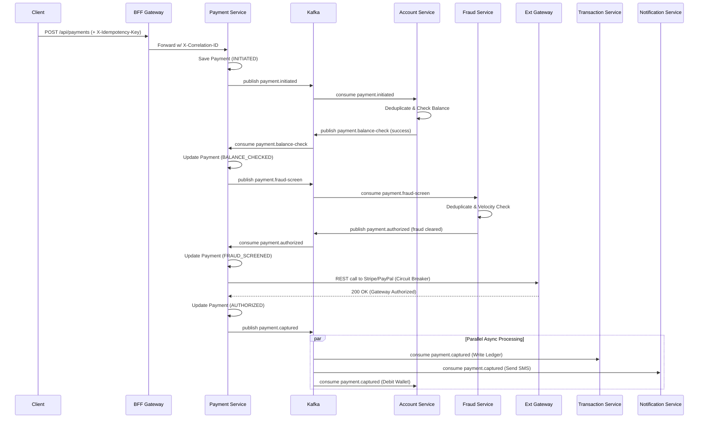
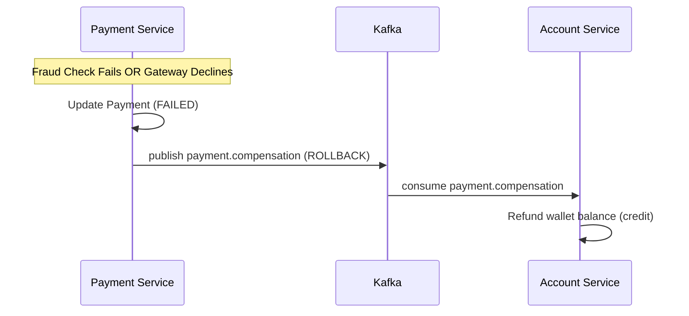
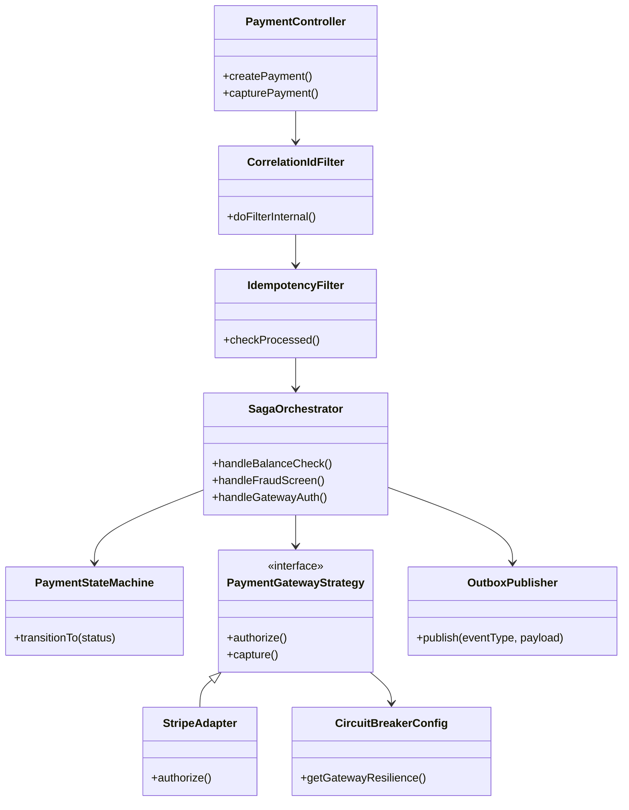

# Low-Level Design Diagrams (Microservices)

This document captures the LLD artifacts for sequence, class, and use case diagrams in the new microservices architecture.

## 1. Payment Saga Sequence Diagram (Choreography)



## 2. Compensation / Rollback Sequence (Failure Path)



## 3. Class Diagram (Payment Service)



## 4. Use Case Diagram

```mermaid
flowchart TB
  actor Customer
  actor Rider
  actor Admin
  actor System

  Customer -->|Place order| UC1[Place Order]
  Customer -->|Make payment| UC2[Authorize Payment]

  Rider -->|Onboard| UC4[Register Rider]
  Rider -->|Report telemetry| UC5[Submit Telemetry]

  Admin -->|Review tickets| UC9[Process HITL Tickets]
  Admin -->|Manage access| UC8[Approve B2B Onboarding]

  System -->|Detect anomalies| UC10[JWT Anomaly Detection]
  System -->|Rotate secrets| UC11[Vault Secret Rotation]
  System -->|Audit log| UC12[Persist Immutable Audit]
```
