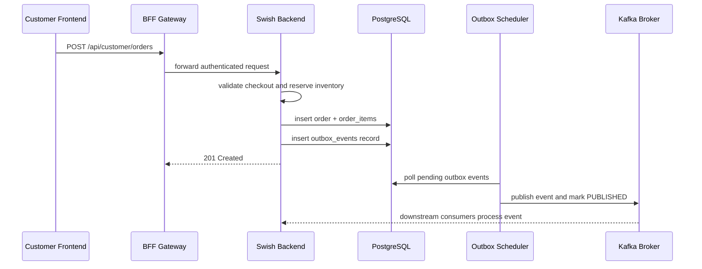
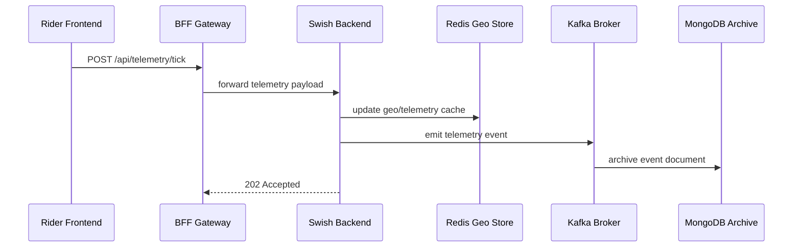
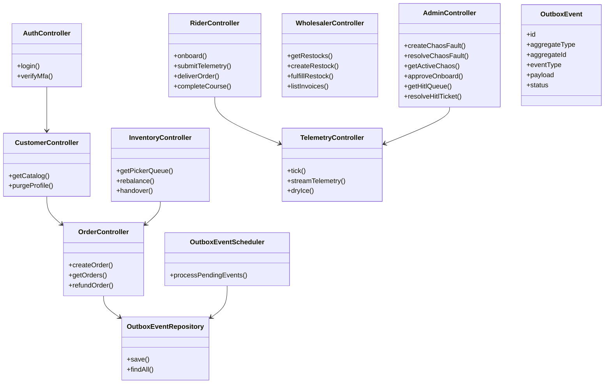

# Low-Level Design Diagrams

This document captures the missing LLD artifacts for sequence, class, and use case diagrams.

## Use Case Diagram

```mermaid
flowchart TB
  actor Customer
  actor Rider
  actor Admin
  actor System

  Customer -->|Place order| UC1[Place Order]
  Customer -->|Track order| UC2[Track Order]
  Customer -->|Authenticate| UC3[Login / MFA]

  Rider -->|Onboard| UC4[Register Rider]
  Rider -->|Report telemetry| UC5[Submit Delivery Telemetry]
  Rider -->|Complete delivery| UC6[Deliver Order]

  Admin -->|Manage operations| UC7[Inject / Resolve Chaos Faults]
  Admin -->|Approve onboarding| UC8[Approve Rider or Merchant]
  Admin -->|Review HITL| UC9[Process Human-in-the-Loop Tickets]

  System -->|Publish events| UC10[Dispatch Outbox Events]
  System -->|Archive analytics| UC11[Persist Telemetry Archive]
```

## Sequence Diagram: Order Placement


```

## Sequence Diagram: Telemetry Ingestion


```

## Class Diagram



> Notes:
> - The class diagram reflects the broader backend controller surface discovered in the repository.
> - The sequence diagrams are aligned with the live BFF contract and actual telemetry/outbox implementation.
