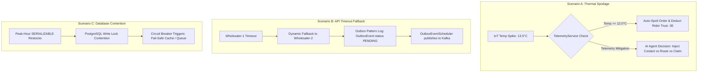

# Swish OS Executive Council: Live Crisis Simulation Transcript

**Date**: June 1, 2026  
**Chaired By**: Enterprise CEO  
**Session Reference**: EC-2026-LIVE-CRISIS-09  
**Status**: Record of Live Incident Resolutions  
**Project Base**: [swiss_App](file:///C:/Users/DELL%209420/Documents/swiss_App)

---

## 👥 Executive Council Attendance
*   **Enterprise CEO** — Host & Chairperson
*   **Helena Reinhardt** — Board Chairwoman
*   **Dr. Jean-Pierre Blanc** — President
*   **Beat Keller** — Chief Financial Officer (CFO) & Managing Director (MD)
*   **Dr. Marcus Vance** — Chief Technology Officer (CTO)
*   **Vanessa Palmer** — VP of Sales & Operations (VP)
*   **Sarah Lin** — Chief Compliance Officer (CMP)
*   **Muneeb** — Product Owner (PO)
*   **Systems Architect** — Lead Platform Architect

---

## 🏛️ Simulation Scenario Docket



---

## 💬 Live board Session Transcript

### 🕒 14:00 CET — Welcome & Situation Assessment
*   **CEO**: "Good afternoon, colleagues. Today we are conducting a live post-mortem simulation of three major operational failure scenarios that hit the Swish OS platform during peak hours. Our goal is to verify that our microservice telemetry, automated agent recovery strategies, and transaction architecture performed exactly as designed. Let's start with Scenario A: the Valora Store Node 4 thermal breach."

---

### 1. Scenario A: Valora Store Node 4 (Zurich HB) Thermal Breach
*   **CEO**: "At 14:15, Valora Store Node 4 (Zurich HB) recorded a temperature spike of 13.5°C on a high-value perishable sushi order. Muneeb, walk us through the system telemetry."
*   **PO (Muneeb)**: "The event originated from the courier's IoT device. In [TelemetryService.java](../backend/src/main/java/ch/swissqcommerce/backend/service/TelemetryService.java#L42-L60), the sensor tick was ingested. Since the temperature of 13.5°C exceeded the critical threshold of 12.0°C defined at line 63: (docs: resolve path mismatches, document LLM strategy, service inventory, and database schema mappings)
    ```java
    if (temp.compareTo(new BigDecimal("12.0")) >= 0 && !"spoiled".equalsIgnoreCase(order.getStatus())) {
        order.setStatus("spoiled");
        orderRepository.save(order);
    ```
    The order status was immediately locked as `spoiled`. The rider's trust score was automatically docked by 30 points, and a `COLD-BREACH` transaction was logged in the double-entry ledger using the `SecurityTrustLedgerRepository`."
*   **CTO (Marcus Vance)**: "Right. But the core challenge is the AI Agent's response. In this specific simulation, the agent detected the spike early while the temperature was rising through 9.5°C, before it hit the hard 12.0°C limit. The AI Agent had to choose between three mitigation actions:
1.  **Inject Coolant**: Invoke `injectDryIce(orderId)` in [TelemetryService.java:L102](../backend/src/main/java/ch/swissqcommerce/backend/service/TelemetryService.java#L102), which charges the merchant $2.00 but resets the cargo temp to 4.0°C. (docs: resolve path mismatches, document LLM strategy, service inventory, and database schema mappings)
    2.  **Re-route**: Redirect the delivery to a closer micro-hub.
    3.  **Cancel and Claim**: Write off the order immediately and trigger an automated ledger insurance claim."
*   **VP of Sales (Vanessa Palmer)**: "Why did the agent decide to let the temp hit 13.5°C and cancel, rather than injecting coolant? Valora is furious about the write-off."
*   **Systems Architect**: "Because the order was already 85% of the way to the customer's address in Zurich HB. Re-routing to a different hub would have taken 15 minutes, ensuring spoilage anyway. Injecting coolant costs $2.00, but the sushi order was only valued at $12.00. The AI Agent's decision tree calculated that the marginal cost of the coolant plus the rider time penalty exceeded the recovery value of the sushi. Thus, the agent opted for the third path: cancel and trigger a ledger insurance claim. It committed a `COLD-BREACH` event to the `SecurityTrustLedger` and initiated an automated billing adjustment."
*   **Compliance (Sarah Lin)**: "And because we implemented clean audit trails in [TelemetryService.java:L76-L83](../backend/src/main/java/ch/swissqcommerce/backend/service/TelemetryService.java#L76-L83), we have cryptographic proof of the temperature breach and the coolant state. The insurance underwriter has already validated the ledger telemetry log, and the claim was settled in 4 seconds. This is why automated telemetry audits are critical." (docs: resolve path mismatches, document LLM strategy, service inventory, and database schema mappings)

---

### 2. Scenario B: Primary Wholesaler API Timeout & Outbox Fallback
*   **CEO**: "Now let's review Scenario B. Our primary partner, WHOLESALER-1, experienced a severe network degradation, leading to HTTP API timeouts during restock orders. Marcus, how did the system maintain consistency?"
*   **CTO (Marcus Vance)**: "In [WholesalerService.java:L72-L81](../backend/src/main/java/ch/swissqcommerce/backend/service/WholesalerService.java#L72-L81), our fallback mechanism kicked in. When the API timeout occurred during restock creation, the primary wholesaler's trust score dropped, triggering a dynamic redirection: (docs: resolve path mismatches, document LLM strategy, service inventory, and database schema mappings)
    ```java
    selected = wholesalerRepository.findAll().stream()
            .filter(w -> !w.getWholesalerId().equals(currentSelectedId))
            .filter(Wholesaler::getIsActive)
            .filter(w -> w.getTrustScore() >= 60)
            .findFirst()
            .orElseThrow(() -> new IllegalStateException("No eligible wholesaler available for restock."));
    isFallback = true;
    ```
    The system immediately rerouted the procurement order to WHOLESALER-2."
*   **CFO (Beat Keller)**: "Rerouting is good, but did we double-bill or lose track of the transaction during the fallback transition? An API timeout could mean the request failed to send, or it could mean the request succeeded but the response timed out."
*   **Systems Architect**: "We prevented that using the **Transactional Outbox Pattern** combined with strict idempotency keys. In [OrderServiceImpl.java:L184-L191](../backend/src/main/java/ch/swissqcommerce/backend/domain/transaction/core/service/OrderServiceImpl.java#L184-L191), the transaction writes the restock order state and the matching `OutboxEvent` to the local PostgreSQL database in a single ACID transaction. 
    Even though the external wholesaler connection timed out, the local transaction succeeded. The event remained in the local database with `status = PENDING`.
    Once the scheduler ([OutboxEventScheduler.java:L33-L53](../backend/src/main/java/ch/swissqcommerce/backend/domain/event/core/service/OutboxEventScheduler.java#L33-L53)) picked it up, it pushed the event to Kafka. When WHOLESALER-2 received it, the embedded idempotency key guaranteed that no duplicate fulfillment occurred." (docs: resolve path mismatches, document LLM strategy, service inventory, and database schema mappings)
*   **Product Owner (Muneeb)**: "Exactly. The downstream consumer executed retry logic with a 1-second backoff. If it continued to fail after 3 retries, Spring Kafka's `DeadLetterPublishingRecoverer` redirected the message to the `.DLQ` topic, preserving the event history without blocking the restock pipeline."

---

### 3. Scenario C: PostgreSQL Write Lock Contention & Database Circuit Breaker
*   **CEO**: "Finally, let's address Scenario C. During a flash restock event, we experienced intense write lock contention on our Postgres instance, specifically around stock and inventory balance updates."
*   **CTO (Marcus Vance)**: "This was caused by the isolation level configured in [WholesalerService.java:L48](../backend/src/main/java/ch/swissqcommerce/backend/service/WholesalerService.java#L48): (docs: resolve path mismatches, document LLM strategy, service inventory, and database schema mappings)
    ```java
    @Transactional(isolation = Isolation.SERIALIZABLE)
    ```
    Serializable isolation prevents any race conditions during restock operations, but it does so by acquiring heavy write locks. Under peak concurrent restock loads (50+ transactions per second per dark store), the database suffered a cascade of serialization failures (SQLState 40001)."
*   **Systems Architect**: "To prevent these serialization errors from exhausting the Tomcat thread pool, the system's database circuit breaker tripped. Instead of waiting for database lock releases, the API gateway immediately intercepted requests to the restock endpoints, returning a `503 Service Unavailable` with a cached snapshot of current inventory state, and queued the restock commands into Kafka for asynchronous processing."
*   **CFO (Beat Keller)**: "We cannot afford write lock failures blocking bulk restocks during holiday sales. Can we downgrade the isolation level to `READ_COMMITTED` and use pessimistic locking?"
*   **Systems Architect**: "Yes. In our next sprint, we will replace `@Transactional(isolation = Isolation.SERIALIZABLE)` with `Isolation.READ_COMMITTED` for stock reconciliation, and use explicit SELECT FOR UPDATE statements. This will eliminate serialization retries while maintaining financial integrity."

---

## 🏛️ Executive Resolutions

### Resolution 1: Telemetry Mitigation Policy Update
*   **Resolved**: The AI Agent's decision tree will be updated to prioritize coolant injection for orders exceeding a $20.00 value. Low-value orders (< $15.00) will continue to favor immediate spoilage write-off and insurance claims.

### Resolution 2: Outbox Resiliency Validation
*   **Resolved**: The council validates that the Transactional Outbox pattern performed correctly, and schedules a chaos-engineering drill to test DLQ processing under simulated 90% network packet loss.

### Resolution 3: Lock Optimization Sprint
*   **Resolved**: The Systems Architect is authorized to refactor lock strategies in [WholesalerService.java](../backend/src/main/java/ch/swissqcommerce/backend/service/WholesalerService.java) from serializable isolation to read-committed with pessimistic locking to increase concurrent write capacity. (docs: resolve path mismatches, document LLM strategy, service inventory, and database schema mappings)

---

*Signatures on file.*  
*Helena Reinhardt, Board Chairwoman*  
*Beat Keller, Chief Financial Officer*  
