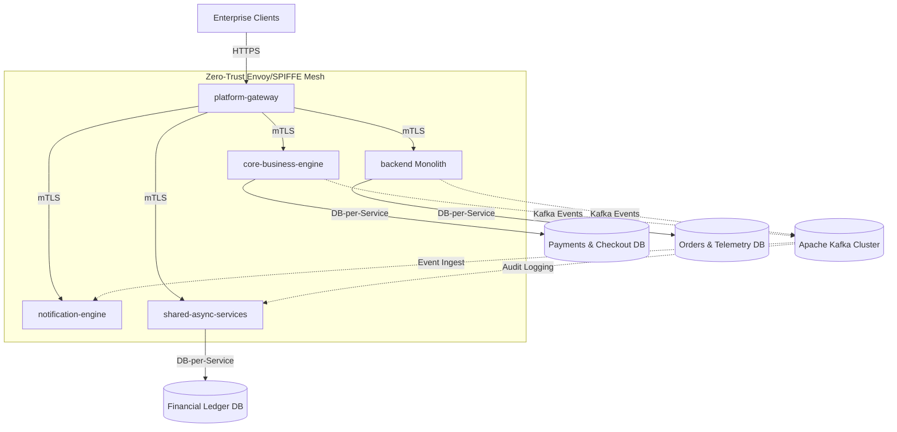
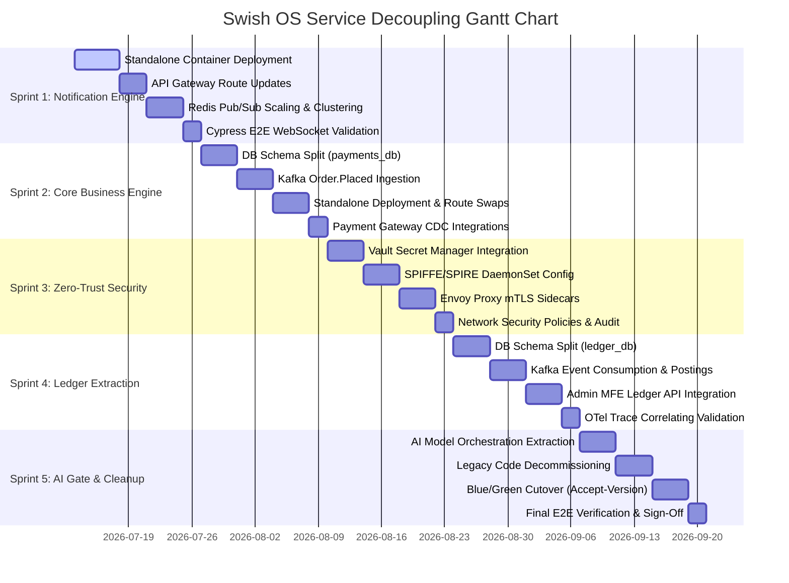

# Swish OS Platform: Microservice Decoupling & Modernization Plan

This document establishes the official architectural blueprint, sprint milestones, and Gantt delivery phases to execute the incremental decoupling of **`core-business-engine`**, **`notification-engine`**, and **`shared-async-services`** from the monolithic `backend` using the **Strangler Fig pattern**.

---

## 1. Architectural Current State vs. Target State

### Current State
*   **Monolithic Backend (`backend`)**: Holds the bulk of the B2B logistics, orders, and telemetry processing logic.
*   **Fragmented Microservice Modules**: `core-business-engine`, `notification-engine`, and `shared-async-services` exist as separate Maven modules but share dependencies, configuration, and database schemas with the monolith.
*   **Database Coupling**: All modules currently read/write to the same shared PostgreSQL database instance (`oltp` schema).

### Target State (Zero-Trust Service Mesh)
*   **Decoupled Services**: Each service runs as a standalone container with its own isolated database instance/schema (Database-per-Service).
*   **API Gateway Routing**: The `platform-gateway` acts as the single entry point, dynamically routing client traffic based on endpoints and headers.
*   **Zero-Trust Security**: Mutual TLS (mTLS) between containers managed by SPIFFE/SPIRE with Envoy sidecars.
*   **Event-Driven Integration**: Core state updates are synchronized asynchronously via Apache Kafka using transactional outbox patterns.



---

## 2. Sprint Milestones (5-Sprint Roadmap)

The extraction is executed incrementally over 5 two-week sprints.

### Sprint 1: Notification Engine Isolation & Standalone Deployment
*   **Milestone**: Independent runtime and client connectivity for `notification-engine`.
*   **Deliverables**:
    *   Deploy `notification-engine` as a standalone container on Port 8082.
    *   Update `platform-gateway` to route `/api/v1/notifications/**` and WebSocket upgrades (`/ws/notifications/**`) directly to the standalone engine.
    *   Configure a standalone Redis cache cluster for managing WebSocket session state and scaling WebSocket broadcast events across multiple notification replicas.
    *   Validate with end-to-end Cypress tests simulating rider/customer real-time updates.

### Sprint 2: Core Business Engine (Payments & Checkout) Extraction
*   **Milestone**: Separate database schema and independent transaction lifecycle for `core-business-engine`.
*   **Deliverables**:
    *   Create a separate database schema/instance `payments_db` and migrate `oltp.payments` table.
    *   Configure `core-business-engine` to connect to `payments_db` and handle payment captures independently.
    *   Introduce `order.placed` event in `backend` monolith; `core-business-engine` consumes this event to initiate payment flow.
    *   Deploy `core-business-engine` on Port 8081; update API Gateway to route `/api/v1/payments/**` to it.

### Sprint 3: Zero-Trust Mesh (SPIFFE/SPIRE & Vault) Rollout
*   **Milestone**: Mutual TLS (mTLS) and secure secrets rotation across the new services.
*   **Deliverables**:
    *   Deploy HashiCorp Vault container for secret storage; migrate dynamic secrets (`JWT_SECRET`, database passwords) from static env files to `vault://` imports.
    *   Configure SPIRE (SPIFFE Runtime Environment) agent and server containers.
    *   Add Envoy proxy sidecar configurations to `core-business-engine` and `notification-engine` Docker/Kubernetes specs.
    *   Verify Zero-Trust east-west communication (non-mesh traffic is blocked).

### Sprint 4: Shared Async Services & Ledger Decoupling
*   **Milestone**: Ledger records extraction and read-model endpoints in `shared-async-services`.
*   **Deliverables**:
    *   Isolate `FinancialLedgerEntry` tables into a new `ledger_db` schema.
    *   Configure `shared-async-services` to consume `payment.captured` and `order.completed` events from Kafka and write corresponding entries to the ledger.
    *   Expose secure REST read endpoints for financial summaries on `shared-async-services`.
    *   Update the `frontend-admin` MFE to retrieve ledger summaries from the gateway, routing to the new service.

### Sprint 5: AI Orchestration Decoupling & Monolith Decommissioning
*   **Milestone**: AI Gateway migration and decommissioning of monolithic legacy paths.
*   **Deliverables**:
    *   Decouple `AiModelOrchestrationPort` from the monolith, running it inside `shared-async-services` as the single gateway to FastAPI/Letta.
    *   Remove legacy payment, ledger, and notification logic/schemas from the `backend` monolith.
    *   Execute final Blue/Green routing switch (`Accept-Version: v2`) to target the extracted microservice endpoints.
    *   Confirm 100% test coverage and Prometheus Actuator observability validation.

---

## 3. Gantt Delivery Phases

The Gantt chart below visualizes the timeline, task sequences, and dependencies across the 5 sprints.



---

## 4. Rollout, Fallback & Operational Runbook

To ensure zero-downtime migrations:

### 1. Database Cutover & Shadow Run
*   During database migrations, a **Kafka CDC connector (Debezium)** will replicate writes from the monolith's database schema to the new microservice schema in real-time.
*   The new microservice will run in "Shadow Mode" — consuming traffic, executing logic, but discarding write outcomes, while validating performance and latency profiles against Prometheus alerts.

### 2. Gateway Dynamic Routing (Accept-Version)
*   The `platform-gateway` will inspect incoming HTTP requests.
*   Requests containing the header `Accept-Version: v2` will be routed to the new microservices.
*   Requests containing `Accept-Version: v1` or missing the header will default to the monolithic backend.

```
[MFE Clients] ---> [platform-gateway]
                       |
                       +---> (Accept-Version: v2) ---> [Extracted Microservice]
                       |
                       +---> (Default / v1)       ---> [backend Monolith]
```

### 3. Circuit Breaker & Fallback Protocol
*   All inter-service network calls are decorated with **Resilience4j Circuit Breakers**.
*   If a decoupled service (e.g. `notification-engine`) undergoes a network partition:
    *   The circuit breaker opens after 5 failures in 10s.
    *   Gateway traffic falls back gracefully to in-memory queues (or Redis buffers) to prevent request loss.
    *   Prometheus warning alerts are triggered automatically.

### 4. Rollback Plan
*   If a critical production bug is detected in the decoupled service:
    *   Change the gateway routing definition to redirect 100% of traffic back to the monolithic v1 endpoints.
    *   Since the legacy monolithic logic remains present until Sprint 5, the monolith acts as a hot-standby fallback.

---

## 5. Architectural & SRE Hardening Decisions

Following the formal joint review by the TPO, SRE, and Enterprise Architect roles, the following decisions are baked into this roadmap:

### 1. Automated Double-Entry Audit Engine (Sprint 4)
*   **Decision**: Implemented as part of the ledger extraction phase. A background auditing job will execute in `shared-async-services` to reconciliate Kafka `payment.captured` logs from `core-business-engine` against ledger entries in `shared-async-services` to identify, report, and auto-correct eventual consistency gaps.

### 2. Common Contract Library (Sprint 1)
*   **Decision**: To prevent DTO/schema drifts and class duplication across services, a common Maven submodule `shared-contracts` will be established as part of the multi-module project structure. It will hold shared event objects (e.g., `OrderFulfilledEvent`, `OrderPlacedEvent`) and shared validation schemas.

### 3. ArchUnit Boundary Fitness Gates (Sprint 1)
*   **Decision**: Automated test guards (fitness functions) are active in `HexagonalArchitectureTest.java` to prevent new coupling. The `payment` and `notification` domains are strictly guarded from direct in-process access by other modules.
