# Swish OS: Enterprise Service Mesh & Agentic Governance Architectural Blueprint

This document details the end-to-end, production-grade system architecture for **Swish OS**. It includes edge delivery, ingress security, micro-frontend compositions, the secure API gateway, VPC-constrained service mesh topologies, transactional persistence isolation, event-driven async message brokers, and zero-trust AI governance integrations.

---

## 🗺️ 1. Complete System Architecture Diagram

The diagram below maps all user personas, ingress routing, the private VPC subnets, secure service boundaries, caching systems, databases, asynchronous event broker schemas, external third-party integrations, and the CI/CD deployment pipeline.

```mermaid
graph TD
    %% User Personas (Client Tier)
    subgraph Clients ["👥 CLIENT TIER & PERSONAS"]
        c_cust["🛒 Customer (Web/Mobile)"]
        c_rider["🚴 Rider (Web/Mobile)"]
        c_wholesaler["🏭 B2B Wholesaler"]
        c_admin["💻 Admin / Ops Team"]
        c_dev["🛠️ DevOps / Developer"]
    end

    %% Edge Ingress & Network Security
    subgraph Ingress ["🌐 NETWORK EDGE & INGRESS SECURITY"]
        dns["DNS (Route 53 / Cloud DNS)"]
        waf["WAF (Cloud Armor / AWS WAF)"]
        alb["Application Load Balancer (ALB)"]
    end

    %% Frontend Tier
    subgraph Frontend ["🎨 MICRO-FRONTEND (MFE) LAYER (Vite + React)"]
        fe_host["frontend-host (Shell / Auth)"]
        fe_cust["frontend-customer"]
        fe_rider["frontend-rider"]
        fe_b2b["frontend-b2b"]
        fe_admin["frontend-admin"]
        fe_mobile["React Native Mobile App"]
    end

    %% API Gateway & Ingress Filters
    subgraph GatewayTier ["🚧 API GATEWAY & SECURITY FILTERS"]
        apigw["platform-gateway (Spring Cloud Gateway)"]
        f_cors["CORS Filter"]
        f_auth["OIDC Auth Filter (JWT)"]
        f_rate["Rate Limiter (Redis Token Bucket)"]
    end

    %% VPC Private Subnets - Service Mesh
    subgraph VPC ["🔒 PRIVATE VPC SUBNET"]
        subgraph Mesh ["🕸️ Envoy Service Mesh (mTLS + SPIFFE/SPIRE)"]
            
            subgraph ServiceMonolith ["📦 backend Monolith"]
                m_core["Logistics & Inventory Core"]
                m_sec["Spring Method Security"]
            end

            subgraph ServicePayment ["💳 core-business-engine (Port 8081)"]
                p_core["Checkout & Payment Core"]
                p_res["Resilience4j Circuit Breakers"]
            end

            subgraph ServiceNotification ["🔔 notification-engine (Port 8082)"]
                n_core["WebSocket Handler"]
                n_cache["Local Memory Buffer"]
            end

            subgraph ServiceAsync ["⚙️ shared-async-services (Port 8083)"]
                a_audit["Double-Entry Audit Engine"]
                a_temp["Temporal.io Saga Workers"]
                a_ai["AI Model Orchestration Port"]
            end

            subgraph ServiceAIGov ["🧠 fastapi-ai-governance (Port 8000)"]
                ai_agent["Agent Mesh (Support & Pricing)"]
                ai_nemo["NVIDIA NeMo Guardrails"]
                ai_letta["Letta Memory Engine"]
            end
        end

        %% Identity & Secrets Management inside VPC
        subgraph SecInfra ["🔑 SECURITY INFRASTRUCTURE"]
            spire["SPIRE Agent & Server DaemonSet"]
            vault["HashiCorp Vault Secrets Manager"]
            idp["Okta / Auth0 IdP (OIDC Provider)"]
        end

        %% Database & Storage Tier (Isolated private subnet)
        subgraph Databases ["🗄️ PERSISTENCE TIER"]
            db_mono[("Orders & Telemetry DB\n(PostgreSQL + TimescaleDB)")]
            db_pay[("Payments DB\n(PostgreSQL)")]
            db_ledger[("Ledger DB\n(PostgreSQL)")]
            redis[("Redis Cluster\n(WS State / Rate Limits)")]
            vector_db[("Qdrant / PGVector DB\n(Agent Embeddings)")]
        end
        
        %% Async Event Broker inside VPC
        subgraph EventBroker ["🐝 EVENT-DRIVEN BROKER"]
            kafka[("Apache Kafka Cluster")]
            cdc["Debezium CDC Connector"]
            temporal[("Temporal.io Orchestrator")]
        end
    end

    %% External Connections (Outbound)
    subgraph External ["🔌 EXTERNAL INTEGRATIONS"]
        ext_stripe["Stripe / Adyen Gateway"]
        ext_fmcg["FMCG Catalog APIs (Nestle/Unilever)"]
        ext_llm["LLM APIs (vLLM / Gemini / OpenAI)"]
    end

    %% Connect clients to Ingress
    c_cust --> dns
    c_rider --> dns
    c_wholesaler --> dns
    c_admin --> dns
    
    dns --> waf
    waf --> alb

    %% Load Balancer distributes to Frontends
    alb --> fe_host
    fe_host --> fe_cust
    fe_host --> fe_rider
    fe_host --> fe_b2b
    fe_host --> fe_admin
    alb --> fe_mobile

    %% Frontends call API Gateway
    fe_cust --> apigw
    fe_rider --> apigw
    fe_b2b --> apigw
    fe_admin --> apigw
    fe_mobile --> apigw

    %% Gateway passes through filters
    apigw --> f_cors
    f_cors --> f_auth
    f_auth --> f_rate
    f_rate --> idp

    %% Gateway routes to Envoy Service Mesh sidecars
    f_rate -->|Dynamic Routing| Mesh

    %% Service connections to databases
    m_core --> db_mono
    p_core --> db_pay
    n_core --> redis
    a_audit --> db_ledger
    ai_letta --> vector_db

    %% Mesh sidecar identity checking
    ServiceMonolith <-->|SPIFFE mTLS| spire
    ServicePayment <-->|SPIFFE mTLS| spire
    ServiceNotification <-->|SPIFFE mTLS| spire
    ServiceAsync <-->|SPIFFE mTLS| spire
    ServiceAIGov <-->|SPIFFE mTLS| spire
    
    %% Vault provides dynamic credentials
    vault -->|Secret Mount| ServiceMonolith
    vault -->|Secret Mount| ServicePayment
    vault -->|Secret Mount| ServiceAsync
    vault -->|Secret Mount| ServiceAIGov

    %% Async Kafka Connections
    ServiceMonolith -->|Publish OrderPlaced| kafka
    ServicePayment -->|Publish PaymentCaptured| kafka
    kafka -->|Consume Events| ServiceNotification
    kafka -->|Reconcile / Log| ServiceAsync
    cdc -->|Change Data Capture| db_mono
    cdc -->|Sync| db_pay

    %% Temporal orchestration
    ServiceAsync <-->|Saga Poll & Execute| temporal

    %% AI Governance Flow
    ServiceAsync -->|REST / JSON| ServiceAIGov
    ai_agent --> ai_nemo
    ai_agent --> ai_letta
    ai_nemo --> ext_llm

    %% External calls from services
    ServicePayment -->|HTTPS| ext_stripe
    ServiceMonolith -->|HTTPS| ext_fmcg

    %% Node styling classes
    classDef persona fill:#FFEAA7,stroke:#D63031,stroke-width:2px,color:#2D3436;
    classDef edge fill:#FF7675,stroke:#D63031,stroke-width:2px,color:#2D3436;
    classDef fe fill:#74B9FF,stroke:#0984E3,stroke-width:2px,color:#2D3436;
    classDef gateway fill:#A29BFE,stroke:#6C5CE7,stroke-width:2px,color:#2D3436;
    classDef service fill:#DFE6E9,stroke:#2D3436,stroke-width:2px,color:#2D3436;
    classDef db fill:#55EFC4,stroke:#00B894,stroke-width:2px,color:#2D3436;
    classDef ext fill:#FFEAA7,stroke:#E17055,stroke-width:2px,color:#2D3436;
    classDef pipeline fill:#FAB1A0,stroke:#E17055,stroke-width:2px,color:#2D3436;
    classDef vpc fill:#F5F6FA,stroke:#7F8C8D,stroke-width:2px,color:#2D3436;

    class c_cust,c_rider,c_wholesaler,c_admin,c_dev persona;
    class dns,waf,alb edge;
    class fe_host,fe_cust,fe_rider,fe_b2b,fe_admin,fe_mobile fe;
    class apigw,f_cors,f_auth,f_rate gateway;
    class ServiceMonolith,ServicePayment,ServiceNotification,ServiceAsync,ServiceAIGov service;
    class db_mono,db_pay,db_ledger,redis,vector_db db;
    class ext_stripe,ext_fmcg,ext_llm ext;
```



---

## 🧱 2. Layer-by-Layer Architectural Breakdown

### 1. Client Tier & User Personas
*   **Customer (Web & Mobile)**: Browses FMCG products, views dynamic surges, places orders, and interacts with the customer support AI.
*   **Rider (Web & Mobile)**: Receives order assignments, sends real-time GPS locations, and updates order states.
*   **B2B Wholesaler**: Logs into the Wholesaler Portal MFE to manage product supply lists, configure prices, and review sales volumes.
*   **Admin / Ops Team**: Views financial ledger summaries, reviews AI agent memory logs via Letta, and overrides pricing surges.
*   **DevOps / SRE**: Deploys services, configures monitoring dashboard alerts, and updates security policies.

### 2. Network Edge & Ingress Filters
*   **DNS (Route 53 / Cloud DNS)**: Directs client traffic using latency-based routing to nearest regions.
*   **WAF (Web Application Firewall)**: Mitigates DDoS attacks, blocks SQL injection, cross-site scripting (XSS), and applies geographic IP restrictions.
*   **Application Load Balancer (ALB)**: Terminates external SSL/TLS certificates and acts as the VPC ingress controller, directing traffic to the frontend micro-frontend shell or the mobile API gateways.

### 3. Frontend Micro-Frontend (MFE) Composition
The client tier is built on a composable React + Vite architecture split into 5 core domain applications:
*   **frontend-host**: The main shell application. It hosts common layouts, global style sheets, and handles login/session orchestration using OAuth2 OIDC tokens.
*   **frontend-customer**: Renders the consumer storefront, product catalogs, cart actions, and checkout forms.
*   **frontend-rider**: Coordinates real-time Mapbox map overlays, WebSocket location publishers, and delivery handshakes.
*   **frontend-admin**: Renders financial audit reports, system configuration toggles, and AI prompt testing consoles.
*   **frontend-b2b**: Manages wholesaler onboarding, inventory uploads, and purchase order tracking.
*   **React Native Mobile App**: Packages customer and rider flows into native mobile shells.

### 4. API Gateway & Cross-Cutting Filters
The **`platform-gateway`** (built with Spring Cloud Gateway) serves as the unified interface to the microservice cluster:
*   **CORS Filter**: Restricts resource access to authorized origins (the client MFE hosts).
*   **OIDC Auth Filter**: Parses, validates, and decodes incoming HS256 JWT tokens against Auth0/Okta providers, appending verified claims (`sub`, `role`, `sid`) as headers for downstream services.
*   **Rate Limiter Filter**: Prevents brute-forcing and API abuse using a Redis-backed token bucket algorithm (applying IP-based limits for anonymous traffic and user ID limits for authenticated sessions).
*   **Dynamic / Version Router**: Inspects the `Accept-Version` header. Automatically forwards `v1` traffic to the legacy monolith and `v2` traffic to decoupled services.

### 5. Private VPC Subnet & Envoy Service Mesh (mTLS + SPIFFE/SPIRE)
The internal microservices are isolated inside a private VPC network. All inter-service communications must go through the **Envoy Service Mesh**:
*   **Zero-Trust mTLS**: Non-mesh traffic is strictly blocked. Inbound and outbound connections are intercepted by Envoy sidecar proxies.
*   **SPIFFE/SPIRE Provider**: A SPIRE Agent DaemonSet runs on each Kubernetes node, dynamically attesting pod workloads and issuing short-lived X.509 SVID credentials for mTLS handshakes.
*   **HashiCorp Vault Integration**: Standardizes credential rotation. Pods inject secrets (`JWT_SECRET`, database passwords) dynamically at runtime, avoiding static environmental files.
*   **Spring Method Security**: Backend services apply annotation-based access controls (`@PreAuthorize("hasRole('ADMIN')")`) to block API endpoints inside the containers.
*   **ArchUnit Boundary Fitness Gates**: Compile-time check rules verify that core domain layers do not depend directly on database adapters or other isolated service core libraries.

### 6. Microservices & Isolated Persistence (Database-per-Service)
*   **`backend` Monolith**: Processes core logistics and inventory. Operates on **Orders & Telemetry DB** (PostgreSQL with TimescaleDB extension for timeseries sensor reads).
*   **`core-business-engine`**: Standalone checkout and payments service. Uses **Payments DB** (isolated PostgreSQL database). Resilient integrations to external APIs (Stripe) are protected with **Resilience4j Circuit Breakers**.
*   **`notification-engine`**: Manages WebSockets for real-time customer and rider alerts. Keeps state in a dedicated **Redis Cache cluster** to support horizonal scaling.
*   **`shared-async-services`**:
    *   **Double-Entry Audit Engine**: Monitors Kafka streams to match payments against ledger postings, detecting transactional anomalies.
    *   **Temporal Saga Workers**: Executes distributed transactions across service borders (e.g., compensating an order capture if inventory allocation fails).
*   **`fastapi-ai-governance`**: FastAPI service running the AI pricing and agent mesh. Integrates **Letta memory engine** to maintain conversational sessions and **Qdrant vector database** for semantic index lookups.

---

## 🔄 3. Key End-to-End Workflows

### Flow A: Transactional Payment Checkout (Strangler Fig Seam)
1. **User Action**: The customer submits their cart on the `frontend-customer` MFE.
2. **Gateway**: The MFE posts to `platform-gateway` at `/api/v2/checkout`.
3. **Monolith Event**: The gateway routes to `backend` monolith, which validates stock and emits a `order.placed` JSON event to the **Apache Kafka** cluster.
4. **Decoupled Payment Ingest**: The `core-business-engine` consumes `order.placed`. It establishes a payment intent and calls the external **Stripe API**.
5. **Gateway Routing Switch**: If Stripe approves, `core-business-engine` updates `payments_db` and publishes `payment.captured` to Kafka.
6. **Ledger Posting**: The `shared-async-services` consumes `payment.captured`, writes double-entry records to `ledger_db`, and triggers the delivery dispatch sequence via **Temporal.io**.

### Flow B: Real-Time Rider Geo-Tracking
1. **Rider Action**: The `frontend-rider` MFE tracks GPS coordinates and publishes them over an active WebSocket to `/ws/rider/telemetry`.
2. **Gateway Routing**: The `platform-gateway` routes the WebSocket request directly to the `notification-engine`.
3. **Redis Pub/Sub**: The `notification-engine` writes location coordinates to the shared **Redis cluster** and broadcasts it to all other engine nodes.
4. **WebSocket Push**: The `notification-engine` pushes the location update to the active `frontend-customer` WebSocket session, updating the map view in real-time.
5. **Timeseries Log**: In the background, telemetry coordinates are asynchronously dumped into **TimescaleDB** (`sensor_readings`) for historical audit.

### Flow C: Governed Customer Support AI Query
1. **Customer Action**: A customer submits a question on the support chat: *"Why was my order #1024 pricing adjusted?"*
2. **Gateway Route**: The gateway forwards the chat query to `shared-async-services`'s AI orchestration port.
3. **FastAPI AI Ingress**: The port triggers the `fastapi-ai-governance` REST endpoint.
4. **NVIDIA NeMo Input Guardrail**: NeMo screens the customer input for toxicity, injection attacks, and jailbreaks. If unsafe, it triggers a fallback response immediately.
5. **Letta Session Retrieval**: The AI service queries the **Letta engine** to retrieve the customer's conversational session history.
6. **Agent Mesh Routing**: The `CustomerSupportAgent` delegates to the `DynamicPricingAgent` via the `DYNAMIC_PRICING` tool to fetch pricing logs.
7. **Vector Context Enrichment**: The agent performs a semantic query in the **Qdrant Vector DB** for historical pricing strategies.
8. **NVIDIA NeMo Output Guardrail**: NeMo audits the generated LLM response against strict schemas, ensures PII data is redacted, and confirms hallucination-free output.
9. **Response Delivery**: The formatted response is pushed back to the client.

---

## 🛠️ 4. CI/CD & Automated Governance Pipeline

A secure DevOps pipeline controls all code updates before they are packaged and deployed to Kubernetes:

```
[Developer Push]
       │
       ▼
[GitHub Actions CI] ──► 1. Code Style: Spotless (Java) & Biome (TypeScript)
       │
       ▼
[Security Gates]   ──► 2. SAST Analysis: Semgrep (OWASP Top-10 Injection check)
       │
       ▼
[Architecture Check] ─► 3. Fitness Functions: ArchUnit boundary validation
       │
       ▼
[AI Model Evals]   ──► 4. Validation: Promptfoo Assertions & LangSmith tracking
       │
       ▼
[Docker Build]     ──► 5. Package Container & Push to Google Artifact Registry
       │
       ▼
[CD Deployer]      ──► 6. GitOps / Helm upgrade to Kubernetes cluster
```

### 1. Automated Security & Architecture Checks
*   **Spotless & Biome Lint**: Enforces strict format compliance across all codebase modules.
*   **Semgrep SAST Gate**: Scans Java, TypeScript, and Python directories. Finds and blocks potential vulnerabilities (e.g. SQL injection patterns, insecure encryption, hardcoded credentials) before merge.
*   **ArchUnit boundaries**: Ensures developers cannot import monolith logic into decoupled packages.
*   **Promptfoo AI Evals**: Assertions check prompt changes against test cases to prevent hallucinations, jailbreaks, or tone drifts.
