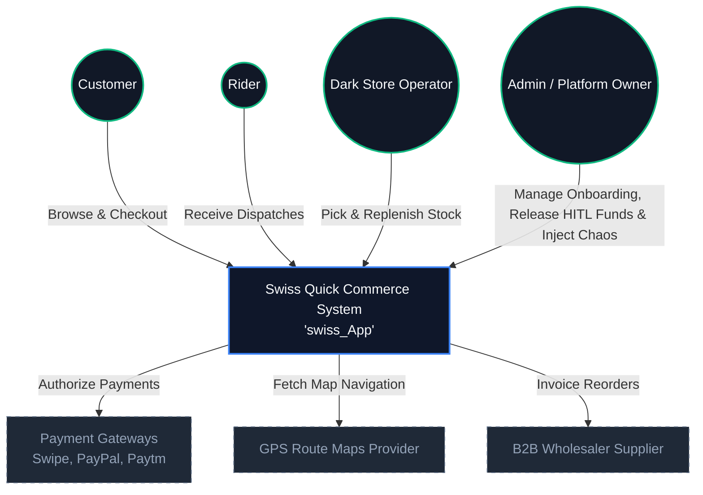
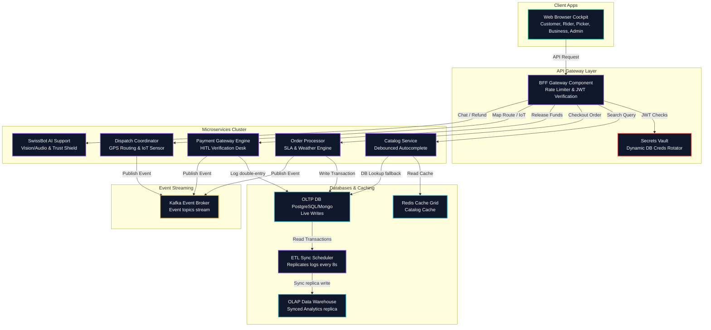
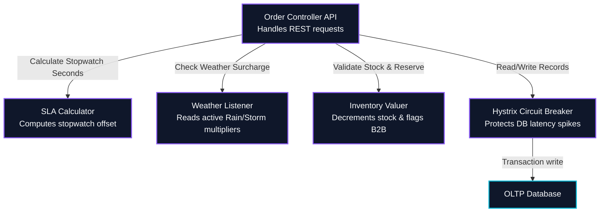

# High-Level Design (HLD): Swiss Quick Commerce System ("swiss_App")

This High-Level Design (HLD) serves as the primary architectural blueprint and governance framework for the **Swiss Quick Commerce System ("swiss_App")**. It aligns our high-performance, 10-minute marketplace with enterprise-level methodologies (**TOGAF ADM**, **C4 Model**, **SAFe**, **ITIL v4**, **COBIT 2019**, and **veriSM**).

---

## 1. Executive Summary & Vision

The **Swiss Quick Commerce System** is an ultra-fast, lightweight, and resilient three-sided marketplace designed to deliver fresh groceries from dark stores to customer doorsteps in under 10 minutes. The system integrates real-time inventory checks, dynamic weather-based SLA adjustments, IoT cold chain transit monitoring, AI fraud shields, and manual Human-in-the-Loop (HITL) payment release protocols.

This architecture includes advanced **Risk, Security, and Capacity Extensions**, adding security trust matrices across all profiles, cold chain spoilage thresholds with dry-ice mitigation, B2B wholesale outages with secondary supplier fallbacks, and micro-fulfillment center (MFC) storage limits with horizontal auto-scaling capabilities.

---

## 2. TOGAF ADM Architecture Alignment

```
       Phase A: Architecture Vision
                    │
      ┌─────────────┴─────────────┐
      ▼                           ▼
Phase B: Business           Phase C: Information Systems
(Processes & Roles)         (Data & Application Microservices)
      ▲                           ▲
      └─────────────┬─────────────┘
                    ▼
      Phase D: Technology Architecture
       (Kafka, Redis, Vault, CBs, Trust Engines)
```

### Preliminary Phase: Architecture Principles
* **Resilience First**: Outages in external payment gateways, wholesaler supplier routes, or database latency spikes must not fail checkout paths (e.g., fallback caching, secondary wholesaling, and circuit breaker policies).
* **Decoupled Data Flow**: High-frequency transactional writes (OLTP) must be isolated from heavy business intelligence queries (OLAP) via asynchronous ETL synchronization.
* **Security by Design**: Every microservice connection must validate JWT tokens, and sensitive DB credentials must rotate dynamically. Account trust scores must govern refund claims and payouts.

### Phase A: Architecture Vision
* **Core Value Proposition**: Fresh groceries delivered under a strict SLA, supported by robust, fault-tolerant infrastructure and audited actors.
* **Stakeholder Maps**:
  * *Customers*: Expect instant product search, dynamic ETA calculations, and trust-shielded support bot refunds.
  * *Riders*: Expect onboarding verification, automated GPS navigation, and trust-incentivized payouts.
  * *Warehouse Pickers*: Require checklists, backup pickers, and accuracy trust index monitoring.
  * *Merchants / Business Owners*: Require analytics dashboards, store capacity metrics, and a security trust & fraud log.
  * *Admins / Platform Owners*: Need chaos desks, L1/L2/L3 approvals, and transaction ledger auditing.

### Phase B: Business Architecture
Our business model is built around a multi-sided marketplace value chain. The following process flow tracks an order checkout, multi-store rerouting, fulfillment, and B2B capacity restocking:

```
[Customer Checkout] ──► [Trust score >= 65?] ──► [OLTP Ledger Transaction] ──► [Fulfillment Checklist]
                                                                                      │
     ┌────────────────────────────────────────────────────────────────────────────────┘
     ▼
[Stock Check < 3?] ──► [Primary Supplier Healthy?] ──(Yes)──► [Pending B2B Funds] ──► [HITL Release] ──► [Capacity Check] ──► [Restock]
     │                                │
     ▼                              (No)
[Picker Fulfill]                      ▼
     │                      [Fallback Wholesaler]
     ▼
[Rider Accept] ──► [Transit GPS & Temp] ──(Temp > 12.0°C)──► [Spoiled Write-off] ──► [Cancel Order]
                               │
                          (Mitigated)
                               ▼
                       [Deliver & Payout]
```

### Phase C: Information Systems Architecture
The system splits data storage and application microservices:

#### Data Architecture: OLTP vs. OLAP Split
* **OLTP Database (Online Transaction Processing)**: High-concurrency database storing live cart checkouts, active order states, trust ratings, and wallet balances. Optimized for write operations (< 5ms write locks).
* **OLAP Database (Online Analytical Processing)**: Replicated Data Warehouse serving heavy Business Dashboard query requests.
* **ETL Sync Pipeline**: Asynchronous data replicator that syncs transactional entries from the OLTP DB to the OLAP DW every 8 seconds, ensuring heavy analytics queries do not degrade checkout write performance.

```
┌───────────────┐                  ┌───────────────┐
│    OLTP DB    │ ───[ETL Sync]───►│    OLAP DW    │
│ (Checkouts/W) │    (8s Loop)     │  (Analytics)  │
└───────────────┘                  └───────────────┘
```

#### Application Architecture: Microservices Catalog
1. **BFF Gateway (Backend-For-Frontend)**: Routes browser queries, applies rate limiters, rotates JWT session tokens, and fetches Redis cache keys.
2. **Catalog Service**: Handles debounced autocomplete product searches.
3. **Order Processor**: Manages checkout lifecycles, states transitions, and dynamic weather SLA fees.
4. **Payments Engine**: Routes transactions to Swipe, PayPal, Paytm, or Wallet gateways.
5. **Dispatch & Routing Coordinator**: Calculates GPS route paths and tracks rider marker updates.
6. **Support Bot AI Service**: Chat bot processing refunds under customer trust score gates.
7. **B2B Procurement Broker**: Checks inventory limits and triggers wholesale restocking invoices.
8. **Trust Score Auditor**: Tracks, updates, and logs security trust deltas for all marketplace actors.

### Phase D: Technology Architecture
* **Event Broker**: Apache Kafka streaming events (`order.placed`, `payment.completed`, `delivery.completed`, `iot.temperature_alert`, `trust.updated`).
* **Cache Layer**: Redis cluster caching catalog autocomplete entries.
* **Secrets Vault**: HashiCorp Vault simulating database credentials rotation (15s cycles).
* **Circuit Breakers**: Netflix Hystrix pattern tripping database gateways to fallback states if query latency > 1000ms.

---

## 3. C4 Model Architecture Diagrams

### System Context Level (L1)
The Context level shows how the Swiss Quick Commerce System interacts with external users, payment partners, and GPS mapping providers.



### Container Level (L2)
The Container level details the microservice layout, databases, cache grids, event streams, and security nodes.



### Component Level (L3): Order Processing Service
L3 highlights the internal components of the **Order Processor Microservice**.



---

## 4. SAFe (Scaled Agile Framework) Integration

The Swiss Q-Commerce application is delivered by the **Quick Commerce Agile Release Train (QC-ART)**, running on a 2-week Program Increment (PI) cycle.

```
QC-ART Agile Release Train:
[PI Planning] ──► [Sprint 1] ──► [Sprint 2] ──► [IP Sprint] ──► [Release on Demand]
```

### Customer Value Stream Mapping
Our Value Stream maps the lead time from grocery harvest/replenishment down to the customer's delivery stopwatch:

| Stage | Lead Time | Governance Target |
| :--- | :--- | :--- |
| **B2B Replenishment** | 1 - 2 Hours | Stock kept above 3 units, Wholesaler trust $\ge$ 70 |
| **Customer Cart Checkout** | < 10 Seconds | Latency < 150ms, Customer trust $\ge$ 65 |
| **Dark Store Pick & Pack** | < 2 Minutes | Picker checklist, Congestion bypass dynamic routing |
| **Rider GPS Transit** | < 6 Minutes | SLA safety, Cold Chain IoT Temp < 8.0°C |

### Release on Demand Strategies (Feature Toggles)
* **Chaos Desk Toggles**: Outage injections (db latency, redis flush, cold chain breakdown, supplier outage) are controlled via Admin feature flags.
* **SLA Override**: Pricing and ETA coefficients change dynamically on demand without releasing new code.
* **Trust Thresholds**: Adjust refund-blocking trust parameters from 65 to 80 dynamically during peak seasons.

---

## 5. ITIL v4 Service Value System (SVS)

```
                       ITIL Service Value Chain
   ┌──────────────────────────────────────────────────────────────┐
   │                                                              │
   │  ┌──────────┐         ┌──────────────┐         ┌──────────┐  │
   │  │  ENGAGE  │────────►│ OBTAIN/BUILD │────────►│ DELIVER/ │  │
   │  │ (Support │         │ (CI/CD Git   │         │ SUPPORT  │  │
   │  │   Bot)   │         │  Deployments)│         │ (SLA Met)│  │
   │  └──────────┘         └──────────────┘         └──────────┘  │
   │                                                              │
   └──────────────────────────────────────────────────────────────┘
```

The **SVS** converts customer grocery demand into valuable marketplace outcomes.

### Service Value Chain (SVC) Stages
1. **Plan**: Align platform capabilities with consumer groceries demand.
2. **Improve**: Continuously audit database queries and cache hit ratios.
3. **Engage**: Gather feedback via customer rating forms and AI help desk bot conversations.
4. **Design & Transition**: Package new services (e.g. dynamic capacity scaling, dry ice mitigations) with security layers.
5. **Obtain/Build**: Deploy lightweight React scripts.
6. **Deliver & Support**: Dispatch riders under map SLA stopwatch countdowns, tracking cold chain integrity.

### ITIL Practices Incorporated
* **Incident Management**: Toggling the Chaos desk triggers automated fallbacks, secondary wholesale routes, and alert toasts.
* **Service Level Management**: Real-time SLA stopwatch digital countdowns violation flags.
* **Release Management**: Zero-downtime client-side script rollouts.

---

## 6. COBIT 2019 Governance Objectives

We align IT governance with the COBIT 2019 framework across five core categories:

| COBIT Domain | Reference | Applied Objective in swiss_App |
| :--- | :--- | :--- |
| **Evaluate, Direct, Monitor** | **EDM03** (Ensure Risk Optimization) | Toggling Chaos Desk faults (Latency, Cold Chain Breakdown, Wholesaler Outage) validates platform breakers. |
| **Align, Plan, Organize** | **APO12** (Manage Risk) | Automated AI Fraud blocker protects merchant capital based on customer trust score thresholds. |
| **Build, Acquire, Implement** | **BAI06** (Manage IT Changes) | Strict capacity tracking and virtual horizontal scaling limits. |
| **Deliver, Service, Support** | **DSS05** (Manage Security Services) | Cryptographic token JWT handshakes, secrets rotation, and security trust audit logging. |
| **Monitor, Evaluate, Assess** | **MEA01** (Monitor Performance) | OLTP latency write bars and OLAP ETL replication synchronization. |

---

## 7. veriSM Management Mesh

The **veriSM** framework helps us build a custom Management Mesh to balance speed, stability, and security in Quick Commerce operations.

```
                           veriSM Management Mesh
                    
                         Resources (CDN, E-Bikes)
                                   │
                                   ▼
  Environment (SLA, Weather) ──► [swiss_App] ◄── Culture (SAFe Agility)
                                   ▲
                                   │
                                   ▼
                    Technologies (OLTP/OLAP, Vault, Trust Engines)
```

We configure our organizational mesh by assigning weights (1 to 5) to technologies and practices based on operational goals:

* **Agile development (SAFe)**: **Weight 5** (High speed feature release toggles).
* **DevOps (CDNs/CI/CD)**: **Weight 5** (Lightweight, zero-compilation local runs).
* **Service Management (ITIL v4)**: **Weight 4** (Stopwatch SLA monitors and support tickets).
* **Governance (COBIT 2019)**: **Weight 5** (Double-entry transaction ledgers, fraud controls, security vaults, trust logs, capacity checks).
