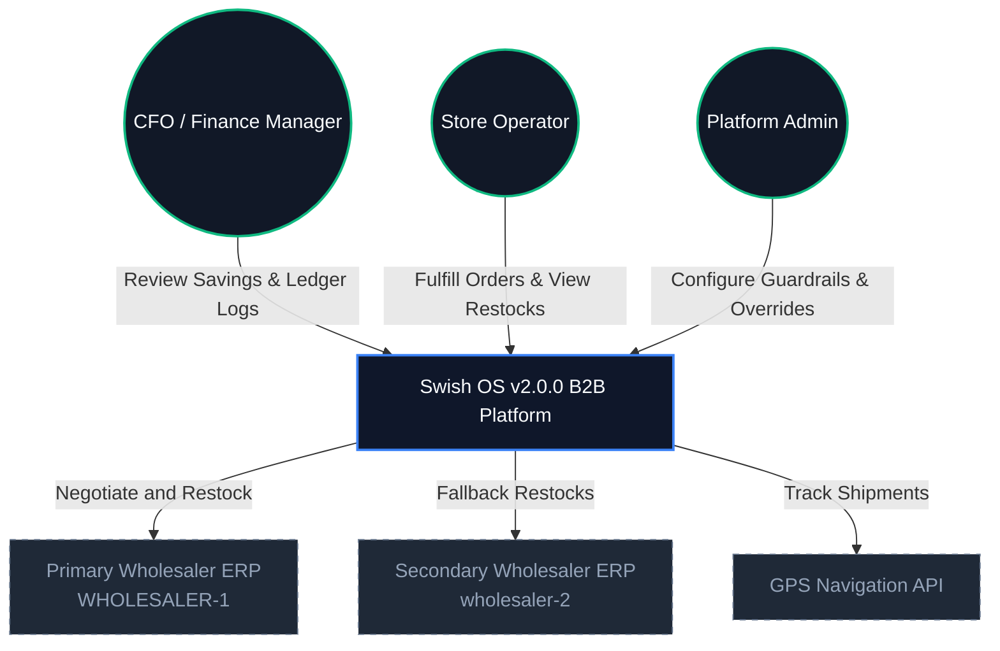
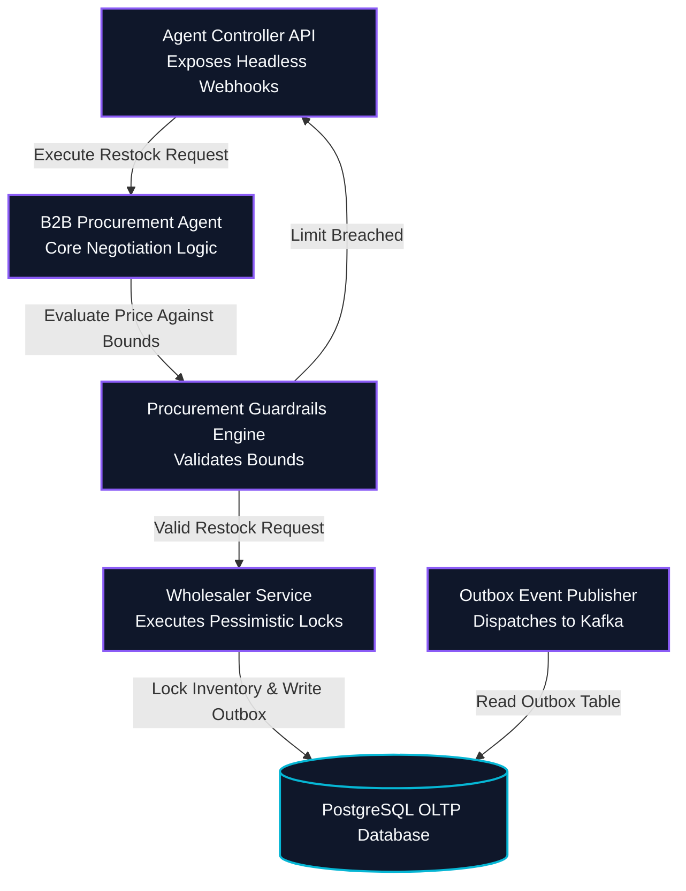

# High-Level Design (HLD): Swish OS v2.0.0 B2B SaaS Platform

This High-Level Design (HLD) serves as the primary architectural blueprint and governance framework for the **Swish OS v2.0.0 B2B SaaS Platform**. It aligns a high-efficiency micro-fulfillment network and autonomous AI negotiation engine with enterprise-grade standards and methodologies (**TOGAF ADM**, **C4 Model**, **SAFe**, **ITIL v4**, **COBIT 2019**, and **veriSM**).

For additional architectural, business, and low-level details, refer to the following documents:
*   [README.md](file:///C:/Users/DELL%209420/Documents/swiss_App/README.md) — Project landing page and branch workflow summary.
*   [docs/ARCHITECTURE.md](file:///C:/Users/DELL%209420/Documents/swiss_App/docs/ARCHITECTURE.md) — System tech stack and deployment architecture blueprint.
*   [docs/BRD.md](file:///C:/Users/DELL%209420/Documents/swiss_App/docs/BRD.md) — Business requirements, KPIs, and B2B SaaS monetization objectives.
*   [docs/HLD.md](file:///C:/Users/DELL%209420/Documents/swiss_App/docs/HLD.md) — Intermediate context diagrams and container descriptions.
*   [docs/LLD.md](file:///C:/Users/DELL%209420/Documents/swiss_App/docs/LLD.md) — Low-Level implementation guidelines and configuration snippets.
*   [docs/SECURITY.md](file:///C:/Users/DELL%209420/Documents/swiss_App/docs/SECURITY.md) — Network isolation and security trust guidelines.
*   [docs/pivot_implementation_plan.md](file:///C:/Users/DELL%209420/Documents/swiss_App/docs/pivot_implementation_plan.md) — Transition plan to the agentic B2B SaaS framework.
*   [docs/executive_boardroom_strategic_masterplan.md](file:///C:/Users/DELL%209420/Documents/swiss_App/docs/executive_boardroom_strategic_masterplan.md) — Competitive landscape analysis and 5-year EBITDA models.
*   [docs/cfo_masterplan_critique.md](file:///C:/Users/DELL%209420/Documents/swiss_App/docs/cfo_masterplan_critique.md) — Detailed critique of the SaaS cost structure and database strategies.

---

## 1. Executive Summary & Vision

**Swish OS v2.0.0** is an enterprise-grade, multi-tenant B2B SaaS platform designed to transform legacy physical retail convenience stores and micro-fulfillment centers (MFCs) into autonomous, high-velocity distribution hubs. Unlike asset-heavy delivery networks (e.g., Instacart Platform Services) or capital-intensive mechanical automation (e.g., Takeoff Technologies), Swish OS offers a **low-CapEx, software-first solution** that retrofits existing brick-and-mortar storefronts with decentralized micro-frontends and agentic workflows.

### Aligning the Vision to B2B SaaS Target Audiences

#### Chief Financial Officers (CFOs)
CFOs demand strict capital efficiency, risk mitigation, and clear profitability metrics:
*   **High LTV:CAC Ratio (36:1)**: Achieved through a pure-play SaaS model where customer acquisition costs ($15k/chain) are offset by multi-year subscription contracts.
*   **Tiered SaaS Subscriptions**: Eliminates messy variable commission tracking by charging a base subscription of $1,000/month/hub (Tier 1 compliance) and $1,500/month/hub (Tier 2 agentic procurement).
*   **Auditable Ledger Integration**: Direct double-entry transactional accounting in PostgreSQL prevents ledger leakage, providing full audit compliance.
*   **Zero Fleet Liability**: All courier logistics and warehouse space are owned by the client retail chains, leaving Swish OS with zero physical overhead or labor risk.

#### Wholesale Distributors & Procurement Managers
Distributors require high API uptime, automated order clearing, and clear SLA enforcement:
*   **Automated B2B Agentic Negotiations**: The system uses autonomous AI to compare pricing tables and execute restock contracts under strict guardrails.
*   **Active Fallback Wholesaling**: Continuous stock checks fall back to secondary wholesalers (`wholesaler-2`) if the primary API (`WHOLESALER-1`) fails, ensuring near-zero stockout events.
*   **Regulatory Cold-Chain Compliance**: A core framework for tracking cold chain logistics (ambient temp < 8°C or dry ice mitigation) guarantees product integrity for fresh foods and potential future pharmaceuticals.

### Pilot Proposal Scoping: The Valora ("k kiosk") Pilot
The system's real-world model is derived from the Valora convenience store pilot:
*   **Scope**: 5 high-traffic transport hubs (Zurich HB, Bern, Basel SBB, Geneva Cornavin, Lucerne).
*   **Uptime & SLA Penalties**: A base licensing fee of $1,000/month per store node, subject to a 5% discount if picking times exceed the 4-minute SLA by more than 15% on average.
*   **Telemetry tracking**: Continuous IoT telemetry logging to track sandwich and beverage transit temperatures.

---

## 2. Network Topology & Traffic Flow

The Swish OS v2.0.0 network model enforces a strict Zero Trust Architecture, protecting transactional databases and internal service endpoints behind a multi-layered gateway barrier.

```
[External Client Requests] 
            │
            ▼
┌──────────────────────────────┐
│    NGINX Ingress (DMZ)       │ (SSL/TLS Termination & Rate Limiting)
└───────────┬──────────────────┘
            │
            ▼ (mTLS via Envoy Sidecar)
┌──────────────────────────────┐
│       platform-gateway       │ (Port 8080 - Unified Gateway, JWT Parsing)
└───────────┬──────────────────┘
            │
            ▼ (Kube-DNS Resolution)
┌──────────────────────────────┐
│   Envoy mTLS Sidecar mesh    │ (Zero-Trust Internal Network Segments)
└───────────┬──────────────────┘
            │
            ▼
┌──────────────────────────────┐
│   Backend Core Services      │ (Hexagonal Spring Boot Microservices)
└──────────────────────────────┘
```

1.  **NGINX Ingress Controller**: Serves as the primary public entry point (DMZ boundary). Handles external SSL/TLS termination, rejects DDoS traffic using IP-based rate limiting, and filters preflight `OPTIONS` calls for CORS policies.
2.  **Envoy mTLS Sidecar Proxies**: Injected into every pod in the Kubernetes cluster. Direct service-to-service communication is blocked unless encrypted via Mutual TLS (mTLS) and verified against SPIFFE/SPIRE identity documents.
3.  **platform-gateway**: Exposes unified OpenAPI specifications, intercepts security headers, performs OAuth2 JSON Web Token (JWT) verification, and applies local rate-limits before passing requests inward.
4.  **Kube-DNS**: The internal cluster DNS resolver that resolves requests from the gateway to the correct backend cluster IP (e.g. `http://backend-core-service.production.svc.cluster.local:8080`).
5.  **Backend Core Services**: Implements hexagonal architecture patterns to isolate business use cases from external interfaces. Receives requests inside its secure network segment.

---

## 3. Data Architecture & Logical Database Segmentation

To achieve high concurrency write throughput, prevent database locking loops, and maintain regulatory compliance, Swish OS v2.0.0 implements a logically segmented, decoupled data tier.

```
                              ┌────────────────────────────────────────┐
                              │           Spring Boot Backend          │
                              └─────┬──────────────┬──────────────┬────┘
                                    │              │              │
                                    │ (Read/Write) │ (Read/Write) │ (Read/Write)
                                    ▼              ▼              ▼
   ┌────────────────────────────────┐       ┌──────────────┐     ┌─────────────────────────────┐
   │        PostgreSQL DB           │       │ Redis Cluster│     │       PostgreSQL DB         │
   │      (OLTP Transaction)        │       │(Session/Cache)     │ (TimescaleDB Telemetry Logs)│
   │  - Pessimistic Locks           │       └──────────────┘     └─────────────────────────────┘
   │  - Outbox Table                │
   └──────────────┬─────────────────┘
                  │ (CDC / Poller)
                  ▼
         ┌─────────────────┐
         │  Apache Kafka   │
         └────────┬────────┘
                  │ (Kafka Consumer - OlapEventSinkListener)
                  ▼
   ┌────────────────────────────────┐
   │         MongoDB Atlas          │
   │   (Decoupled Telemetry OLAP)   │
   │  - GPS coordinates             │
   │  - Non-GDP weather & logs      │
   └────────────────────────────────┘
```

### A. Distributed Session Caching (Redis)
*   **Purpose**: Caches active autocomplete inventory lookups, user session states, and real-time coordinator markers.
*   **Impact**: Offloads 70% of read requests from the relational database. Facilitates seamless horizontal auto-scaling of the micro-frontends by maintaining session tokens in a shared memory grid.

### B. Event-Driven Data Pipeline (Transactional Outbox Pattern)
To eliminate dual-write risks (where writing to a database succeeds but publishing to a message broker fails):
1.  **Local Outbox Commit**: The business transaction and an corresponding event record are written to an `outbox` table in the PostgreSQL OLTP database in the **same local ACID transaction block**.
2.  **Outbox Poller / CDC**: A Change Data Capture (CDC) tool (e.g. Debezium or an asynchronous polling scheduler) polls the `outbox` table and streams the messages to **Apache Kafka**.
3.  **Reliability**: Guarantees at-least-once delivery of events (`order.placed`, `procurement.negotiating`, `stock.alarm`) across downstream microservices without locking the main thread.

### C. Decoupled MongoDB Analytical Architecture
To keep transactional performance latency below 5ms:
*   High-throughput, unstructured data streams (e.g., rider coordinates, raw weather feeds, and IoT diagnostic updates) bypass PostgreSQL write paths.
*   The `OlapEventSinkListener` consumes telemetry messages from Kafka and archives them into MongoDB collections.
*   **CFO Critique Resolution**: In response to concerns regarding the cost and compliance overhead of maintaining dual PostgreSQL + MongoDB databases:
    *   **PostgreSQL/TimescaleDB** remains the single source of truth for all structured financial ledgers and regulatory GDP-compliant logs (such as certified temperature audits).
    *   **MongoDB** acts strictly as an analytical cold-archive for high-volume, non-GDP telemetry. Under this model, MongoDB runs on low-cost tiered storage with strict retention rules to minimize OpEx growth.

### D. Transaction Isolation & Pessimistic Database Locks
To resolve the database write lock failures (SQLState 40001 serialization errors) under high concurrent bulk restocks, the platform implements transactional tuning in [WholesalerService.java](file:///C:/Users/DELL%209420/Documents/swiss_App/backend/src/main/java/ch/swissqcommerce/backend/service/WholesalerService.java):
*   Downgrades isolation levels from `@Transactional(isolation = Isolation.SERIALIZABLE)` to `Isolation.READ_COMMITTED`.
*   Uses explicit database locks (`SELECT ... FOR UPDATE`) in the JPA repository to prevent concurrent update anomalies on inventory rows while bypassing serialization rollback overhead.

---

## 4. TOGAF ADM Phase Alignment

```
       Phase A: Architecture Vision & Stakeholder ROI Alignment
                                 │
             ┌───────────────────┴───────────────────┐
             ▼                                       ▼
  Phase B: Business Architecture         Phase C: Information Systems
 (Procurement Workflows & LOIs)         (Outbox Pipeline & Logical DBs)
             ▲                                       ▲
             └───────────────────┬───────────────────┘
                                 ▼
                    Phase D: Technology Architecture
                  (NGINX Ingress, Envoy Mesh, Kafka)
```

### Preliminary Phase: Architecture Principles
*   **Zero-Trust Connectivity**: Service interactions must require mutual TLS verification.
*   **Event-Driven Asynchrony**: Telemetry logs and secondary processes must use message brokers to decouple the write loop from main transaction threads.
*   **Auditable Security Ledger**: All transactional state alterations must be recorded with tamper-evident hashes.

### Phase A: Architecture Vision
*   **B2B Value Proposition**: Eliminate operational costs by licensing a software-only micro-fulfillment engine directly to retail chains.
*   **Stakeholder Maps**:
    *   *CFOs*: Require high LTV:CAC, simplified tiered SaaS subscription auditing, and CapEx mitigation via software-only orchestration.
    *   *Wholesale Distributors*: Require REST webhook integrations and robust fallback pathways.
    *   *Store Operators*: Require high-accuracy checklist tools (picking SLA < 4 mins).
    *   *System Admins*: Require Chaos Desks for fault injection testing.

### Phase B: Business Architecture
This phase maps B2B replenishment and the autonomous procurement pipeline. If local convenience store stock drops below 3 units, the agentic workflow is triggered:

```
[Stock < 3 Alarm] 
        │
        ▼
[B2BProcurementAgent] ──► [Query Wholesaler Pricing] ──► [Evaluate Contract Cost]
                                                                  │
      ┌───────────────────────────────────────────────────────────┘
      ▼
[ProcurementGuardrailsEngine]
      │
      ├─► (Passes bounds: Cost < $5000 & Variance < 10%) ──► [REST API RESTOCK] ──► [Update PostgreSQL]
      │                                                                                  │
      └─► (Violates bounds) ──► [Write to HitlQueue] ──► [L1/L2 Operator Release] ───────┘
```

*   **B2B Procurement Workflows**: Details of the autonomous negotiation agent and guardrails are implemented in [B2BProcurementAgent.java](file:///C:/Users/DELL%209420/Documents/swiss_App/backend/src/main/java/ch/swissqcommerce/backend/domain/agent/core/service/B2BProcurementAgent.java) and [ProcurementGuardrailsEngine.java](file:///C:/Users/DELL%209420/Documents/swiss_App/backend/src/main/java/ch/swissqcommerce/backend/domain/agent/core/service/ProcurementGuardrailsEngine.java).
*   **Primary/Secondary Wholesaler Failovers**: If the primary distributor's API fails, the backend automatically retries routing restocks to secondary wholesale channels (`wholesaler-2`).

### Phase C: Information Systems Architecture

#### Data Architecture
The data model divides structures into three segments to avoid contention:
1.  **Transactional Schema (OLTP)**: PostgreSQL DB containing ledger entries, inventory state, and active orders.
2.  **Session & Buffer Schema**: Redis cluster holding cached products and autocompletes.
3.  **Analytical & Telemetry Schema (OLAP)**: TimescaleDB for time-series logs and MongoDB for unstructured telemetry, decoupled via Kafka.

#### Application Architecture (Microservices Catalog)
*   **`bff-gateway` (Spring Cloud Gateway)**: Headless REST router executing pre-routing security filters.
*   **`catalog-service`**: Handles product cache indexing and autocomplete.
*   **`order-processor`**: Manages order lifecycles and SLA calculations.
*   **`payment-engine`**: Manages merchant settlement and double-entry transaction ledgers.
*   **`b2b-procurement-agent`**: Executes LLM-driven price negotiations.
*   **`dispatch-coordinator`**: Maps rider routes and processes incoming IoT sensor ticks.
*   **`support-bot-ai`**: Handles merchant refund applications and filters claims based on client trust ratings.

### Phase D: Technology Architecture
*   **Ingress Proxy**: NGINX Ingress Controller.
*   **Service Mesh**: Envoy mTLS proxies.
*   **Secret Management**: HashiCorp Vault for rotated database credentials.
*   **Message Streaming**: Apache Kafka clusters.
*   **Fault Tolerance**: Resilience4j circuit breakers applied at the gateway boundary.

### Phase E & F: Opportunities & Solutions, Migration Planning
*   Migrating the legacy system to Swish OS v2.0.0 is managed in stages outlined in [docs/pivot_implementation_plan.md](file:///C:/Users/DELL%209420/Documents/swiss_App/docs/pivot_implementation_plan.md).
*   Initial pilot nodes deploy the headless BFF gateway first, routing to mock wholesale channels before enabling live agentic negotiations.

---

## 5. C4 Model Architecture Diagrams

### System Context Level (L1)



### Container Level (L2)

```mermaid
graph TB
  classDef edge fill:#0f172a,stroke:#10b981,stroke-width:2px,color:#f8fafc;
  classDef gateway fill:#0f172a,stroke:#8b5cf6,stroke-width:2px,color:#f8fafc;
  classDef container fill:#0f172a,stroke:#3b82f6,stroke-width:2px,color:#f8fafc;
  classDef store fill:#0f172a,stroke:#06b6d4,stroke-width:2px,color:#f8fafc;
  classDef queue fill:#0f172a,stroke:#f59e0b,stroke-width:2px,color:#f8fafc;

  Ingress[NGINX Ingress Controller<br>DMZ / TLS Termination]:::edge
  
  subgraph k8s-service-mesh [Kubernetes Pod Mesh]
    GW[platform-gateway<br>Spring Cloud Gateway Port 8080]:::gateway
    
    subgraph core-services [Core Services (Envoy mTLS Sidecars)]
      Backend[backend Service<br>Hexagonal Core Port 8080]:::container
      BusinessEngine[core-business-engine<br>Checkout/Inv/B2B Port 8081]:::container
      NotifEngine[notification-engine<br>Kafka Consumer/WS Port 8082]:::container
      SharedAsync[shared-async-services<br>AI & Ledger]:::container
      SecurityEngine[Security Engine<br>Guardrails / mTLS]:::container
      RewardsEngine[Rewards Engine<br>Gamification / Loyalty]:::container
      EventsEngine[Events Engine<br>Outbox Relay]:::container
      GovernanceEngine[Governance Engine<br>Compliance / Onboarding]:::container
    end
    
    subgraph databases [Data & Storage Tier]
      Redis[(Redis Cache & Rate Limiting)]:::store
      Postgres[(PostgreSQL OLTP Database)]:::store
      MongoDB[(MongoDB Analytical Archive)]:::store
    end

    Kafka[Kafka Event Broker]:::queue
  end

  Ingress -->|mTLS Traffic Route| GW
  
  GW -->|Route| Backend
  GW -->|Route| BusinessEngine
  GW -->|Route| NotifEngine
  GW -->|Route| SharedAsync

  Backend --> Postgres
  BusinessEngine --> Postgres
  NotifEngine --> Postgres
  SharedAsync --> Postgres

  Backend --> SecurityEngine
  Backend --> EventsEngine
  SharedAsync --> RewardsEngine
  BusinessEngine --> GovernanceEngine

  SecurityEngine -.-> Redis
  SecurityEngine -.->|"publish"| Kafka
  RewardsEngine --> Postgres
  RewardsEngine -.-> Redis
  EventsEngine --> Postgres
  EventsEngine -.->|"publish"| Kafka
  GovernanceEngine --> Postgres

  Backend -.-> Redis
  BusinessEngine -.-> Redis
  NotifEngine -.-> Redis
  GW -.-> Redis

  BusinessEngine -.->|"publish"| Kafka
  Kafka -.->|"consume"| NotifEngine
  Kafka -.->|"consume"| SharedAsync
  Postgres -.->|"Outbox publish"| Kafka
  Kafka -.->|OlapEventSinkListener| MongoDB
```

### Component Level (L3): Order & Procurement Processing



---

## 6. SAFe (Scaled Agile Framework) Integration

The development and rollout of Swish OS v2.0.0 are governed by the **Quick Commerce Agile Release Train (QC-ART)** on a 2-week Program Increment (PI) planning cycle.

### Customer Value Stream Mapping (B2B Procurement Focused)

| Stage | Lead Time | Governance Target & Metrics |
| :--- | :--- | :--- |
| **Wholesale Reorder Triggers** | < 5 Seconds | Stock checks trigger restocks immediately when units < 3. |
| **Autonomous Bid Negotiation** | < 1 Minute | `B2BProcurementAgent` compares prices and commits. |
| **Guardrails & HITL Evaluation**| < 3 Minutes | Non-compliant orders held in `HitlQueue` for operator approval. |
| **Store Dispatch Picking Cycle** | < 4 Minutes | 4-minute picking SLA. Uptime monitored in [application.yml](file:///C:/Users/DELL%209420/Documents/swiss_App/bff/src/main/resources/application.yml). |
| **Logistics Cargo Transit** | < 10 Minutes | GPS path updates tracked. GDP temperature logs < 8°C. |

### Release on Demand Strategies (Feature Toggles)
*   **Chaos Desk Toggles**: Active database latency simulations, Kafka message delivery failures, and wholesale API outages are toggled dynamically on the platform administration portal to verify fallback resilience.
*   **Procurement Guardrail Override Toggles**: Threshold parameters (e.g., maximum cost per contract limits, acceptable wholesale price variance) are updated in-memory without redeploying code.
*   **Wholesaler Routing Toggles**: Allows routing traffic between `WHOLESALER-1` and `wholesaler-2` dynamically to adjust to supplier contract updates.

---

## 7. ITIL v4 Service Value System (SVS)

The **Service Value System** structures the flow of demand (e.g., store restocking requests) into business value (e.g., margin optimization and uninterrupted supply chains).

### Service Value Chain (SVC) Stages
1.  **Plan**: Align the micro-fulfillment features of Swish OS v2.0.0 with retail store densities and wholesale network integrations.
2.  **Improve**: Analyze transaction database lock latency metrics to tune hibernate transaction Isolation levels in [WholesalerService.java](file:///C:/Users/DELL%209420/Documents/swiss_App/backend/src/main/java/ch/swissqcommerce/backend/service/WholesalerService.java).
3.  **Engage**: Capture operational metrics through merchant exception dashboards.
4.  **Design & Transition**: Introduce secure container upgrades (NGINX Ingress limits, Envoy mTLS sidecar boundaries) using automated deployment pipelines.
5.  **Obtain/Build**: Compile and execute unit and integration tests as detailed in [docs/LLD.md](file:///C:/Users/DELL%209420/Documents/swiss_App/docs/LLD.md).
6.  **Deliver & Support**: Monitor the 4-minute picking SLA and trigger alarms for cold chain sensor temperature deviations.

### ITIL Practices Incorporated
*   **Incident Management**: The system triggers circuit-breaker fallback paths automatically when latency exceeds 1000ms.
*   **Service Level Management**: Standardizes automated penalty calculations if picking SLA compliance falls below 85% of pilot agreements.
*   **Change Control**: All configuration, security policies, and feature flags must be tracked in version control, following the guidelines in [BRANCH_STRATEGY.md](file:///C:/Users/DELL%209420/Documents/swiss_App/BRANCH_STRATEGY.md).

---

## 8. COBIT 2019 Governance Objectives

We align IT governance with the COBIT 2019 framework across five core domains:

| COBIT Domain | Reference | Applied Objective in Swish OS v2.0.0 |
| :--- | :--- | :--- |
| **Evaluate, Direct, Monitor** | **EDM03** (Ensure Risk Optimization) | Enforcing circuit breakers at the API Gateway and Pessimistic locks in [WholesalerService.java](file:///C:/Users/DELL%209420/Documents/swiss_App/backend/src/main/java/ch/swissqcommerce/backend/service/WholesalerService.java) to prevent database deadlocks. |
| **Align, Plan, Organize** | **APO12** (Manage Risk) | Implementing the `ProcurementGuardrailsEngine` to intercept and block abnormal AI procurement contracts. |
| **Build, Acquire, Implement** | **BAI06** (Manage IT Changes) | Managing micro-frontend rollouts via Module Federation config definitions in [docs/LLD.md](file:///C:/Users/DELL%209420/Documents/swiss_App/docs/LLD.md). |
| **Deliver, Service, Support** | **DSS05** (Manage Security Services) | Restricting inter-container communications using Envoy mTLS sidecars and rotating database credentials via HashiCorp Vault. |
| **Monitor, Evaluate, Assess** | **MEA01** (Monitor Performance) | Auditing system response times and streaming metrics to Zipkin and Prometheus dashboards. |

---

## 9. veriSM Management Mesh

The **veriSM** mesh balances organization capabilities, environment resources, and technologies:

```
                            veriSM Management Mesh
                    
                          Resources (CDNs, Store Nodes)
                                    │
                                    ▼
   Environment (GDP, Wholesalers) ──► [Swish OS v2.0.0] ◄── Culture (SAFe Agility)
                                    ▲
                                    │
                                    ▼
                 Technologies (mTLS, Kafka, Postgres, Redis)
```

We configure our organizational mesh by assigning weights (1 to 5) to technologies and practices based on operational goals:
*   **Agile Development (SAFe)**: **Weight 5** (Rapid feature releases, weekly deployment matrix checks).
*   **DevOps (CI/CD)**: **Weight 5** (Automated matrix testing of backend containers).
*   **Service Management (ITIL v4)**: **Weight 4** (SLA monitoring, cold chain telemetry tracking).
*   **Governance (COBIT 2019)**: **Weight 5** (Tamper-evident double-entry financial ledger, dynamic secrets rotation).

---

## 10. Regulatory Compliance & Guidelines (GDP & WORM)

Should Swish OS v2.0.0 expand its footprint to support clinical pharmaceutical logistics, the systems must satisfy strict **Good Distribution Practice (GDP - EU Guidelines 2013/C 343/01)** regulations:

1.  **Temperature Invariant Auditing**: Telemetry logs must be stored in a Write-Once, Read-Many (WORM) storage format. Temperature recordings are cryptographically signed at the sensor level before being written to PostgreSQL/TimescaleDB. Any modifications to the database records will trigger security alarms.
2.  **Sensor Calibration Logs**: All IoT thermal sensors must log self-calibration timestamps. If a sensor fails to submit calibration evidence, its associated store node is flagged as non-compliant, and the system dynamically reroutes active deliveries to a compliant node.
3.  **Human Override Audits**: Every time a human supervisor overrides a transaction blocked by the `ProcurementGuardrailsEngine` via the `HitlQueue`, the operator must input a detailed justification. This justification is permanently logged to the immutable security ledger for federal audit trails.
