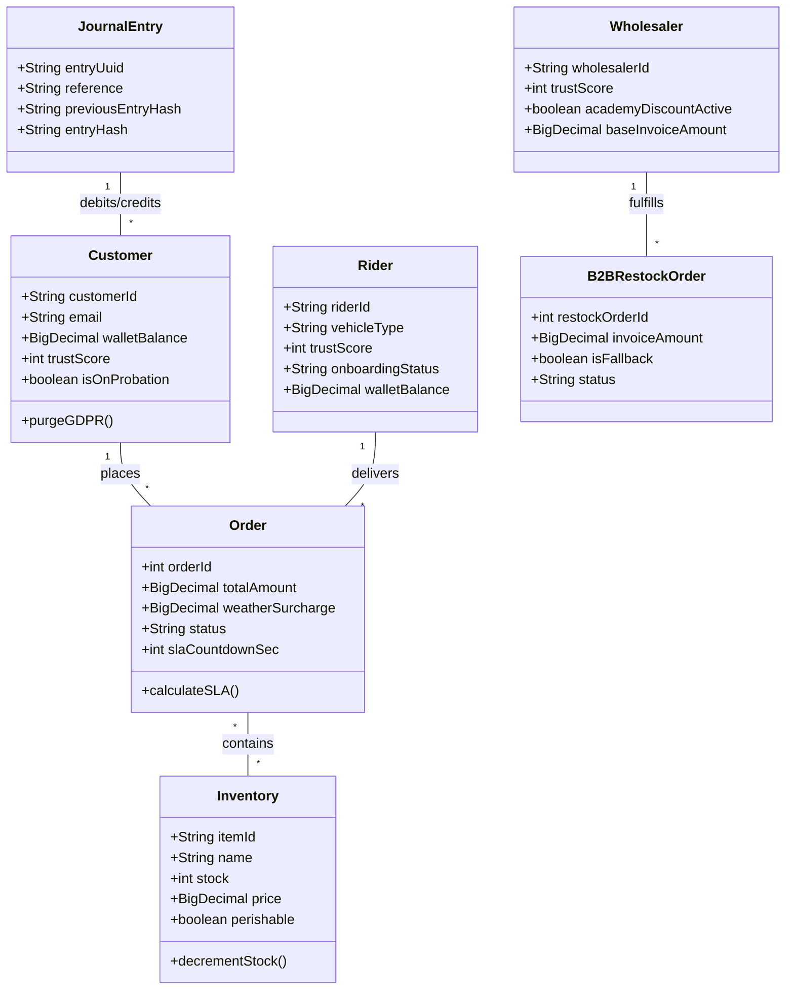
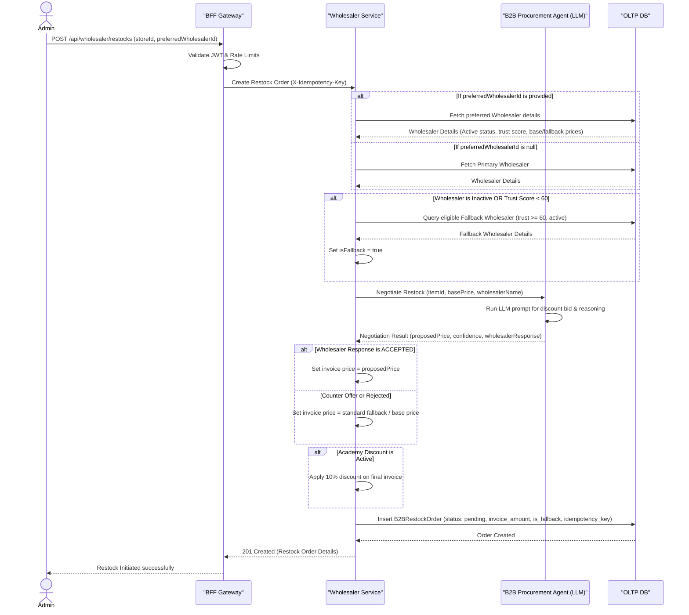
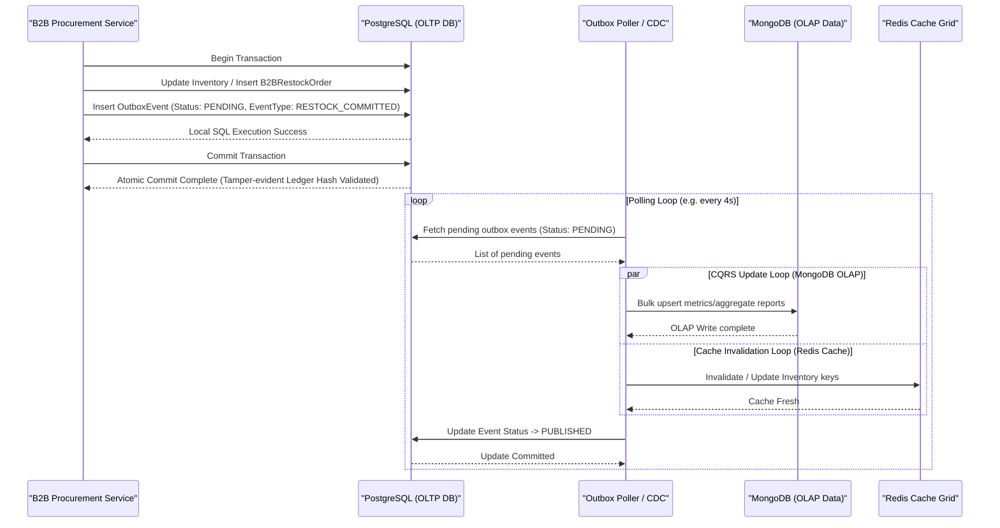
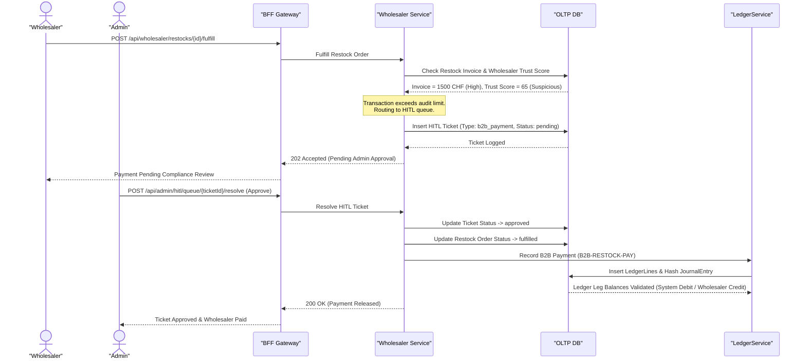
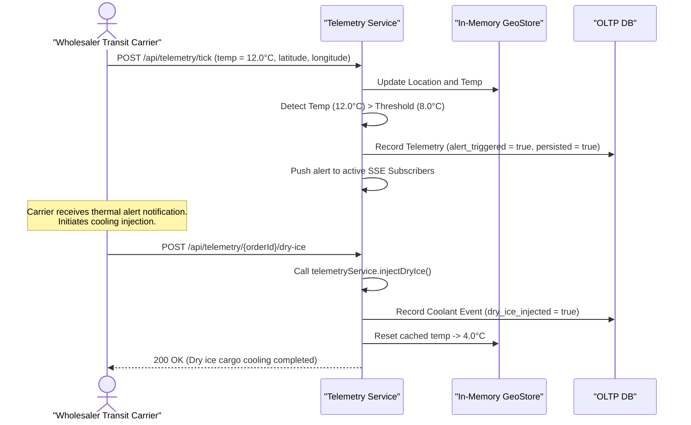
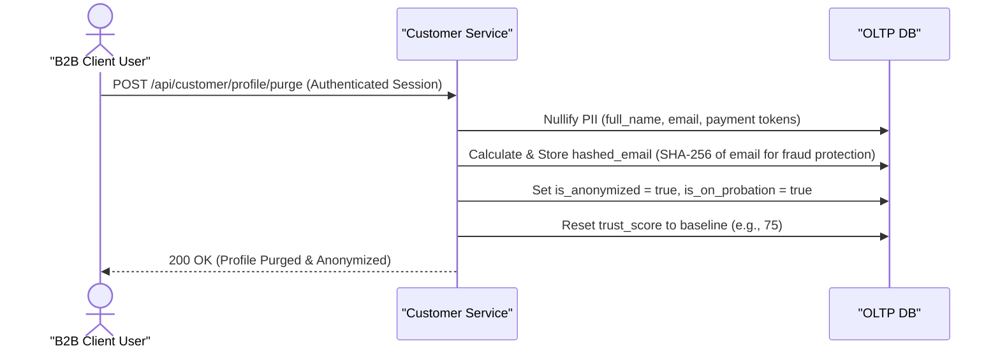
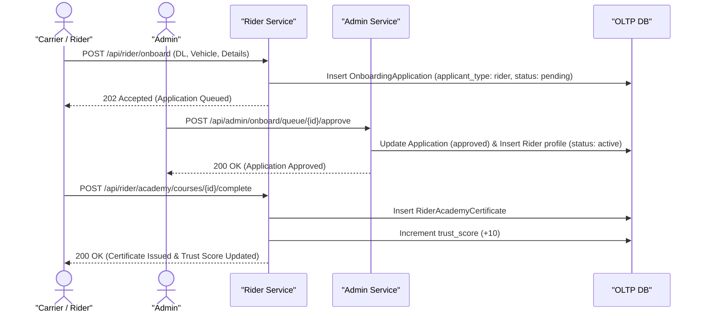
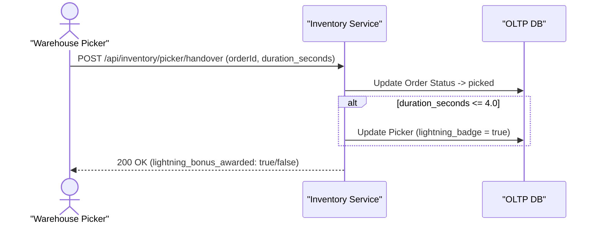
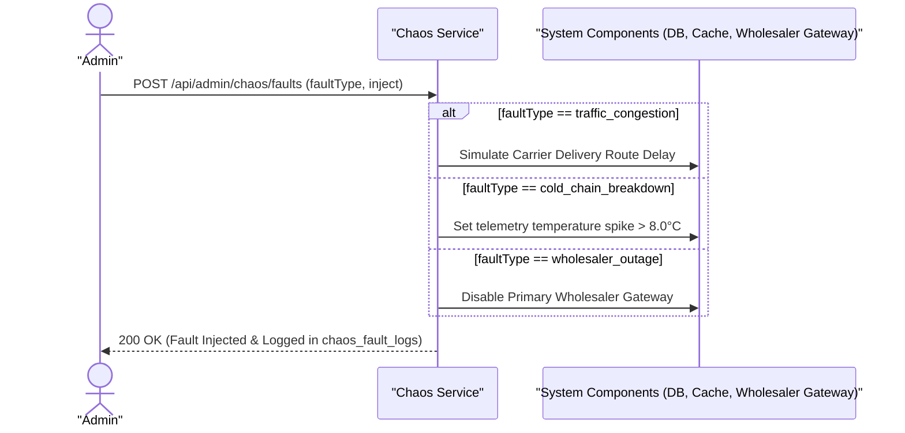

# Low-Level Design (LLD): Swiss Quick Commerce System

This Low-Level Design (LLD) document translates the High-Level Design (HLD) architecture and Business Requirements Document (BRD) into concrete operational models. It maps directly to the API contracts ([bff-openapi.yaml](file:///C:/Users/DELL%209420/Documents/swiss_App/bff-openapi.yaml)) and database schemas ([V1__init_schema.sql](file:///C:/Users/DELL%209420/Documents/swiss_App/backend/src/main/resources/db/migration/V1__init_schema.sql)).

---

## 1. Use Case Diagrams

### 1.1 Core Marketplace Operations
This diagram maps the interactions of primary actors (Customer, Rider, Picker) with the system's core capabilities.

```mermaid
usecaseDiagram
    actor Customer
    actor Rider
    actor Picker
    
    package "Core Operations" {
        usecase "Browse Catalog" as UC1
        usecase "Place Checkout Order" as UC2
        usecase "Request AI Refund" as UC3
        usecase "Complete Picking" as UC4
        usecase "Inject Cold Chain Coolant" as UC5
        usecase "Confirm Delivery" as UC6
    }
    
    Customer --> UC1
    Customer --> UC2
    Customer --> UC3
    
    Picker --> UC4
    
    Rider --> UC5
    Rider --> UC6
```

### 1.2 Back-Office & Governance
This diagram maps the interactions of administrative and B2B actors (Admin, Wholesaler) managing capacity, risk, and stability.

```mermaid
usecaseDiagram
    actor Admin
    actor Wholesaler
    
    package "Governance & B2B" {
        usecase "Toggle Chaos Faults" as UC7
        usecase "Resolve HITL Tickets" as UC8
        usecase "Approve Onboarding" as UC9
        usecase "Fulfill Restock Invoice" as UC10
        usecase "Rebalance MFC Stock" as UC11
    }
    
    Admin --> UC7
    Admin --> UC8
    Admin --> UC9
    Admin --> UC11
    
    Wholesaler --> UC10
```

---

## 2. Domain & Database Diagrams

### 2.1 Domain Class Model

This class diagram represents the Object-Relational mapping directly derived from [V1__init_schema.sql](file:///C:/Users/DELL%209420/Documents/swiss_App/backend/src/main/resources/db/migration/V1__init_schema.sql).



### 2.2 Physical Entity-Relationship Diagram (ERD)

This diagram shows the physical table structures in the PostgreSQL database separated logically by schema domains (Customer, Catalog, Order), along with the unstructured MongoDB analytical collections.

#### Database Schema References:
- **PostgreSQL `oltp` Schema Tables ([V1__init_schema.sql](file:///C:/Users/DELL%209420/Documents/swiss_App/backend/src/main/resources/db/migration/V1__init_schema.sql)):**
  - Customer Domain:
    - [oltp.customers](file:///C:/Users/DELL%209420/Documents/swiss_App/backend/src/main/resources/db/migration/V1__init_schema.sql#L12)
    - [oltp.customer_addresses](file:///C:/Users/DELL%209420/Documents/swiss_App/backend/src/main/resources/db/migration/V1__init_schema.sql#L29)
    - [oltp.customer_payment_cards](file:///C:/Users/DELL%209420/Documents/swiss_App/backend/src/main/resources/db/migration/V1__init_schema.sql#L40)
  - Catalog Domain:
    - [oltp.dark_stores](file:///C:/Users/DELL%209420/Documents/swiss_App/backend/src/main/resources/db/migration/V1__init_schema.sql#L71)
    - [oltp.inventory](file:///C:/Users/DELL%209420/Documents/swiss_App/backend/src/main/resources/db/migration/V1__init_schema.sql#L105)
    - [oltp.wholesalers](file:///C:/Users/DELL%209420/Documents/swiss_App/backend/src/main/resources/db/migration/V1__init_schema.sql#L92)
  - Order Domain & System Operations:
    - [oltp.orders](file:///C:/Users/DELL%209420/Documents/swiss_App/backend/src/main/resources/db/migration/V1__init_schema.sql#L119)
    - [oltp.order_items](file:///C:/Users/DELL%209420/Documents/swiss_App/backend/src/main/resources/db/migration/V1__init_schema.sql#L136)
    - [oltp.b2b_restock_orders](file:///C:/Users/DELL%209420/Documents/swiss_App/backend/src/main/resources/db/migration/V1__init_schema.sql#L145)
    - [oltp.order_telemetry_logs](file:///C:/Users/DELL%209420/Documents/swiss_App/backend/src/main/resources/db/migration/V1__init_schema.sql#L157)
    - [oltp.hitl_queue](file:///C:/Users/DELL%209420/Documents/swiss_App/backend/src/main/resources/db/migration/V1__init_schema.sql#L219)
  - Double-Entry Auditing Ledger:
    - [oltp.journal_entries](file:///C:/Users/DELL%209420/Documents/swiss_App/backend/src/main/resources/db/migration/V1__init_schema.sql#L173)
    - [oltp.ledger_lines](file:///C:/Users/DELL%209420/Documents/swiss_App/backend/src/main/resources/db/migration/V1__init_schema.sql#L184)
    - [oltp.security_trust_ledger](file:///C:/Users/DELL%209420/Documents/swiss_App/backend/src/main/resources/db/migration/V1__init_schema.sql#L196)
  - Onboarding & Governance:
    - [oltp.riders](file:///C:/Users/DELL%209420/Documents/swiss_App/backend/src/main/resources/db/migration/V1__init_schema.sql#L50)
    - [oltp.rider_academy_certificates](file:///C:/Users/DELL%209420/Documents/swiss_App/backend/src/main/resources/db/migration/V1__init_schema.sql#L63)
    - [oltp.pickers](file:///C:/Users/DELL%209420/Documents/swiss_App/backend/src/main/resources/db/migration/V1__init_schema.sql#L82)
    - [oltp.onboarding_applications](file:///C:/Users/DELL%209420/Documents/swiss_App/backend/src/main/resources/db/migration/V1__init_schema.sql#L207)
    - [oltp.system_configurations](file:///C:/Users/DELL%209420/Documents/swiss_App/backend/src/main/resources/db/migration/V1__init_schema.sql#L231)
    - [oltp.chaos_fault_logs](file:///C:/Users/DELL%209420/Documents/swiss_App/backend/src/main/resources/db/migration/V1__init_schema.sql#L238)
  - Transactional Outbox Events:
    - Mapped to [OutboxEvent.java](file:///C:/Users/DELL%209420/Documents/swiss_App/backend/src/main/java/ch/swissqcommerce/backend/model/OutboxEvent.java) (No physical DDL defined in V1__init_schema.sql)
- **PostgreSQL `olap` Schema Tables ([V1__init_schema.sql](file:///C:/Users/DELL%209420/Documents/swiss_App/backend/src/main/resources/db/migration/V1__init_schema.sql)):**
  - [olap.dw_revenue_facts](file:///C:/Users/DELL%209420/Documents/swiss_App/backend/src/main/resources/db/migration/V1__init_schema.sql#L252)
  - [olap.dw_delivery_sla_dimension](file:///C:/Users/DELL%209420/Documents/swiss_App/backend/src/main/resources/db/migration/V1__init_schema.sql#L261)
  - [olap.dw_iot_temperature_violations](file:///C:/Users/DELL%209420/Documents/swiss_App/backend/src/main/resources/db/migration/V1__init_schema.sql#L271)
  - [olap.dw_customer_fraud_risk_scores](file:///C:/Users/DELL%209420/Documents/swiss_App/backend/src/main/resources/db/migration/V1__init_schema.sql#L280)
  - [olap.dw_esg_carbon_facts](file:///C:/Users/DELL%209420/Documents/swiss_App/backend/src/main/resources/db/migration/V1__init_schema.sql#L290)
- **MongoDB `olap` Schema Documents:**
  - [olap.negotiation_history_logs](file:///C:/Users/DELL%209420/Documents/swiss_App/docs/PRD.md#L34) (Unstructured document logs defined in product requirements)

```mermaid
erDiagram
    %% ==========================================
    %% CUSTOMER DOMAIN (oltp)
    %% ==========================================
    oltp_customers {
        varchar customer_id PK
        varchar full_name
        varchar email
        varchar hashed_email
        numeric wallet_balance
        int loyalty_points
        boolean vip_status
        int trust_score
        boolean is_anonymized
        boolean is_on_probation
        int consecutive_orders_completed
        bigint version
        timestamp created_at
    }

    oltp_customer_addresses {
        int address_id PK
        varchar customer_id FK
        varchar label
        text address_line
        numeric latitude
        numeric longitude
        timestamp created_at
    }

    oltp_customer_payment_cards {
        int card_id PK
        varchar customer_id FK
        varchar card_type
        varchar last_four_digits
        varchar token_reference
        timestamp created_at
    }

    oltp_riders {
        varchar rider_id PK
        varchar full_name
        varchar vehicle_type
        varchar onboarding_status
        numeric wallet_balance
        numeric active_lat
        numeric active_lng
        int trust_score
        timestamp created_at
    }

    oltp_rider_academy_certificates {
        int certificate_id PK
        varchar rider_id FK
        varchar course_name
        timestamp completed_at
    }

    oltp_pickers {
        varchar picker_id PK
        varchar full_name
        int trust_score
        boolean lightning_badge
        varchar active_store_id FK
        timestamp created_at
    }

    %% ==========================================
    %% CATALOG DOMAIN (oltp)
    %% ==========================================
    oltp_dark_stores {
        varchar store_id PK
        varchar store_name
        text address
        numeric latitude
        numeric longitude
        int storage_capacity_limit
        timestamp created_at
    }

    oltp_inventory {
        varchar item_id PK
        varchar store_id FK
        varchar name
        numeric price
        int stock
        varchar category
        varchar emoji
        boolean perishable
        bigint version
        timestamp updated_at
    }

    oltp_wholesalers {
        varchar wholesaler_id PK
        varchar name
        boolean is_primary
        int trust_score
        boolean is_active
        boolean academy_discount_active
        numeric base_invoice_amount
        numeric fallback_invoice_amount
        timestamp created_at
    }

    %% ==========================================
    %% ORDER DOMAIN & SYSTEM OPERATIONS (oltp)
    %% ==========================================
    oltp_orders {
        int order_id PK
        varchar customer_id FK
        varchar store_id FK
        varchar rider_id FK
        numeric total_amount
        numeric tip_amount
        numeric weather_surcharge
        varchar payment_method
        varchar status
        int sla_countdown_sec
        int bags_returned
        varchar idempotency_key
        timestamp created_at
    }

    oltp_order_items {
        int order_id PK, FK
        varchar item_id PK, FK
        int quantity
        numeric price
    }

    oltp_b2b_restock_orders {
        int restock_order_id PK
        varchar store_id FK
        varchar wholesaler_id FK
        numeric invoice_amount
        boolean is_fallback
        varchar status
        varchar idempotency_key
        timestamp created_at
    }

    oltp_order_telemetry_logs {
        int log_id PK
        int order_id FK
        timestamp device_timestamp
        timestamp server_timestamp
        numeric latitude
        numeric longitude
        numeric temperature
        boolean dry_ice_injected
        boolean alert_triggered
    }

    oltp_hitl_queue {
        varchar ticket_id PK
        varchar type
        varchar customer_id FK
        int order_id FK
        text description
        numeric amount
        varchar status
        timestamp created_at
    }

    oltp_outbox_events {
        int id PK
        varchar aggregate_type
        varchar aggregate_id
        varchar event_type
        varchar payload
        varchar status
        timestamp created_at
    }

    %% ==========================================
    %% DOUBLE-ENTRY AUDITING LEDGER (oltp)
    %% ==========================================
    oltp_journal_entries {
        int entry_id PK
        uuid entry_uuid
        timestamp timestamp
        varchar reference
        text description
        varchar previous_entry_hash
        varchar entry_hash
    }

    oltp_ledger_lines {
        int line_id PK
        int entry_id FK
        varchar account_type
        varchar actor_id
        numeric debit
        numeric credit
    }

    oltp_security_trust_ledger {
        int audit_id PK
        timestamp timestamp
        varchar actor_type
        varchar actor_id
        varchar event
        int delta
        int current_value
    }

    oltp_onboarding_applications {
        varchar application_id PK
        varchar applicant_type
        varchar name
        text details
        boolean approval_ops
        boolean approval_compliance
        boolean approval_admin
        timestamp created_at
    }

    oltp_system_configurations {
        varchar config_key PK
        varchar config_value
        timestamp updated_at
    }

    oltp_chaos_fault_logs {
        int fault_id PK
        varchar fault_type
        timestamp triggered_at
        timestamp resolved_at
        text details
    }

    %% ==========================================
    %% POSTGRESQL OLAP DATA WAREHOUSE (olap)
    %% ==========================================
    olap_dw_revenue_facts {
        int fact_id PK
        timestamp timestamp
        varchar payment_method
        numeric total_sales
        numeric surcharges
    }

    olap_dw_delivery_sla_dimension {
        int dimension_id PK
        int order_id
        varchar weather_condition
        int seconds_remaining
        varchar sla_status
        timestamp timestamp
    }

    olap_dw_iot_temperature_violations {
        int violation_id PK
        int order_id
        varchar item_name
        numeric max_temperature_recorded
        timestamp alert_triggered
    }

    olap_dw_customer_fraud_risk_scores {
        varchar customer_id PK
        int order_count
        int refund_count
        int fraud_risk_percentage
        boolean audit_flagged
        timestamp updated_at
    }

    olap_dw_esg_carbon_facts {
        int fact_id PK
        int order_id
        varchar customer_id
        int bags_returned
        int co2_offset_grams
        timestamp timestamp
    }

    %% ==========================================
    %% MONGODB OLAP ANALYTICAL DOCUMENTS (olap)
    %% ==========================================
    olap_negotiation_history_logs {
        objectId _id PK
        string negotiation_id
        string buyer_id_hashed
        string wholesaler_id
        string item_id
        numeric initial_bid_price
        numeric final_agreed_price
        string status
        array transcript
        timestamp created_at
    }

    %% ==========================================
    %% RELATIONSHIPS
    %% ==========================================
    oltp_customers ||--o{ oltp_customer_addresses : "has addresses"
    oltp_customers ||--o{ oltp_customer_payment_cards : "has payment cards"
    oltp_riders ||--o{ oltp_rider_academy_certificates : "holds certificates"
    oltp_dark_stores ||--o{ oltp_pickers : "employs"
    oltp_dark_stores ||--o{ oltp_inventory : "holds stock"
    oltp_customers ||--o{ oltp_orders : "places"
    oltp_dark_stores ||--o{ oltp_orders : "fulfills"
    oltp_riders ||--o{ oltp_orders : "delivers"
    oltp_orders ||--o{ oltp_order_items : "contains"
    oltp_inventory ||--o{ oltp_order_items : "ordered as"
    oltp_dark_stores ||--o{ oltp_b2b_restock_orders : "receives inventory"
    oltp_wholesalers ||--o{ oltp_b2b_restock_orders : "supplies inventory"
    oltp_orders ||--o{ oltp_order_telemetry_logs : "records temperature"
    
    oltp_customers ||--o{ oltp_hitl_queue : "submitted by"
    oltp_orders ||--o{ oltp_hitl_queue : "requires audit for"

    oltp_journal_entries ||--o{ oltp_ledger_lines : "consists of"
    
    %% Relationships for Outbox Events (Logical references)
    oltp_outbox_events }o..|| oltp_orders : "references (logical)"
    oltp_outbox_events }o..|| oltp_b2b_restock_orders : "references (logical)"

    %% Relationships for MongoDB (Logical references to Postgres entities)
    oltp_wholesalers ||--o{ olap_negotiation_history_logs : "negotiates with (logical)"
    oltp_inventory ||--o{ olap_negotiation_history_logs : "negotiates item (logical)"
```



---

## 3. Sequence Diagrams

### 3.1 Autonomous Restock Order & Wholesaler Negotiation Flow
Maps to: `POST /api/wholesaler/restocks`
Implementation files:
* Controller: [WholesalerController.java](file:///C:/Users/DELL%209420/Documents/swiss_App/backend/src/main/java/ch/swissqcommerce/backend/controller/WholesalerController.java)
* Service: [WholesalerService.java](file:///C:/Users/DELL%209420/Documents/swiss_App/backend/src/main/java/ch/swissqcommerce/backend/service/WholesalerService.java)
* Negotiation Agent: [B2BProcurementAgent.java](file:///C:/Users/DELL%209420/Documents/swiss_App/backend/src/main/java/ch/swissqcommerce/backend/domain/agent/core/service/B2BProcurementAgent.java)
* Database Schema: [V1__init_schema.sql](file:///C:/Users/DELL%209420/Documents/swiss_App/backend/src/main/resources/db/migration/V1__init_schema.sql)



### 3.2 OAuth2/OIDC Authentication Redirect via BFF & Session Replication
Maps to: `GET /api/wholesaler/invoices` or any secured endpoint.
Implementation files:
* Filter: [EdgeJwtVerificationFilter.java](file:///C:/Users/DELL%209420/Documents/swiss_App/bff/src/main/java/ch/swissqcommerce/bff/filter/EdgeJwtVerificationFilter.java)
* BFF Main: [BffApplication.java](file:///C:/Users/DELL%209420/Documents/swiss_App/bff/src/main/java/ch/swissqcommerce/bff/BffApplication.java)

```mermaid
sequenceDiagram
    actor User as "B2B User Browser"
    participant BFF as "BFF Gateway"
    participant IdP as "Identity Provider (OIDC)"
    participant Redis as "Redis Session Cache"
    participant ApiSrv as "Downstream API Service"
    
    User->>BFF: GET /api/wholesaler/invoices (Request without session cookie)
    BFF->>BFF: Detect missing session cookie / expired state
    BFF-->>User: 302 Redirect to OIDC Login Endpoint (with PKCE client challenge)
    
    User->>IdP: Authenticate & Verify MFA (redirected)
    IdP-->>User: 302 Redirect back to BFF `/login/oauth2/code/oidc` with auth code
    
    User->>BFF: GET /login/oauth2/code/oidc?code=AUTH_CODE
    BFF->>IdP: POST /oauth2/token (code exchange + PKCE verifier)
    IdP-->>BFF: 200 OK (Access Token, ID Token, Refresh Token)
    
    BFF->>Redis: Set Session Key (uuid -> Tokens JSON) with TTL
    Redis-->>BFF: Session Stored
    
    BFF->>BFF: Encrypt Session Key into Secure HttpOnly Cookie
    BFF-->>User: Set-Cookie: jwt_session=ENCRYPTED_KEY; HttpOnly; Secure; SameSite=Strict
    
    Note over User, BFF: Subsequent Requests (Cookie-to-Token Relay)
    
    User->>BFF: GET /api/wholesaler/invoices (Cookie: jwt_session)
    BFF->>Redis: Fetch Tokens by Decrypted Session Key
    Redis-->>BFF: Tokens JSON
    
    BFF->>BFF: Validate JWT signature & Strip incoming spoof headers
    BFF->>BFF: Inject verified headers (X-User-Subject, X-User-Roles)
    
    BFF->>ApiSrv: GET /api/wholesaler/invoices (Authorization: Bearer AccessToken)
    ApiSrv-->>BFF: 200 OK (Invoice JSON)
    BFF-->>User: Render Invoice Data
```

### 3.3 Asynchronous Outbox/CQRS Event Loop
Maps to: `OutboxEventScheduler.processPendingEvents()` scheduler.
Implementation files:
* Outbox Scheduler: [OutboxEventScheduler.java](file:///C:/Users/DELL%209420/Documents/swiss_App/backend/src/main/java/ch/swissqcommerce/backend/domain/event/core/service/OutboxEventScheduler.java)
* Database Schema: [V1__init_schema.sql](file:///C:/Users/DELL%209420/Documents/swiss_App/backend/src/main/resources/db/migration/V1__init_schema.sql)



### 3.4 B2B Human-In-The-Loop (HITL) Procurement Approval Flow
Maps to: `POST /api/wholesaler/restocks/{id}/fulfill` and `POST /api/admin/hitl/queue/{id}/resolve`
Implementation files:
* Wholesaler Controller: [WholesalerController.java](file:///C:/Users/DELL%209420/Documents/swiss_App/backend/src/main/java/ch/swissqcommerce/backend/controller/WholesalerController.java)
* Wholesaler Service: [WholesalerService.java](file:///C:/Users/DELL%209420/Documents/swiss_App/backend/src/main/java/ch/swissqcommerce/backend/service/WholesalerService.java)
* Admin Controller: [AdminController.java](file:///C:/Users/DELL%209420/Documents/swiss_App/backend/src/main/java/ch/swissqcommerce/backend/controller/AdminController.java)
* Database Schema: [V1__init_schema.sql](file:///C:/Users/DELL%209420/Documents/swiss_App/backend/src/main/resources/db/migration/V1__init_schema.sql)



### 3.5 B2B IoT Cold Chain Replenishment Telemetry Tracking & Mitigation
Maps to: `POST /api/telemetry/tick` and `POST /api/telemetry/{orderId}/dry-ice`
Implementation files:
* Telemetry Controller: [TelemetryController.java](file:///C:/Users/DELL%209420/Documents/swiss_App/backend/src/main/java/ch/swissqcommerce/backend/controller/TelemetryController.java)
* Database Schema: [V1__init_schema.sql](file:///C:/Users/DELL%209420/Documents/swiss_App/backend/src/main/resources/db/migration/V1__init_schema.sql)



### 3.6 GDPR Right to be Forgotten (B2B User Profile Anonymization)
Maps to: `POST /api/customer/profile/purge`
Implementation files:
* Customer Controller: [CustomerController.java](file:///C:/Users/DELL%209420/Documents/swiss_App/backend/src/main/java/ch/swissqcommerce/backend/controller/CustomerController.java)
* Database Schema: [V1__init_schema.sql](file:///C:/Users/DELL%209420/Documents/swiss_App/backend/src/main/resources/db/migration/V1__init_schema.sql)



### 3.7 B2B Partner Onboarding & Compliance Queue
Maps to: `POST /api/rider/onboard` and `POST /api/admin/onboard/queue/{id}/approve`
Implementation files:
* Controller: [RiderController.java](file:///C:/Users/DELL%209420/Documents/swiss_App/backend/src/main/java/ch/swissqcommerce/backend/domain/enrollment/adapter/in/web/RiderController.java)
* Service Implementation: [RiderServiceImpl.java](file:///C:/Users/DELL%209420/Documents/swiss_App/backend/src/main/java/ch/swissqcommerce/backend/domain/enrollment/core/service/RiderServiceImpl.java)
* Database Schema: [V1__init_schema.sql](file:///C:/Users/DELL%209420/Documents/swiss_App/backend/src/main/resources/db/migration/V1__init_schema.sql)



### 3.8 MFC Bulk Picking & Lightning Fulfillment Optimization
Maps to: `POST /api/inventory/picker/handover`
Implementation files:
* Inventory Controller: [InventoryController.java](file:///C:/Users/DELL%209420/Documents/swiss_App/backend/src/main/java/ch/swissqcommerce/backend/controller/InventoryController.java)
* Database Schema: [V1__init_schema.sql](file:///C:/Users/DELL%209420/Documents/swiss_App/backend/src/main/resources/db/migration/V1__init_schema.sql)



### 3.9 Chaos Engineering Fault Injection & System Outage Mitigation
Maps to: `POST /api/admin/chaos/faults`
Implementation files:
* Admin Controller: [AdminController.java](file:///C:/Users/DELL%209420/Documents/swiss_App/backend/src/main/java/ch/swissqcommerce/backend/controller/AdminController.java)
* Database Schema: [V1__init_schema.sql](file:///C:/Users/DELL%209420/Documents/swiss_App/backend/src/main/resources/db/migration/V1__init_schema.sql)


