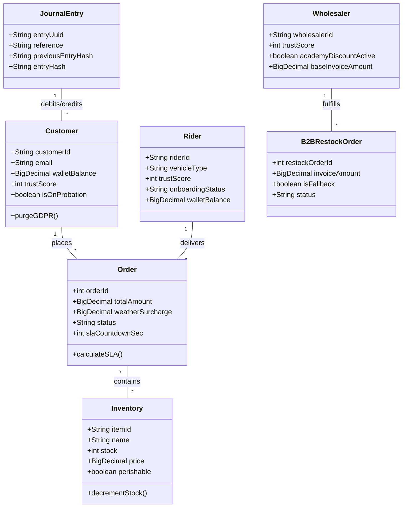
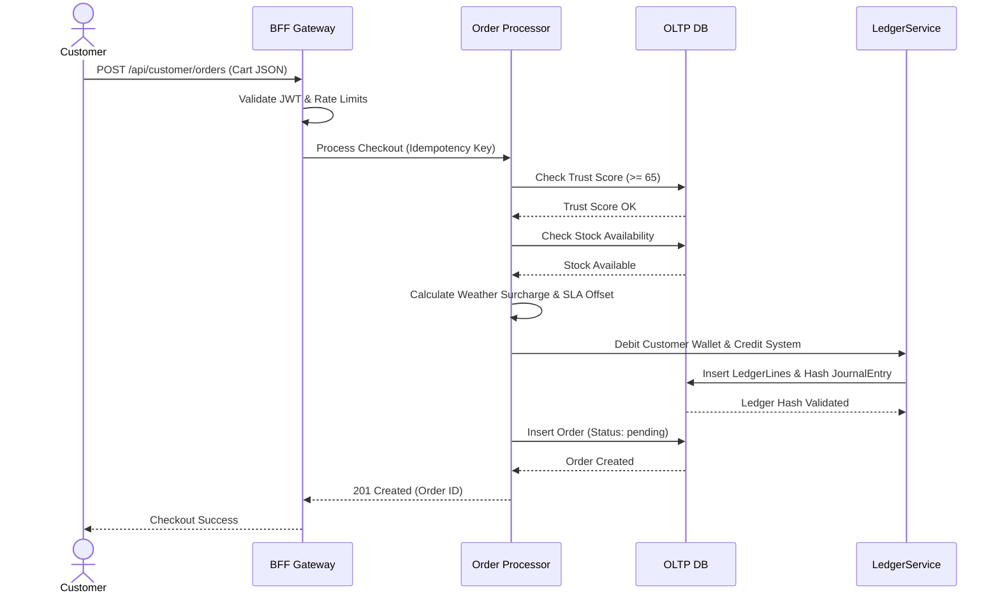
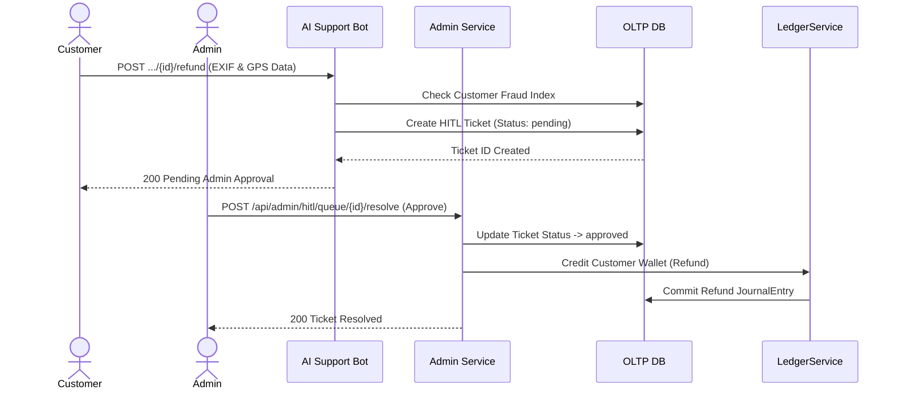
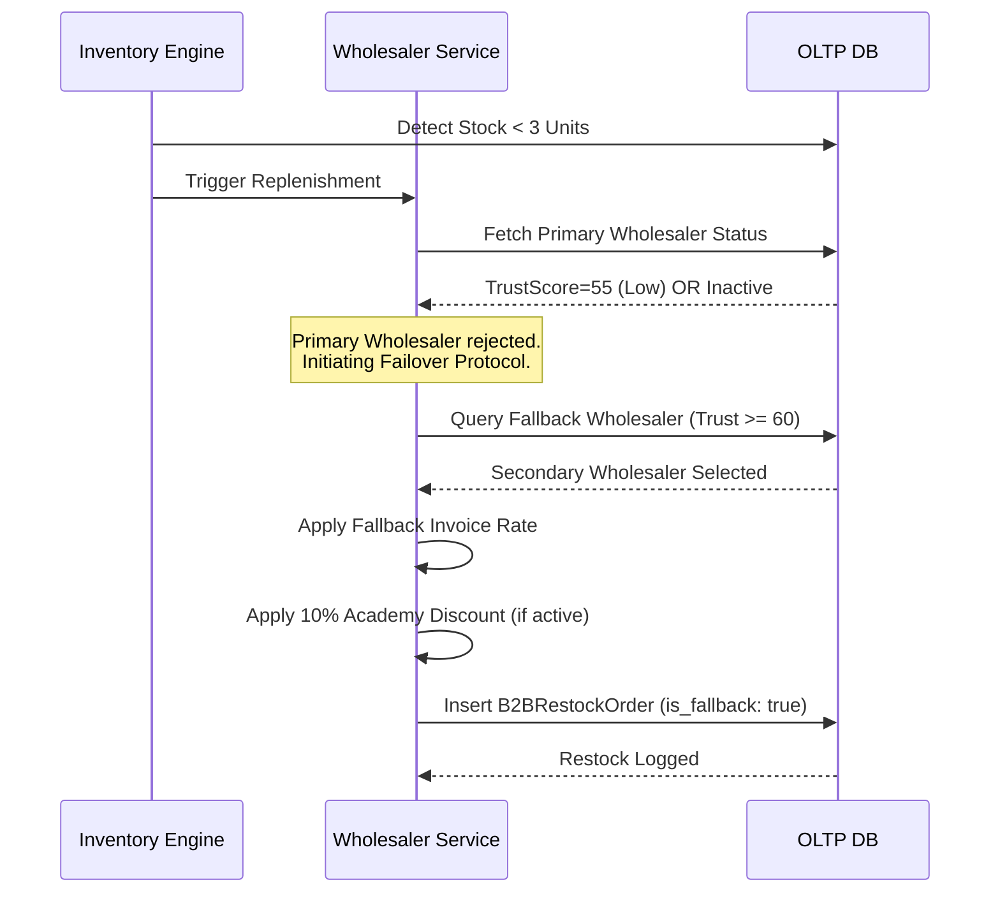
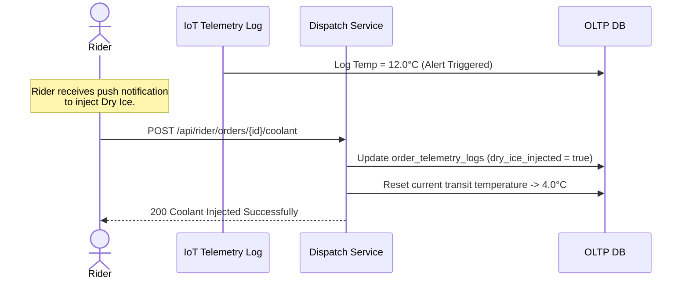
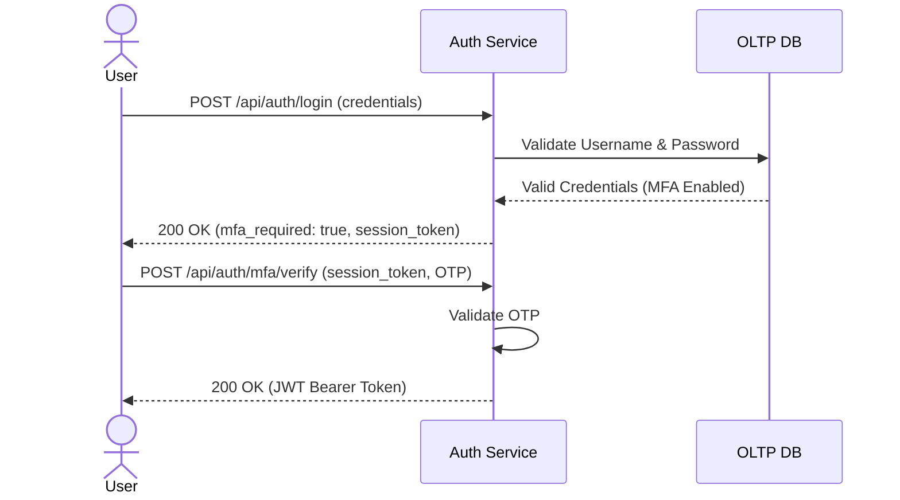
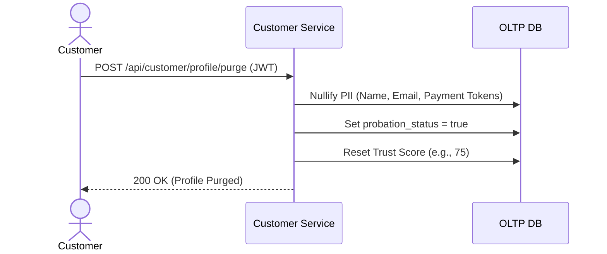
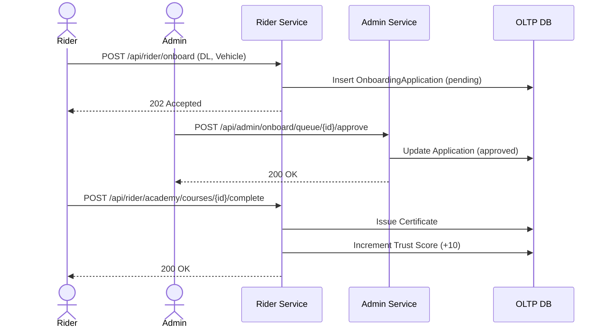
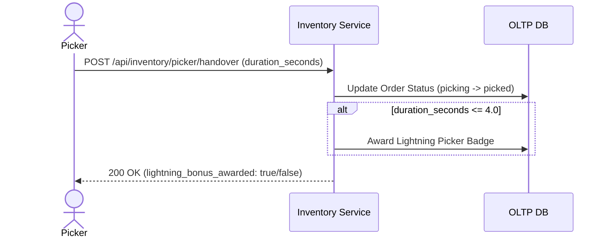
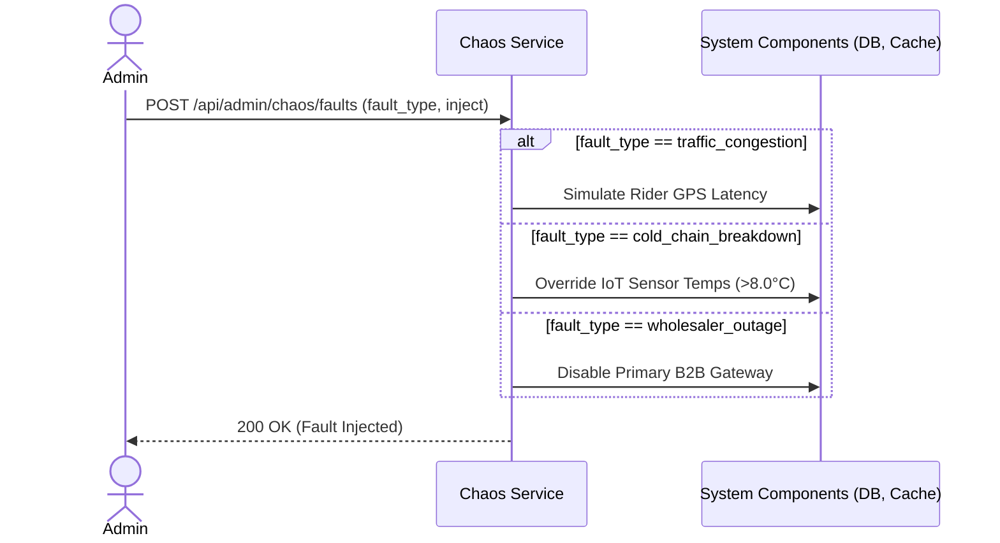

# Low-Level Design (LLD): Swiss Quick Commerce System

This Low-Level Design (LLD) document translates the High-Level Design (HLD) architecture and Business Requirements Document (BRD) into concrete operational models. It maps directly to the API contracts (`bff-openapi.yaml`) and database schemas (`schema.sql`).

---

## 1. Use Case Diagrams

### 1.1 Core Marketplace Operations
This diagram maps the interactions of primary actors (Customer, Rider, Picker) with the system's core capabilities.

```mermaid
usecaseDiagram
    actor Customer
    actor Rider
    actor Picker
    
    package "Core Operations" {
        usecase "Browse Catalog" as UC1
        usecase "Place Checkout Order" as UC2
        usecase "Request AI Refund" as UC3
        usecase "Complete Picking" as UC4
        usecase "Inject Cold Chain Coolant" as UC5
        usecase "Confirm Delivery" as UC6
    }
    
    Customer --> UC1
    Customer --> UC2
    Customer --> UC3
    
    Picker --> UC4
    
    Rider --> UC5
    Rider --> UC6
```

### 1.2 Back-Office & Governance
This diagram maps the interactions of administrative and B2B actors (Admin, Wholesaler) managing capacity, risk, and stability.

```mermaid
usecaseDiagram
    actor Admin
    actor Wholesaler
    
    package "Governance & B2B" {
        usecase "Toggle Chaos Faults" as UC7
        usecase "Resolve HITL Tickets" as UC8
        usecase "Approve Onboarding" as UC9
        usecase "Fulfill Restock Invoice" as UC10
        usecase "Rebalance MFC Stock" as UC11
    }
    
    Admin --> UC7
    Admin --> UC8
    Admin --> UC9
    Admin --> UC11
    
    Wholesaler --> UC10
```

---

## 2. Class Diagrams (Domain Model)

This class diagram represents the Object-Relational mapping directly derived from `schema.sql`.



---

## 3. Sequence Diagrams

### 3.1 Order Checkout Flow & SLA Engine
Maps to: `POST /api/customer/orders`



### 3.2 Human-In-The-Loop (HITL) Refund Flow
Maps to: `POST /api/customer/orders/{id}/refund` and `POST /api/admin/hitl/queue/{id}/resolve`



### 3.3 Dynamic B2B Restock & Fallback Failover
Maps to backend `WholesalerService.createRestockOrder()` cron job.



### 3.4 IoT Cold Chain Spoilage Mitigation
Maps to: `POST /api/rider/orders/{id}/coolant`



### 3.5 Authentication & MFA Flow
Maps to: `POST /api/auth/login` and `POST /api/auth/mfa/verify`



### 3.6 GDPR Erasure (Right to be Forgotten)
Maps to: `POST /api/customer/profile/purge`



### 3.7 Rider Onboarding & Academy Certification
Maps to: `POST /api/rider/onboard`, `POST /admin/onboard/queue/{id}/approve`, and `POST /api/rider/academy/courses/{id}/complete`



### 3.8 Warehouse Picking & Lightning Bonus
Maps to: `POST /api/inventory/picker/handover`



### 3.9 Chaos Engineering Fault Injection
Maps to: `POST /api/admin/chaos/faults`


